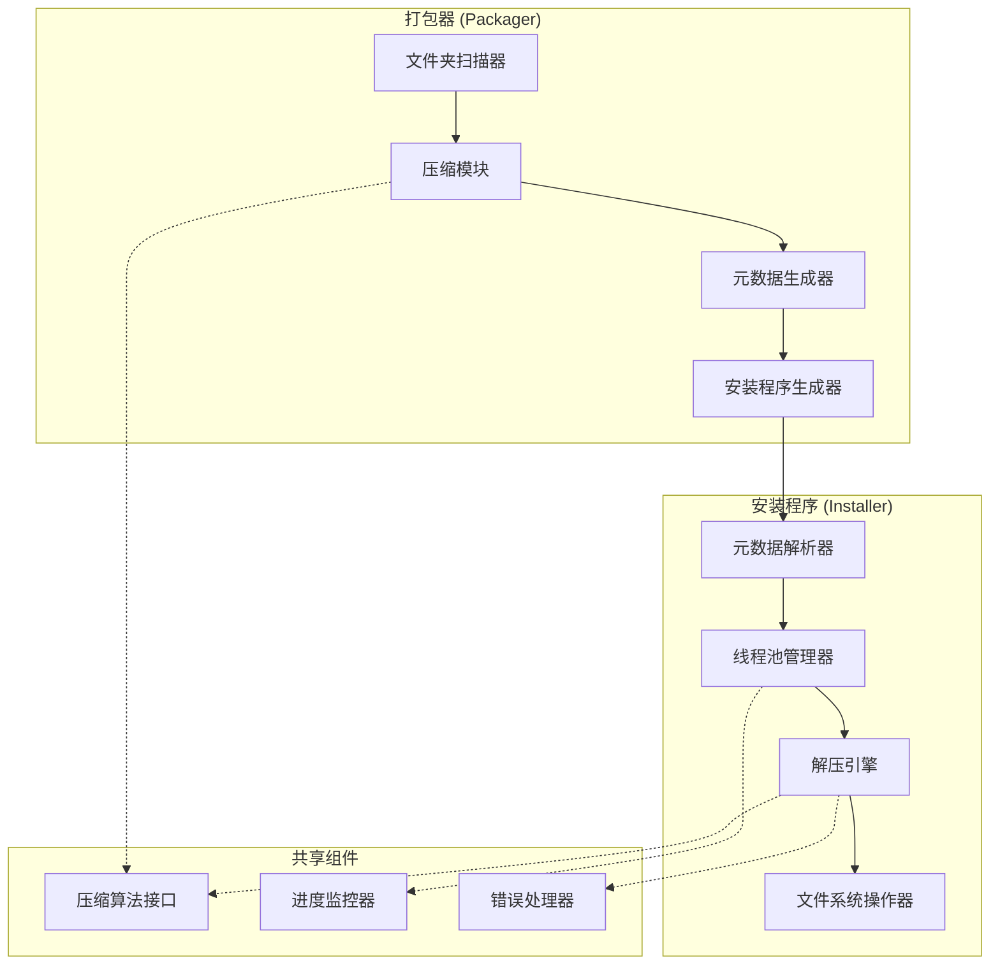

# 设计文档

## 概述

多线程安装器是一个C++控制台应用程序，包含两个主要组件：打包器（Packager）和安装程序（Installer）。打包器负责压缩输入文件夹并生成自解压安装程序，安装程序利用多线程技术快速解压并安装文件到指定目录。

系统采用模块化设计，支持并行处理多个文件夹的压缩和解压操作，通过优化的压缩算法和线程池技术实现高性能的文件处理。整个系统通过命令行界面操作，无需图形界面。

## 架构

### 系统架构图



### 核心设计原则

1. **模块化分离**：打包器和安装程序功能完全分离，通过嵌入的元数据通信
2. **并行处理**：利用多线程技术并行处理不同文件夹和大文件
3. **快速解压优化**：选择针对解压速度优化的压缩算法
4. **自包含部署**：生成的安装程序包含所有必要的数据和代码

## 组件和接口

### 打包器组件

#### 1. 文件夹扫描器 (FolderScanner)
```cpp
class FolderScanner {
public:
    struct FolderInfo {
        std::string sourcePath;
        std::string targetPath;
        std::vector<std::string> files;
        size_t totalSize;
    };
    
    std::vector<FolderInfo> scanInputDirectory(const std::string& inputPath);
    bool validateFolderStructure(const std::vector<FolderInfo>& folders);
};
```

#### 2. 压缩模块 (CompressionModule)
```cpp
enum class CompressionAlgorithm {
    ZSTD_FAST,    // Zstandard快速模式
    LZMA_HIGH     // 7z LZMA高压缩比模式
};

class CompressionModule {
public:
    struct CompressionResult {
        std::vector<uint8_t> compressedData;
        uint32_t checksum;
        size_t originalSize;
        size_t compressedSize;
        CompressionAlgorithm algorithm;
    };
    
    CompressionResult compressFolder(const FolderScanner::FolderInfo& folder);
    bool setCompressionAlgorithm(CompressionAlgorithm algorithm);
    bool setCompressionLevel(int level); // zstd: 1-22, LZMA: 0-9
    bool setBlockSize(size_t blockSize = 65536); // 仅适用于zstd
    
private:
    CompressionAlgorithm currentAlgorithm = CompressionAlgorithm::ZSTD_FAST;
    
    // Zstandard相关
    ZSTD_CCtx* zstdContext;
    
    // 7z LZMA相关
    void* lzmaEncoder; // LZMA编码器句柄
};
```

**依赖库**：
- **libzstd**：Zstandard压缩库的C++接口（>= 1.4.0）
- **7z SDK**：7-Zip的LZMA压缩库（>= 19.00）
#### 3. 元数据生成器 (MetadataGenerator)
```cpp
class MetadataGenerator {
public:
    struct InstallationMetadata {
        uint32_t version;
        uint32_t folderCount;
        std::vector<FolderMapping> folderMappings;
        uint64_t totalCompressedSize;
    };
    
    struct FolderMapping {
        std::string folderName;
        std::string targetPath;
        uint64_t offset;
        uint64_t compressedSize;
        uint64_t originalSize;
        uint32_t checksum;
        CompressionAlgorithm algorithm; // 使用的压缩算法
    };
    
    InstallationMetadata generateMetadata(const std::vector<CompressionModule::CompressionResult>& results);
    std::vector<uint8_t> serializeMetadata(const InstallationMetadata& metadata);
};
```

#### 4. 安装程序生成器 (InstallerGenerator)
```cpp
class InstallerGenerator {
public:
    bool generateInstaller(const std::string& outputPath,
                          const std::vector<uint8_t>& metadata,
                          const std::vector<std::vector<uint8_t>>& compressedData);
    bool embedInstallerTemplate(const std::string& templatePath);
};
```

### 安装程序组件

#### 1. 元数据解析器 (MetadataParser)
```cpp
class MetadataParser {
public:
    MetadataGenerator::InstallationMetadata parseEmbeddedMetadata();
    bool validateMetadata(const MetadataGenerator::InstallationMetadata& metadata);
};
```

#### 2. 线程池管理器 (ThreadPoolManager)
```cpp
class ThreadPoolManager {
public:
    ThreadPoolManager(size_t threadCount = std::thread::hardware_concurrency());
    ~ThreadPoolManager();
    
    template<typename F, typename... Args>
    auto enqueue(F&& f, Args&&... args) -> std::future<typename std::result_of<F(Args...)>::type>;
    
    void waitForAll();
    size_t getActiveThreadCount() const;
};
```

#### 3. 解压引擎 (DecompressionEngine)
```cpp
class DecompressionEngine {
public:
    struct DecompressionTask {
        std::vector<uint8_t> compressedData;
        std::string targetPath;
        uint32_t expectedChecksum;
        size_t originalSize;
        CompressionAlgorithm algorithm; // 指示使用的压缩算法
    };
    
    bool decompressFolder(const DecompressionTask& task);
    void setThreadPool(std::shared_ptr<ThreadPoolManager> threadPool);
    void registerProgressCallback(std::function<void(const std::string&, float)> callback);
    
private:
    // Zstandard解压
    ZSTD_DCtx* zstdContext;
    bool decompressZstd(const DecompressionTask& task);
    
    // 7z LZMA解压
    void* lzmaDecoder;
    bool decompressLzma(const DecompressionTask& task);
    
    std::shared_ptr<ThreadPoolManager> threadPool;
};
```

**依赖库**：
- **libzstd**：用于zstd解压缩操作
- **7z SDK**：用于LZMA解压缩操作

#### 5. 控制台界面 (ConsoleInterface)
```cpp
class ConsoleInterface {
public:
    // 打包器界面
    void showPackagerMenu();
    bool getPackagerInput(std::string& inputPath, std::string& outputPath, 
                         CompressionAlgorithm& algorithm);
    void showPackagingProgress(const std::string& currentFolder, float progress);
    
    // 安装程序界面
    void showInstallerMenu();
    bool getInstallationPaths(std::vector<std::pair<std::string, std::string>>& folderMappings);
    void showInstallationProgress(const std::string& currentFolder, float progress);
    void showInstallationResult(bool success, const std::vector<std::string>& errors);
    
    // 通用界面
    void showError(const std::string& message);
    void showWarning(const std::string& message);
    bool confirmAction(const std::string& prompt);
    
private:
    void clearScreen();
    void showProgressBar(float progress, int width = 50);
};
```
```cpp
class FileSystemOperator {
public:
    bool createDirectoryRecursive(const std::string& path);
    bool writeFile(const std::string& filePath, const std::vector<uint8_t>& data);
    bool verifyFileIntegrity(const std::string& filePath, uint32_t expectedChecksum);
    bool handleFileConflict(const std::string& filePath);
};
```

## 数据模型

### 安装程序文件结构
```
+------------------+
| 安装程序可执行文件  |
+------------------+
| 元数据区域        |
| - 版本信息        |
| - 文件夹映射表     |
| - 校验和信息      |
+------------------+
| 压缩数据区域      |
| - 文件夹A压缩数据  |
| - 文件夹B压缩数据  |
| - ...            |
+------------------+
```

### 元数据格式
```cpp
struct BinaryMetadata {
    uint32_t magic;           // 魔数标识: 0x4D544950 ("MTIP")
    uint32_t version;         // 版本号
    uint32_t folderCount;     // 文件夹数量
    uint64_t metadataSize;    // 元数据总大小
    uint64_t dataOffset;      // 压缩数据起始偏移
    // 后续跟随 folderCount 个 FolderMapping 结构
};
```

### 压缩技术栈选择

**支持的压缩算法**：

#### 1. Zstandard (zstd) - 默认推荐
- **适用场景**：快速安装，优先考虑解压速度
- **压缩比**：约 2.9:1 (500MB → 172MB，减少65.6%)
- **压缩速度**：510 MB/s
- **解压速度**：1550 MB/s
- **多线程支持**：原生支持
- **随机访问**：支持块级随机访问

#### 2. 7z (LZMA) - 高压缩比选项
- **适用场景**：网络分发，优先考虑文件大小
- **压缩比**：约 4.5:1 (500MB → 111MB，减少77.8%)
- **压缩速度**：约50 MB/s
- **解压速度**：约200 MB/s
- **多线程支持**：支持多线程压缩，解压为单线程
- **随机访问**：有限支持

**算法选择策略**：
- **默认模式**：使用zstd快速模式，适合大多数安装场景
- **高压缩模式**：使用7z LZMA，适合网络带宽受限的场景
- **用户可配置**：打包器允许用户选择压缩算法

### 压缩数据格式
根据选择的算法采用不同格式：

#### Zstandard格式
- 使用Zstandard压缩算法（快速模式 --fast=1）
- 支持随机访问的块压缩格式
- 块大小：64KB
- 每个块包含CRC32校验和

#### 7z格式  
- 使用LZMA压缩算法（压缩级别5）
- 固体压缩模式提高压缩比
- 支持多文件压缩
- 包含SHA-256校验和
## 正确性属性

*属性是应该在系统所有有效执行中保持为真的特征或行为——本质上是关于系统应该做什么的正式陈述。属性作为人类可读规范和机器可验证正确性保证之间的桥梁。*

### 属性1：文件夹扫描完整性
*对于任何*输入目录，扫描器识别的子目录集合应该与文件系统中实际存在的子目录完全匹配
**验证：需求 1.1**

### 属性2：独立压缩处理
*对于任何*包含多个文件夹的输入目录，每个文件夹应该被独立压缩，且压缩结果之间不应相互依赖
**验证：需求 1.2**

### 属性3：压缩往返完整性
*对于任何*文件夹，压缩后再解压应该产生与原始文件夹结构、内容和属性完全相同的结果
**验证：需求 1.3, 6.4**

### 属性4：元数据映射一致性
*对于任何*压缩操作的结果，生成的元数据应该包含所有压缩文件夹的完整映射信息，且映射关系与实际压缩数据一致
**验证：需求 1.4**

### 属性5：安装程序完整嵌入
*对于任何*生成的安装程序，其应该包含所有压缩数据和元数据，使得安装程序可以独立执行而无需外部文件
**验证：需求 2.2, 2.3**

### 属性6：多线程并行处理
*对于任何*需要解压的多个文件夹或大文件，解压引擎应该利用多个线程并行处理，且线程数应该与可用CPU核心数相关
**验证：需求 3.1, 3.2, 3.3, 3.4**

### 属性7：目录映射正确性
*对于任何*文件夹和其指定的目标目录，解压后的文件夹应该出现在正确的目标位置，且目标目录应该在需要时自动创建
**验证：需求 4.1, 4.2, 4.3**

### 属性8：安装验证完整性
*对于任何*安装操作，完成后所有文件都应该存在于其预期的目标位置，且文件内容应该与原始文件匹配
**验证：需求 4.4**

### 属性9：错误恢复连续性
*对于任何*解压过程中的错误，系统应该记录错误信息并继续处理剩余的文件夹，不应因单个文件夹的错误而停止整个安装过程
**验证：需求 5.2**

### 属性10：文件冲突覆盖一致性
*对于任何*目标位置已存在的文件，安装程序应该一致地执行覆盖操作，不应出现不一致的处理行为
**验证：需求 5.3**

### 属性11：状态报告准确性
*对于任何*安装操作，最终状态报告应该准确反映安装过程中的成功、警告和错误情况
**验证：需求 5.4**

### 属性12：压缩性能优化
*对于任何*文件夹压缩操作，应该在保持合理压缩比的同时优先考虑解压速度，且压缩数据应该支持多线程随机访问
**验证：需求 6.2, 6.3**

## 错误处理

### 错误分类和处理策略

#### 1. 打包阶段错误
- **输入验证错误**：输入目录不存在或无权限访问
  - 处理：立即终止并显示清晰错误信息
- **压缩错误**：文件读取失败或压缩算法错误
  - 处理：跳过有问题的文件，记录错误，继续处理其他文件
- **安装程序生成错误**：输出路径无权限或磁盘空间不足
  - 处理：清理临时文件，显示错误信息并终止

#### 2. 安装阶段错误
- **元数据解析错误**：安装程序损坏或版本不兼容
  - 处理：显示详细错误信息并终止安装
- **解压错误**：数据损坏或校验和不匹配
  - 处理：记录错误，跳过损坏的文件夹，继续处理其他文件夹
- **文件系统错误**：目标路径无权限或磁盘空间不足
  - 处理：尝试创建备用路径，失败则记录错误并继续

#### 3. 线程同步错误
- **线程池异常**：线程创建失败或线程异常终止
  - 处理：降级到单线程模式，记录警告信息
- **资源竞争**：多线程访问共享资源冲突
  - 处理：使用互斥锁保护，实现重试机制

## 测试策略

### 双重测试方法

本系统采用单元测试和基于属性的测试相结合的方法：

#### 单元测试
- **具体示例验证**：测试特定的输入输出场景
- **边界条件测试**：空文件夹、大文件、特殊字符文件名
- **错误条件测试**：模拟各种错误情况
- **集成点测试**：组件间接口的正确性

#### 基于属性的测试
- **通用属性验证**：通过随机化输入验证通用属性
- **全面输入覆盖**：自动生成大量测试用例
- **最少100次迭代**：每个属性测试运行至少100次
- **属性标记格式**：**功能：multi-threaded-installer，属性 {编号}：{属性文本}**

### 测试框架选择
- **单元测试框架**：Google Test (gtest)
- **基于属性的测试框架**：RapidCheck
- **性能测试**：Google Benchmark
- **集成测试**：自定义测试脚本

### 测试配置
- 每个正确性属性必须对应一个基于属性的测试
- 每个属性测试必须引用其设计文档属性
- 最小迭代次数：100次（由于随机化特性）
- 测试数据生成：智能约束到有效输入空间
private:
    void clearScreen();
    void showProgressBar(float progress, int width = 50);
};
```

#### 6. 文件系统操作器 (FileSystemOperator)
```cpp
class FileSystemOperator {
public:
    bool createDirectoryRecursive(const std::string& path);
    bool writeFile(const std::string& filePath, const std::vector<uint8_t>& data);
    bool verifyFileIntegrity(const std::string& filePath, uint32_t expectedChecksum);
    bool handleFileConflict(const std::string& filePath); // 直接覆盖
    bool fileExists(const std::string& filePath);
    size_t getFileSize(const std::string& filePath);
};
```

### 命令行接口设计

#### 打包器命令行参数
```bash
packager.exe [选项] <输入目录> <输出文件>

选项：
  -a, --algorithm <zstd|lzma>    选择压缩算法 (默认: zstd)
  -l, --level <级别>             压缩级别 (zstd: 1-22, lzma: 0-9)
  -t, --threads <数量>           压缩线程数 (默认: CPU核心数)
  -v, --verbose                  显示详细信息
  -h, --help                     显示帮助信息

示例：
  packager.exe -a zstd -l 1 ./input ./output/installer.exe
  packager.exe -a lzma -l 5 ./input ./output/installer.exe
```

#### 安装程序命令行参数
```bash
installer.exe [选项] [目标映射...]

选项：
  -d, --destination <目录>       默认安装目录
  -t, --threads <数量>           解压线程数 (默认: CPU核心数)
  -f, --force                    强制覆盖现有文件
  -s, --silent                   静默安装模式
  -v, --verbose                  显示详细信息
  -h, --help                     显示帮助信息

目标映射格式：
  <文件夹名>=<目标路径>

示例：
  installer.exe -d C:\Program Files\MyApp
  installer.exe folderA=C:\App\A folderB=C:\App\B
  installer.exe -s -f -d C:\Program Files\MyApp
```