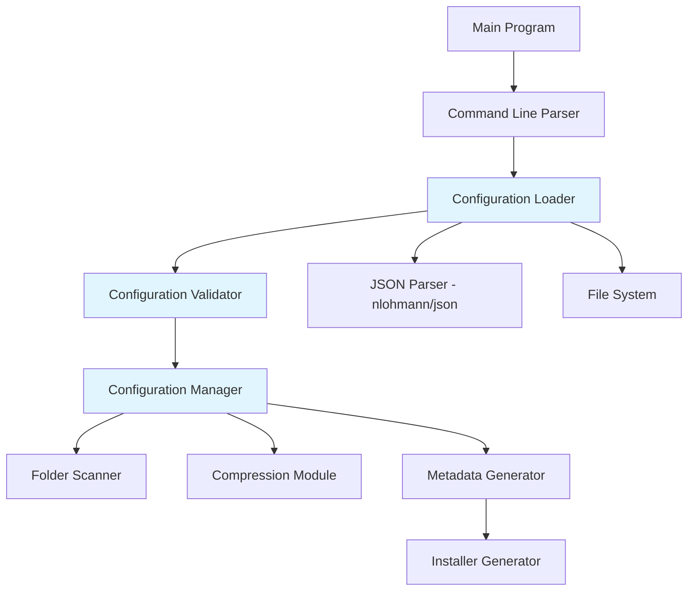

# Design Document: Packager Configuration File Support

## Overview

本设计文档描述了为打包器添加配置文件支持的实现方案。该功能允许用户通过JSON格式的配置文件来指定打包选项，包括应用程序名称、默认安装目录、压缩算法选择、以及文件夹级别的安装位置映射。同时简化命令行接口，使打包器只需要接受输入目录和输出文件两个参数。

**核心特性**:
1. 为每个文件夹指定不同的安装目标目录
2. 支持用户选择的安装目录（`installDirectory`）
3. 支持环境变量路径（如 `%AppData%`、`%ProgramData%`）
4. 安装程序智能补齐应用程序名称目录
5. 配置文件采用JSON格式，使用nlohmann/json库解析

## Architecture

### 系统架构图



### 组件职责

1. **Configuration Loader**: 负责查找和加载配置文件
2. **Configuration Validator**: 验证配置文件的正确性
3. **Configuration Manager**: 管理配置数据并提供访问接口
4. **Modified Metadata Generator**: 扩展现有元数据生成器以支持新的配置选项
5. **Modified Installer**: 扩展安装程序以支持文件夹级别的目标目录和智能路径补齐


## Components and Interfaces

### 1. Configuration Structure

```cpp
// 特殊目录类型枚举
enum class SpecialDirectoryType {
    INSTALL_DIRECTORY,  // 用户选择的安装目录
    PROGRAM_FILES,      // %ProgramFiles%
    APPDATA_ROAMING,    // %AppData%
    APPDATA_LOCAL,      // %LocalAppData%
    PROGRAM_DATA        // %ProgramData%
};

// 文件夹目标目录配置
struct FolderTargetConfig {
    std::string folderName;           // 文件夹名称（相对于输入目录）
    std::string targetDirectory;      // 目标目录配置字符串
    SpecialDirectoryType dirType;     // 目标目录类型
    
    FolderTargetConfig()
        : dirType(SpecialDirectoryType::INSTALL_DIRECTORY) {}
};

// 文件映射规则（可选，用于单个文件的细粒度控制）
struct FileMappingRule {
    std::string pattern;              // 文件匹配模式（支持通配符）
    std::string targetDirectory;      // 目标目录
    SpecialDirectoryType dirType;     // 目标目录类型
    std::string subPath;              // 目标目录下的子路径
    
    FileMappingRule()
        : dirType(SpecialDirectoryType::INSTALL_DIRECTORY) {}
};

// 打包器配置
struct PackagerConfiguration {
    std::string applicationName;                    // 应用程序名称
    std::string defaultInstallDir;                  // 建议的默认安装目录（不含应用程序名）
    CompressionAlgorithm compressionAlgorithm;      // 压缩算法
    std::vector<FolderTargetConfig> folderTargets;  // 文件夹目标配置
    std::vector<FileMappingRule> fileMappings;      // 文件映射规则（可选）
    
    // 默认值
    PackagerConfiguration() 
        : applicationName("MyApplication"),
          defaultInstallDir("%ProgramFiles%"),
          compressionAlgorithm(CompressionAlgorithm::ZSTD_FAST) {}
};
```

### 2. Configuration Loader

```cpp
class ConfigurationLoader {
public:
    // 从输入目录加载配置文件
    std::optional<PackagerConfiguration> loadConfiguration(
        const std::string& inputDirectory);
    
    // 从指定路径加载配置文件
    std::optional<PackagerConfiguration> loadConfigurationFromPath(
        const std::string& configPath);
    
    // 获取最后的错误信息
    std::string getLastError() const;
    
    // 获取加载的配置文件路径
    std::string getLoadedConfigPath() const;
    
private:
    std::string lastError_;
    std::string loadedConfigPath_;
    
    // 查找配置文件（按优先级：packager.json -> .packager.json）
    std::optional<std::string> findConfigFile(const std::string& directory);
    
    // 解析JSON配置文件
    std::optional<PackagerConfiguration> parseJsonConfig(
        const std::string& filePath);
    
    // 解析目标目录类型
    SpecialDirectoryType parseDirectoryType(const std::string& dirStr);
};
```

### 3. Configuration Validator

```cpp
class ConfigurationValidator {
public:
    struct ValidationResult {
        bool isValid;
        std::vector<std::string> errors;
        std::vector<std::string> warnings;
    };
    
    ValidationResult validate(const PackagerConfiguration& config,
                             const std::string& inputDirectory);
    
private:
    // 验证应用程序名称
    bool validateApplicationName(const std::string& name,
                                std::vector<std::string>& errors);
    
    // 验证文件夹是否存在
    bool validateFolderExists(const std::string& folder,
                             const std::string& inputDir,
                             std::vector<std::string>& errors);
    
    // 验证目标目录配置
    bool validateTargetDirectory(const std::string& targetDir,
                                std::vector<std::string>& errors);
};
```

### 4. Configuration Manager

```cpp
class ConfigurationManager {
public:
    // 初始化配置管理器
    bool initialize(const std::string& inputDirectory);
    
    // 获取配置
    const PackagerConfiguration& getConfiguration() const;
    
    // 检查是否使用了配置文件
    bool hasConfigFile() const;
    
    // 获取配置文件路径
    std::string getConfigFilePath() const;
    
    // 应用文件夹目标配置到文件夹信息
    void applyFolderTargets(std::vector<FolderInfo>& folders);
    
private:
    PackagerConfiguration config_;
    bool hasConfigFile_;
    std::string configFilePath_;
    ConfigurationLoader loader_;
    ConfigurationValidator validator_;
};
```

### 5. Extended Metadata Structures

```cpp
// 扩展的文件夹映射结构（向后兼容）
struct ExtendedFolderMapping : public FolderMapping {
    SpecialDirectoryType targetDirType;   // 目标目录类型
    std::string customTargetPath;         // 自定义目标路径
    
    ExtendedFolderMapping() 
        : FolderMapping(),
          targetDirType(SpecialDirectoryType::INSTALL_DIRECTORY) {}
};

// 扩展的安装元数据结构（向后兼容）
struct ExtendedInstallationMetadata : public InstallationMetadata {
    std::string applicationName;                    // 应用程序名称
    std::string defaultInstallDir;                  // 建议的默认安装目录
    std::vector<ExtendedFolderMapping> extendedMappings; // 扩展的文件夹映射
    
    ExtendedInstallationMetadata() 
        : InstallationMetadata(),
          applicationName("MyApplication"),
          defaultInstallDir("%ProgramFiles%") {}
};
```

### 6. Installer Path Resolution Logic

```cpp
class InstallerPathResolver {
public:
    // 解析最终的安装路径
    // userSelectedPath: 用户选择的安装目录
    // targetDirType: 目标目录类型
    // applicationName: 应用程序名称
    std::string resolveFinalPath(
        const std::string& userSelectedPath,
        SpecialDirectoryType targetDirType,
        const std::string& applicationName);
    
private:
    // 检查路径是否已包含应用程序名
    bool pathContainsAppName(const std::string& path,
                            const std::string& appName);
    
    // 智能补齐应用程序名
    std::string appendAppNameIfNeeded(const std::string& basePath,
                                     const std::string& appName);
    
    // 展开环境变量
    std::string expandEnvironmentVariables(const std::string& path);
};
```

## Data Models

### Complete Usage Example

假设你的输入目录结构如下：
```
input_directory/
├── packager.json
├── app/
│   ├── main.exe
│   └── lib.dll
├── plugin/
│   ├── plugin1.dll
│   └── plugin2.dll
└── config/
    └── settings.ini
```

配置文件 `packager.json`:
```json
{
  "version": "1.0",
  "applicationName": "MyApplication",
  "defaultInstallDirectory": "%ProgramFiles%",
  "compressionAlgorithm": "zstd",
  "folderTargets": [
    {
      "folder": "app",
      "targetDirectory": "installDirectory"
    },
    {
      "folder": "plugin",
      "targetDirectory": "%AppData%\\Roaming"
    },
    {
      "folder": "config",
      "targetDirectory": "%ProgramData%"
    }
  ]
}
```

**安装行为**:

**场景1**: 用户未修改安装目录（使用默认建议）
- 建议路径: `C:\Program Files (x86)\` （从 `%ProgramFiles%` 展开）
- 安装程序自动补齐应用程序名
- `app/` → `C:\Program Files (x86)\MyApplication\`
- `plugin/` → `C:\Users\[Username]\AppData\Roaming\MyApplication\`
- `config/` → `C:\ProgramData\MyApplication\`

**场景2**: 用户修改为 `D:\Program Files (x86)\`
- 安装程序检测路径不包含应用程序名，自动补齐
- `app/` → `D:\Program Files (x86)\MyApplication\`
- `plugin/` → `C:\Users\[Username]\AppData\Roaming\MyApplication\`
- `config/` → `C:\ProgramData\MyApplication\`

**场景3**: 用户修改为 `D:\Program Files (x86)\MyApplication\`
- 安装程序检测路径已包含应用程序名，不补齐
- `app/` → `D:\Program Files (x86)\MyApplication\`
- `plugin/` → `C:\Users\[Username]\AppData\Roaming\MyApplication\`
- `config/` → `C:\ProgramData\MyApplication\`

**说明**:
- `"installDirectory"` 表示映射到用户选择的安装目录
- `defaultInstallDirectory` 不包含应用程序名，安装程序会智能补齐
- 环境变量路径（如 `%AppData%`、`%ProgramData%`）也会自动补齐应用程序名
- 安装程序会检测用户输入的路径是否已包含应用程序名，避免重复

### JSON Configuration File Format

```json
{
  "version": "1.0",
  "applicationName": "MyApplication",
  "defaultInstallDirectory": "%ProgramFiles%",
  "compressionAlgorithm": "zstd",
  "folderTargets": [
    {
      "folder": "app",
      "targetDirectory": "installDirectory"
    },
    {
      "folder": "plugin",
      "targetDirectory": "%AppData%\\Roaming"
    }
  ],
  "fileMappings": [
    {
      "pattern": "*.config",
      "targetDirectory": "%AppData%\\Roaming",
      "subPath": "Config"
    }
  ]
}
```

### Configuration File Schema

| Field | Type | Required | Default | Description |
|-------|------|----------|---------|-------------|
| version | string | No | "1.0" | 配置文件版本 |
| applicationName | string | Yes | - | 应用程序名称 |
| defaultInstallDirectory | string | No | "%ProgramFiles%" | 建议的默认安装目录（不含应用程序名） |
| compressionAlgorithm | string | No | "zstd" | 压缩算法 ("zstd" 或 "lzma") |
| folderTargets | array | No | [] | 文件夹目标配置数组 |
| fileMappings | array | No | [] | 文件映射规则数组（可选） |

### Folder Target Configuration Schema

| Field | Type | Required | Description |
|-------|------|----------|-------------|
| folder | string | Yes | 文件夹名称（相对于输入目录） |
| targetDirectory | string | Yes | 目标目录类型或路径 |

### Supported Target Directory Values

| Value | Description | Example Final Path |
|-------|-------------|-------------------|
| `installDirectory` | 用户选择的安装目录 | `D:\MyApp\MyApplication\` |
| `%ProgramFiles%` | Program Files 目录 | `C:\Program Files (x86)\MyApplication\` |
| `%AppData%\\Roaming` | 用户 Roaming 目录 | `C:\Users\[User]\AppData\Roaming\MyApplication\` |
| `%LocalAppData%` | 用户 Local 目录 | `C:\Users\[User]\AppData\Local\MyApplication\` |
| `%ProgramData%` | 共享数据目录 | `C:\ProgramData\MyApplication\` |

**注意**: 所有路径都会自动补齐应用程序名称目录

## Correctness Properties

*属性是关于系统应该保持为真的特征或行为的正式陈述——本质上是关于系统应该做什么的正式声明。属性作为人类可读规范和机器可验证正确性保证之间的桥梁。*

### Property 1: Configuration File Discovery and Parsing
*For any* 输入目录，如果该目录包含有效的配置文件（packager.json或.packager.json），则打包器应该能够找到并成功解析该配置文件，读取所有配置选项。
**Validates: Requirements 1.1, 7.5, 8.1**

### Property 2: Invalid Configuration Rejection
*For any* 格式无效或包含无效值的配置文件，打包器应该返回清晰的错误信息，包括错误的配置项和具体原因，并终止执行。
**Validates: Requirements 1.2, 3.2, 12.1**

### Property 3: Application Name Requirement
*For any* 配置文件，如果缺少applicationName字段，打包器应该返回错误信息并终止执行。
**Validates: Requirements 1.6, 9.1**

### Property 4: Configuration File Priority
*For any* 输入目录，如果存在多个配置文件，打包器应该使用优先级最高的文件（packager.json > .packager.json），并记录警告信息。
**Validates: Requirements 8.3**

### Property 5: Unknown Configuration Items Tolerance
*For any* 包含未知配置项的有效配置文件，打包器应该记录警告信息但继续执行，不应该因为未知配置项而失败。
**Validates: Requirements 1.5**

### Property 6: Folder Existence Validation
*For any* 配置的文件夹目标，打包器应该验证该文件夹在输入目录中是否存在，如果不存在则返回错误。
**Validates: Requirements 9.4**

### Property 7: Compression Algorithm Selection
*For any* 配置文件中指定的有效压缩算法（"zstd"或"lzma"），打包器应该根据配置调用相应的压缩模块，并将算法信息写入元数据。
**Validates: Requirements 3.4, 10.3**

### Property 8: Folder Target Metadata Persistence
*For any* 配置的文件夹目标，打包器应该将文件夹名称和目标目录类型写入元数据。
**Validates: Requirements 4.2, 10.2**

### Property 9: Install Directory Path Resolution
*For any* 用户选择的安装路径和应用程序名称，如果路径不包含应用程序名，安装程序应该自动补齐；如果路径已包含应用程序名，则不应该重复添加。
**Validates: Requirements 4.6, 2.5**

### Property 10: Environment Variable Path Resolution
*For any* 包含环境变量的目标目录配置（如%AppData%、%ProgramData%），安装程序应该在安装时展开环境变量并自动补齐应用程序名称。
**Validates: Requirements 5.3, 5.4**

### Property 11: Command Line Argument Validation
*For any* 命令行调用，打包器应该只接受恰好两个参数（input_directory和output_file），对于参数数量不正确的调用应该显示使用说明并返回错误代码。
**Validates: Requirements 7.1, 7.2**

### Property 12: Configuration Validation Completeness
*For any* 配置文件，打包器应该验证所有配置项的类型、格式和值的有效性，包括应用程序名称、路径格式、压缩算法和文件夹存在性。
**Validates: Requirements 9.1, 9.2, 9.5**

### Property 13: Metadata Configuration Round-Trip
*For any* 有效的配置（包括应用程序名称、文件夹目标、压缩算法），打包器应该将这些配置写入元数据，安装程序应该能够从元数据中正确读取并应用这些配置。
**Validates: Requirements 10.1, 10.2, 10.3, 10.5**

### Property 14: Backward Compatibility
*For any* 不包含新配置选项的元数据（旧版本），安装程序应该能够正确读取并使用默认值，保持向后兼容性。
**Validates: Requirements 10.4**

### Property 15: Comprehensive Error Logging
*For any* 配置文件解析失败、验证失败或其他配置相关错误，打包器应该记录详细的错误信息，包括配置文件路径、错误位置、错误原因和修复建议。
**Validates: Requirements 12.1, 12.3, 12.5**

### Property 16: Configuration Usage Logging
*For any* 成功加载的配置，打包器应该记录所使用的配置文件路径和所有应用的配置选项及其值；当使用默认值时，应该记录信息级别的日志。
**Validates: Requirements 12.2, 12.3, 12.4**

## Error Handling

### Error Categories

1. **Configuration File Errors**
   - 文件不存在（使用默认配置）
   - 文件格式无效（JSON解析错误）
   - 文件权限不足

2. **Validation Errors**
   - 必需字段缺失（applicationName）
   - 字段类型错误
   - 字段值无效
   - 文件夹不存在
   - 路径格式错误

3. **Runtime Errors**
   - 环境变量不存在
   - 路径解析失败
   - 内存分配失败

### Error Handling Strategy

```cpp
// 错误处理示例
try {
    auto config = configLoader.loadConfiguration(inputDir);
    if (!config) {
        // 配置文件不存在，使用默认配置
        logger.info("No configuration file found, using defaults");
        config = PackagerConfiguration();
    }
    
    auto validation = validator.validate(*config, inputDir);
    if (!validation.isValid) {
        // 验证失败，显示错误并退出
        for (const auto& error : validation.errors) {
            logger.error(error);
        }
        return 1;
    }
    
    // 显示警告
    for (const auto& warning : validation.warnings) {
        logger.warning(warning);
    }
    
    // 继续处理...
} catch (const std::exception& e) {
    logger.error("Unexpected error: " + std::string(e.what()));
    return 1;
}
```

### Error Messages

所有错误消息应该包含：
1. 错误类型和严重程度
2. 错误发生的位置（文件路径、字段名）
3. 错误的具体原因
4. 修复建议

示例：
```
ERROR: Missing required field in configuration file
  File: C:\project\packager.json
  Field: applicationName
  Reason: Application name is required
  Suggestion: Add "applicationName": "YourAppName" to the configuration file
```

## Testing Strategy

### Dual Testing Approach

本项目采用单元测试和基于属性的测试相结合的方法：

- **单元测试**: 验证特定示例、边缘情况和错误条件
- **属性测试**: 验证跨所有输入的通用属性
- 两者互补，共同提供全面的测试覆盖

### Unit Testing

单元测试应该专注于：
- 特定的配置文件示例
- 边缘情况（空配置、最小配置、最大配置）
- 错误条件（无效JSON、缺失字段、类型错误）
- 路径解析逻辑（应用程序名补齐）
- 组件之间的集成点

示例单元测试：
```cpp
TEST(ConfigurationLoader, LoadValidJsonConfig) {
    // 测试加载有效的JSON配置文件
}

TEST(ConfigurationValidator, RejectMissingApplicationName) {
    // 测试拒绝缺少应用程序名的配置
}

TEST(InstallerPathResolver, AppendAppNameWhenNeeded) {
    // 测试智能补齐应用程序名
}

TEST(InstallerPathResolver, DoNotAppendWhenAlreadyPresent) {
    // 测试不重复添加应用程序名
}
```

### Property-Based Testing

属性测试应该专注于：
- 通用属性，适用于所有输入
- 通过随机化实现全面的输入覆盖

**配置要求**:
- 每个属性测试最少运行100次迭代
- 每个测试必须引用其设计文档属性
- 标签格式: **Feature: packager-config-file, Property {number}: {property_text}**

示例属性测试：
```cpp
// Feature: packager-config-file, Property 1: Configuration File Discovery and Parsing
TEST(ConfigurationProperties, DiscoveryAndParsing) {
    // 生成随机的有效配置文件
    // 验证能够被正确发现和解析
    // 运行100次迭代
}

// Feature: packager-config-file, Property 9: Install Directory Path Resolution
TEST(ConfigurationProperties, PathResolution) {
    // 生成随机的路径和应用程序名
    // 验证路径解析逻辑的正确性
    // 运行100次迭代
}
```

### Testing Framework

- **单元测试框架**: Google Test (已在项目中使用)
- **属性测试框架**: RapidCheck (C++的属性测试库)
- **测试组织**: 
  - 单元测试: `tests/test_configuration_*.cpp`
  - 属性测试: `tests/pbt/test_configuration_properties.cpp`

### Test Coverage Goals

- 代码覆盖率: >90%
- 属性测试迭代: 每个属性最少100次
- 边缘情况覆盖: 所有已知的边缘情况都应该有单元测试

## Implementation Notes

### Integration with Existing Code

1. **Minimal Changes to Main Program**
   - 修改`src/packager/main.cpp`以使用新的配置管理器
   - 简化命令行参数解析，只接受两个参数

2. **Metadata Extension**
   - 扩展`InstallationMetadata`结构以支持新字段
   - 保持向后兼容性，旧版本元数据仍然可以被读取

3. **Installer Extension**
   - 扩展安装程序以支持文件夹级别的目标目录
   - 实现智能路径补齐逻辑

### Third-Party Dependencies

- **nlohmann/json**: 单头文件JSON库
  - 版本: 3.11.0或更高
  - 许可证: MIT
  - 集成方式: 将`json.hpp`放入`third_party/nlohmann/`目录

### Configuration File Location Strategy

1. 首先检查环境变量`PACKAGER_CONFIG`
2. 如果未设置，在输入目录中按优先级查找：
   - `packager.json`
   - `.packager.json`
3. 如果都不存在，使用默认配置

### Path Resolution Logic

**打包器阶段**:
- 配置文件中的路径不包含应用程序名
- 打包器将目标目录类型和应用程序名写入元数据

**安装程序阶段**:
1. 读取元数据中的应用程序名和目标目录类型
2. 对于每个文件夹：
   - 如果目标是`installDirectory`：使用用户选择的安装路径
   - 如果目标是环境变量：展开环境变量
3. 检查路径是否已包含应用程序名：
   - 检查方法：路径的最后一个目录名是否等于应用程序名
   - 如果不包含：追加应用程序名
   - 如果已包含：直接使用

**路径补齐示例**:
```cpp
// 用户路径: "D:\Program Files (x86)\"
// 应用程序名: "MyApp"
// 最后目录: "x86"
// 不等于应用程序名 → 补齐 → "D:\Program Files (x86)\MyApp\"

// 用户路径: "D:\Program Files (x86)\MyApp\"
// 应用程序名: "MyApp"
// 最后目录: "MyApp"
// 等于应用程序名 → 不补齐 → "D:\Program Files (x86)\MyApp\"
```

### Environment Variable Handling

环境变量在打包时不展开，而是保存在元数据中。安装程序在安装时根据目标系统的环境变量展开路径。

支持的环境变量：
- `%ProgramFiles%`
- `%ProgramFiles(x86)%`
- `%AppData%`
- `%LocalAppData%`
- `%ProgramData%`
- `%USERPROFILE%`

### Wildcard Pattern Matching (Optional Feature)

支持的通配符（用于fileMappings）：
- `*`: 匹配任意数量的任意字符（不包括路径分隔符）
- `?`: 匹配单个任意字符
- `**`: 匹配任意数量的任意字符（包括路径分隔符）

## Documentation Requirements

需要创建以下文档：

1. **Configuration File Reference** (`docs/configuration_reference.md`)
   - 所有配置选项的详细说明
   - 每个选项的类型、默认值、有效值范围
   - 完整的配置文件示例

2. **Migration Guide** (`docs/migration_guide.md`)
   - 从旧的命令行参数迁移到配置文件
   - 向后兼容性说明

3. **Examples** (`examples/configurations/`)
   - 基本配置示例
   - 高级配置示例（多个文件夹目标）
   - 特殊场景配置示例

## Performance Considerations

- 配置文件解析应该在程序启动时只执行一次
- 路径解析应该使用高效的字符串操作
- 配置验证应该尽早执行，避免在处理大量文件后才发现配置错误

## Security Considerations

- 配置文件路径应该进行验证，防止路径遍历攻击
- 环境变量展开应该有白名单机制，只允许特定的环境变量
- 文件夹目标配置应该验证目标路径的安全性
- 配置文件权限应该被检查，避免加载不安全的配置文件
