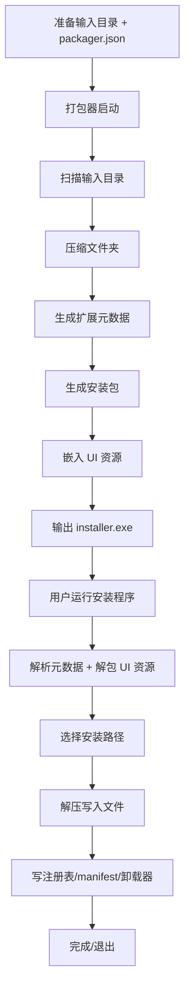
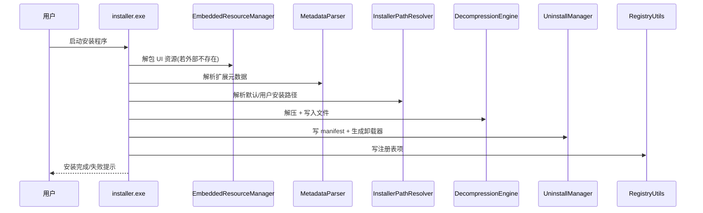
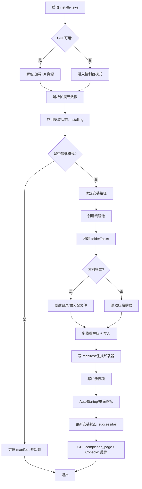
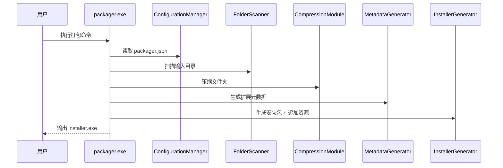
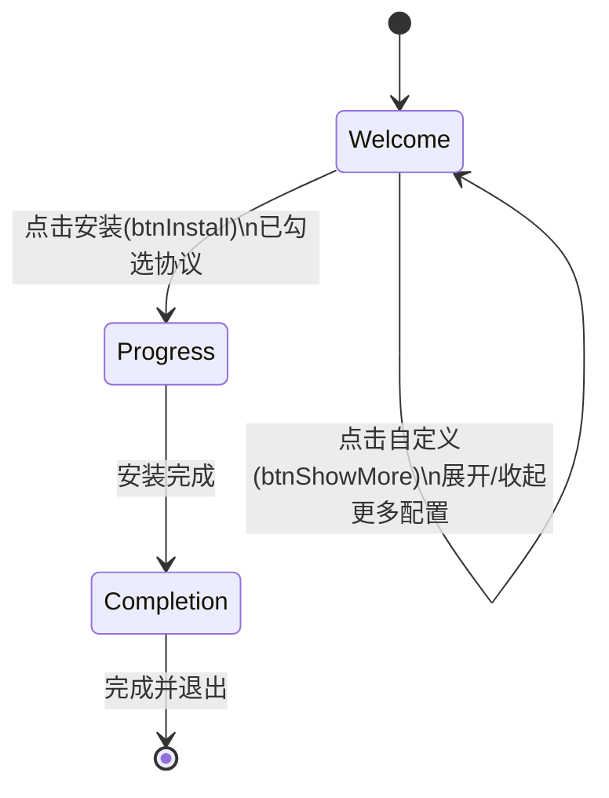

# 打包与安装业务流程梳理

本文档用于梳理本项目“打包器 + 安装器”的完整业务流程，覆盖配置、打包、资源嵌入、安装、卸载等关键环节，并标注核心代码入口，便于定位与维护。

## 1. 参与组件与入口

- 打包器入口：`src/packager/main.cpp`
- 安装器入口：`src/installer/main.cpp`
- 元数据生成：`src/packager/metadata_generator.cpp`
- 安装包生成：`src/packager/installer_generator.cpp`
- 解压引擎：`src/installer/decompression_engine.cpp`
- GUI 入口：`src/gui/gui_manager.cpp`（仅 Windows 且 `GUI_ENABLED`）
- 资源嵌入/解包：`src/installer/embedded_resources.cpp`

## 1.1 总体流程图（Flowchart）



## 1.2 安装时序图（Sequence）



## 1.2.1 安装详细流程图（Flowchart）



## 1.3 打包时序图（Sequence）



## 1.4 GUI 页面流转图（State）



## 2. 配置与输入

### 2.1 packager.json
打包器读取 `packager.json`（或 `.packager.json`），用于配置应用名、默认安装路径、注册表写入等信息。

关键字段参考：`docs/configuration_reference.md`。

### 2.2 输入目录结构
打包器以输入目录为根，扫描子目录并构建“文件夹安装映射”。  
文件夹目标路径可由配置指定（如安装目录、`%AppData%` 等）。

## 3. 打包流程

入口：`src/packager/main.cpp`

1) 读取并校验配置（`ConfigurationManager`）  
2) 扫描输入目录（`FolderScanner`）  
3) 根据配置应用目标路径（`applyFolderTargets`）  
4) 逐文件夹压缩（`CompressionModule`）  
5) 生成扩展元数据（`MetadataGenerator::generateExtendedMetadata`）  
6) 写入安装包（`InstallerGenerator::generateInstaller`）  
   - 读取 installer 模板（默认 `build/Release/installer.exe`）  
   - 追加嵌入资源（UI XML、images、license 等）  
   - 写入元数据、压缩数据、DataLocator 结构  
7) （可选）写出独立数据包（`--data-out`）

### 3.1 产物结构
生成的安装包结构（逻辑）：

```
installer.exe
  ├─ 原始安装器可执行内容
  ├─ 扩展元数据（ExtendedMetadata）
  ├─ 压缩数据块
  └─ DataLocator + 结尾 magic
```

### 3.2 资源嵌入
打包器会把 `resources/skins`、`resources/images`、`resources/license.txt` 嵌入进安装包。  
资源清单由 `IMAGES_LIST` 存储，解包时用于枚举 images。

相关实现：
- 打包：`src/packager/installer_generator.cpp`
- 解包：`src/installer/embedded_resources.cpp`

## 4. 安装流程（Console / GUI 共用）

入口：`src/installer/main.cpp`

### 4.1 元数据加载
1) 解析嵌入的扩展元数据（`MetadataParser`）  
2) 校验元数据完整性  

### 4.2 安装状态标记
通过 InstallState 配置写入“正在安装”状态：
- 注册表/文件/双写
- 可选互斥锁（防止并发安装）

### 4.3 目标路径解析
使用 `InstallerPathResolver` 解析目标路径：
- 默认安装目录（含 `%ProgramFiles%` 等）
- 自动补齐应用名子目录
- 支持不同目标类型（INSTALL_DIRECTORY / APPDATA / PROGRAM_DATA 等）

### 4.4 解压与写入
核心路径：
- `DecompressionEngine` 执行解压（多线程）
- 对“索引分块模式”文件进行按块解压与写入
- 对“非索引模式”走 legacy 解压流

关键优化点：
1) 目录批量创建，避免重复创建  
2) 稀疏文件阈值（`SparseFileThresholdBytes`）  
3) 全局进度按总字节计算

### 4.5 安装后处理（GUI/Console统一逻辑）
1) 写入安装清单 manifest（用于卸载）  
2) 写注册表项（`Registry` 数组）  
3) 创建卸载程序（uninstall.exe）  
4) AutoStartup / DesktopIcons 等选项落地  
5) 更新安装状态为成功/失败  

## 5. GUI 安装流程

### 5.1 启动与资源
1) 如果找到外部 resources 目录则直接使用  
2) 否则从安装包中解包到 `%TEMP%\\MTInstaller_xxx\\`  
3) 设置 DuiLib 资源路径  

### 5.2 页面流转
1) welcome_page：选择目录 + 勾选协议  
2) progress_page：显示安装进度  
3) completion_page：安装结束  

### 5.3 关键控件行为
- `btnShowMore`：展开更多配置区（只改高度）  
- `btnSelectDir`：选择目录，自动补齐应用名  
- `chkAgree`：勾选后允许安装  
- `comboLanguageSelect`：依据系统语言设置默认选项  

## 6. 卸载流程

入口：`installer.exe --uninstall` 或 `uninstall.exe`

流程：
1) 读取 manifest（优先本地，后全局）  
2) 按 manifest 清理文件  
3) 清理注册表（若配置）  

相关实现：`src/installer/uninstall_manager.cpp`

## 7. 常见问题定位

- 资源加载失败：检查 `EmbeddedResourceManager` 是否解包成功，路径是否为 `skins` 根  
  - 入口：`src/installer/embedded_resources.cpp`  
  - UI 入口：`src/gui/gui_manager.cpp`  
- UI 白屏：确认 `main.xml` / `welcome_page.xml` 是否有效 XML  
- 进度不准：检查 `InstallationWorker` 中的全局进度计算  
- 注册表不写：检查 `Registry` 配置是否正确，install 流程是否走到 `applyRegistryEntries`

## 8. 推荐排查路径（按阶段）

1) 打包：`src/packager/*`  
2) 资源嵌入：`src/packager/installer_generator.cpp`  
3) 资源解包：`src/installer/embedded_resources.cpp`  
4) 安装路径：`src/installer/path_resolver.cpp`  
5) 解压写入：`src/installer/decompression_engine.cpp`  
6) UI 交互：`src/gui/gui_manager.cpp`  
7) 安装后处理：`src/gui/installation_worker.cpp` / `src/installer/uninstall_manager.cpp`
