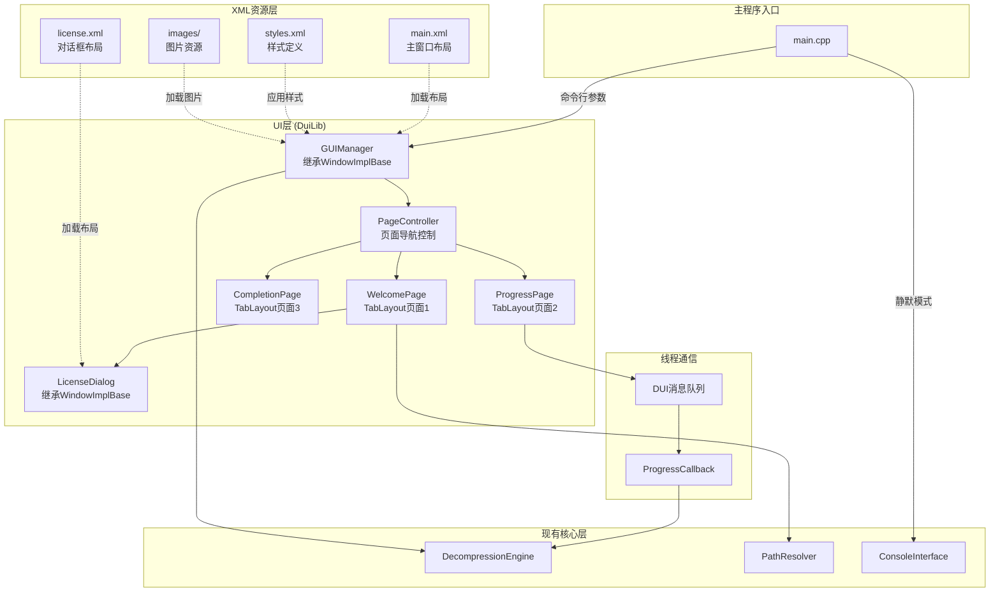
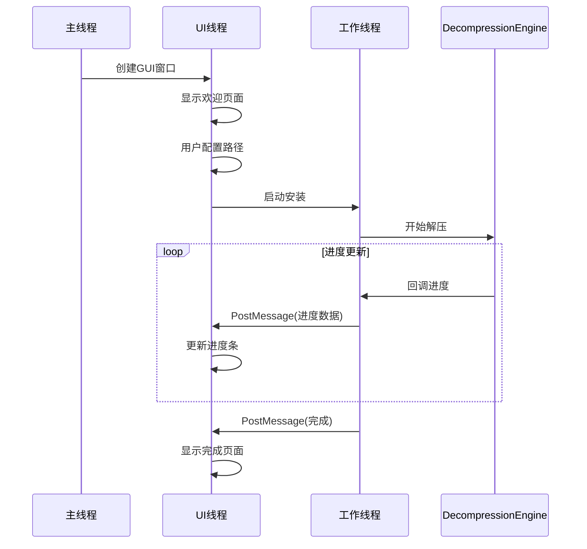

# 设计文档

## 概述

本设计文档描述了为现有C++多线程安装程序添加Windows原生GUI界面的技术实现方案。该GUI将使用Win32 API和Windows资源文件构建，提供三个主要页面（欢迎、进度、完成）和一个许可协议对话框。设计重点关注线程安全、与现有架构的无缝集成、以及通过资源文件实现UI与代码的分离。

核心设计原则：
- 使用Win32 API实现轻量级原生GUI
- UI线程与工作线程分离，确保响应性
- 所有UI资源定义在.rc文件中，支持独立修改
- 最小化对现有代码的修改
- 支持高DPI显示和现代Windows视觉风格

## 技术栈选择

### 选定方案：DuiLib + XML布局

**理由**：
1. **UI/代码完全分离**: 通过XML文件定义UI布局，修改界面无需重新编译C++代码
2. **现代化外观**: DirectUI架构支持复杂的视觉效果和动画
3. **轻量级**: 相比Qt等框架，DuiLib增加的体积较小（约1-2MB）
4. **灵活性**: 易于调整布局、颜色、字体等，适应未来需求变化
5. **国内生态**: 中文文档丰富，大量实际案例（360、QQ等安装程序）
6. **性能优秀**: DirectUI无句柄控件，渲染性能好

**技术组成**：
- **DuiLib框架**: 核心UI框架（选择DuiLib_Ultimate或Duilib_Faw分支）
- **XML布局文件**: 定义窗口、控件、样式
- **资源文件**: 图片、字体等资源
- **Win32 API**: 底层窗口管理和系统交互
- **GDI+**: 图形渲染后端

**选择的DuiLib分支**: DuiLib_Ultimate
- 活跃维护
- 支持现代C++特性
- 文档完善
- 社区支持好

### 备选方案分析

#### 方案1: Win32 API + 资源文件

**优点**：
- 零依赖，最轻量
- 原生性能
- 完全控制
- 使用Windows资源文件(.rc)

**缺点**：
- UI修改需要重新编译
- 实现现代化外观需要大量自定义绘制代码
- 布局调整困难
- 不适合频繁的UI迭代

**结论**: 不推荐。虽然轻量，但UI调整灵活性不足，不符合"方便未来调整UI"的需求。

#### 方案2: Windows Template Library (WTL)

**优点**：
- 轻量级C++包装器，封装Win32 API
- 提供更好的C++风格接口
- 仍然使用资源文件，保持UI/代码分离
- 无运行时依赖

**缺点**：
- 需要引入WTL头文件库
- 学习曲线（需要理解ATL/WTL模式）
- 社区活跃度较低
- 对于简单安装程序来说可能过度设计

**结论**: 不推荐。对于三页式简单UI，WTL的额外抽象层带来的收益有限，且仍然需要重新编译才能修改UI。

#### 方案3: wxWidgets

**优点**：
- 跨平台GUI框架
- 丰富的控件库
- 良好的文档和社区支持
- C++友好的API

**缺点**：
- 需要链接大型库（增加可执行文件大小约5-10MB）
- 不符合"轻量级"要求
- 跨平台特性对Windows-only项目无用
- 无法使用Windows资源文件（UI/代码分离困难）
- 学习曲线较陡

**结论**: 不推荐。违反了"轻量级"要求，且UI修改灵活性不如DuiLib。

#### 方案4: Qt

**优点**：
- 功能强大的跨平台框架
- 优秀的开发工具（Qt Designer）
- 丰富的控件和功能
- 良好的文档

**缺点**：
- 需要链接大型库（可执行文件大小显著增加）
- 需要Qt运行时DLL或静态链接
- 严重违反"轻量级"要求
- 使用QML或.ui文件，不是Windows资源文件
- 学习曲线陡峭
- 许可证问题（LGPL或商业许可）

**结论**: 不推荐。完全不符合项目要求，过于重量级。

#### 方案5: Dear ImGui

**优点**：
- 极其轻量级
- 即时模式GUI，代码简洁
- 易于集成

**缺点**：
- 主要用于工具和调试界面，不适合最终用户应用
- 需要渲染后端（DirectX/OpenGL）
- 外观不符合Windows原生风格
- 无法使用Windows资源文件
- 不适合传统的向导式界面

**结论**: 不推荐。不适合安装程序场景，外观不符合Windows原生风格。

#### 方案6: Windows Forms (C++/CLI)

**优点**：
- 可视化设计器
- .NET框架支持
- 事件驱动模型简单

**缺点**：
- 需要.NET Framework运行时
- C++/CLI混合托管代码，与现有纯C++代码集成复杂
- 性能开销
- 不符合"原生"要求
- 无法使用传统Windows资源文件

**结论**: 不推荐。引入.NET依赖不符合项目要求。

### 最终决策

**选择DuiLib + XML布局方案**，原因如下：

1. **满足核心需求**：
   - ✅ Windows原生（基于Win32）
   - ✅ 相对轻量（增加1-2MB）
   - ✅ UI/代码完全分离（XML布局）
   - ✅ 易于调整UI（修改XML无需重新编译）

2. **未来扩展性**：
   - 支持复杂的视觉效果和动画
   - 易于实现皮肤主题切换
   - 适应UI需求变化

3. **开发效率**：
   - 中文文档丰富
   - 大量实际案例可参考
   - XML布局直观易懂

4. **权衡考虑**：
   - 虽然引入了第三方库，但体积增加可接受
   - 虽然不是Windows资源文件，但XML提供了更好的灵活性
   - DirectUI的调试虽然相对困难，但对于简单UI影响有限

### DuiLib技术栈详细说明

**选择的DuiLib分支**: DuiLib_Ultimate (https://github.com/qdtroy/DuiLib_Ultimate)
- 基于原版DuiLib改进
- 支持C++11/14特性
- 活跃维护，bug修复及时
- 文档和示例完善

**核心组件**：
```cpp
// DuiLib核心头文件
#include "UIlib.h"
using namespace DuiLib;

// 需要链接的库
#pragma comment(lib, "DuiLib.lib")

// 依赖的Windows库
#pragma comment(lib, "comctl32.lib")
#pragma comment(lib, "GdiPlus.lib")
#pragma comment(lib, "Imm32.lib")
```

**XML布局文件结构**：
```xml
<?xml version="1.0" encoding="utf-8"?>
<Window size="600,450" caption="0,0,0,35">
    <Font name="微软雅黑" size="12"/>
    <VerticalLayout bkcolor="#FFFFFFFF">
        <!-- 标题栏 -->
        <HorizontalLayout height="35" bkcolor="#FF4A90E2">
            <Label text="安装向导" textcolor="#FFFFFFFF" font="1"/>
        </HorizontalLayout>
        
        <!-- 内容区域 -->
        <TabLayout name="pages">
            <!-- 欢迎页面 -->
            <VerticalLayout name="welcome_page">
                <!-- 控件定义 -->
            </VerticalLayout>
            
            <!-- 进度页面 -->
            <VerticalLayout name="progress_page">
                <!-- 控件定义 -->
            </VerticalLayout>
            
            <!-- 完成页面 -->
            <VerticalLayout name="completion_page">
                <!-- 控件定义 -->
            </VerticalLayout>
        </TabLayout>
    </VerticalLayout>
</Window>
```

**资源文件组织**：
```
resources/
├── skins/
│   ├── main.xml          # 主窗口布局
│   ├── license.xml       # 许可协议对话框布局
│   └── styles.xml        # 样式定义
├── images/
│   ├── logo.png          # 应用程序logo
│   ├── button_normal.png # 按钮背景
│   └── ...
└── fonts/
    └── custom.ttf        # 自定义字体（可选）
```

## 架构

### 整体架构图



### 线程模型



## 组件和接口

### 1. GUIManager类（继承DuiLib::WindowImplBase）

**职责**: 管理主窗口、页面导航和DuiLib初始化

**接口**:
```cpp
class GUIManager : public DuiLib::WindowImplBase {
public:
    GUIManager();
    virtual ~GUIManager();
    
    // 初始化并显示窗口
    void ShowWindow();
    
    // 设置安装配置
    void SetInstallConfig(const InstallConfig& config);
    
protected:
    // DuiLib虚函数重写
    virtual CDuiString GetSkinFolder() override;
    virtual CDuiString GetSkinFile() override;
    virtual LPCTSTR GetWindowClassName() const override;
    
    // 消息处理
    virtual void Notify(TNotifyUI& msg) override;
    virtual void InitWindow() override;
    virtual LRESULT HandleMessage(UINT uMsg, WPARAM wParam, LPARAM lParam) override;
    
private:
    CTabLayoutUI* m_pTabPages;          // 页面容器
    PageController* m_pPageController;   // 页面控制器
    InstallConfig m_config;              // 安装配置
    
    // 初始化控件
    void InitControls();
    
    // 处理按钮点击
    void OnInstallButtonClick();
    void OnCancelButtonClick();
    void OnBrowseButtonClick();
    void OnLicenseLinkClick();
    void OnFinishButtonClick();
};
```

### 2. PageController类

**职责**: 管理页面切换和状态

**接口**:
```cpp
enum class PageType {
    Welcome = 0,
    Progress = 1,
    Completion = 2
};

class PageController {
public:
    PageController(CTabLayoutUI* pTabLayout);
    ~PageController();
    
    // 导航到指定页面
    void NavigateToPage(PageType pageType);
    
    // 获取当前页面
    PageType GetCurrentPage() const;
    
    // 显示许可协议对话框
    bool ShowLicenseDialog(HWND hParent);
    
    // 启动安装过程
    void StartInstallation(const std::wstring& installPath, HWND hNotifyWindow);
    
    // 处理安装完成
    void OnInstallationComplete(bool success, const std::wstring& errorMsg);
    
    // 处理安装进度更新
    void OnProgressUpdate(const std::wstring& currentFolder, float progress);
    
private:
    CTabLayoutUI* m_pTabLayout;
    PageType m_currentPage;
    InstallationWorker* m_pWorker;
    
    // 应用页面切换动画
    void ApplyTransitionAnimation();
};
```

### 3. WelcomePage（通过XML定义，C++控制）

**职责**: 欢迎页面的业务逻辑

**XML布局示例**:
```xml
<VerticalLayout name="welcome_page" padding="20,20,20,20">
    <!-- Logo -->
    <Control name="app_logo" width="64" height="64" bkimage="logo.png"/>
    
    <!-- 应用名称和版本 -->
    <Label name="app_name" text="应用程序名称" font="2" textcolor="#FF333333"/>
    <Label name="app_version" text="版本 1.0.0" font="0" textcolor="#FF666666"/>
    
    <!-- 安装路径 -->
    <VerticalLayout height="80" padding="0,20,0,0">
        <Label text="安装路径:" height="20"/>
        <HorizontalLayout height="30">
            <Edit name="install_path" text="C:\Program Files\MyApp"/>
            <Button name="browse_button" text="浏览..." width="80"/>
        </HorizontalLayout>
        <Label name="disk_space_info" text="所需空间: 100 MB | 可用空间: 500 MB" height="20"/>
    </VerticalLayout>
    
    <!-- 许可协议 -->
    <CheckBox name="license_checkbox" text="我同意" height="25"/>
    <RichEdit name="license_link" text="&lt;a&gt;安装协议&lt;/a&gt;" height="25"/>
    
    <!-- 按钮 -->
    <HorizontalLayout height="35" padding="0,20,0,0">
        <Control/>  <!-- 弹簧 -->
        <Button name="install_button" text="安装" width="80" enabled="false"/>
        <Button name="cancel_button" text="取消" width="80"/>
    </HorizontalLayout>
</VerticalLayout>
```

**C++控制代码**:
```cpp
class WelcomePageController {
public:
    void Initialize(CPaintManagerUI* pManager);
    void UpdateDiskSpaceInfo(const std::wstring& path);
    void UpdateInstallButtonState();
    std::wstring GetInstallPath() const;
    bool IsLicenseAgreed() const;
    
private:
    CEditUI* m_pInstallPathEdit;
    CCheckBoxUI* m_pLicenseCheckbox;
    CButtonUI* m_pInstallButton;
    CLabelUI* m_pDiskSpaceLabel;
};
```

### 4. ProgressPage（通过XML定义，C++控制）

**职责**: 进度页面的业务逻辑

**XML布局示例**:
```xml
<VerticalLayout name="progress_page" padding="20,20,20,20">
    <!-- Logo和版本 -->
    <Control name="app_logo" width="64" height="64" bkimage="logo.png"/>
    <Label name="app_name" text="应用程序名称" font="2"/>
    <Label name="app_version" text="版本 1.0.0" font="0"/>
    
    <!-- 进度信息 -->
    <VerticalLayout padding="0,30,0,0">
        <Label name="current_folder" text="正在安装..." height="25"/>
        <Progress name="progress_bar" value="0" height="20"/>
        <HorizontalLayout height="25">
            <Label name="progress_percent" text="0%"/>
            <Control/>  <!-- 弹簧 -->
            <Label name="estimated_time" text="预计剩余时间: --:--"/>
        </HorizontalLayout>
    </VerticalLayout>
    
    <!-- 取消按钮 -->
    <HorizontalLayout height="35" padding="0,20,0,0">
        <Control/>
        <Button name="cancel_button" text="取消" width="80"/>
    </HorizontalLayout>
</VerticalLayout>
```

**C++控制代码**:
```cpp
class ProgressPageController {
public:
    void Initialize(CPaintManagerUI* pManager);
    void UpdateProgress(const std::wstring& folder, float percentage);
    void StartInstallation(const std::wstring& installPath);
    
private:
    CLabelUI* m_pCurrentFolderLabel;
    CProgressUI* m_pProgressBar;
    CLabelUI* m_pProgressPercentLabel;
    CLabelUI* m_pEstimatedTimeLabel;
    std::chrono::steady_clock::time_point m_startTime;
};
```

### 5. CompletionPage（通过XML定义，C++控制）

**职责**: 完成页面的业务逻辑

**XML布局示例**:
```xml
<VerticalLayout name="completion_page" padding="20,20,20,20">
    <!-- Logo和版本 -->
    <Control name="app_logo" width="64" height="64" bkimage="logo.png"/>
    <Label name="app_name" text="应用程序名称" font="2"/>
    <Label name="app_version" text="版本 1.0.0" font="0"/>
    
    <!-- 结果消息 -->
    <Label name="result_message" text="安装成功！" font="1" padding="0,30,0,0"/>
    
    <!-- 选项 -->
    <VerticalLayout padding="0,20,0,0">
        <CheckBox name="run_app_checkbox" text="立即运行应用程序" height="25"/>
        <CheckBox name="open_web_checkbox" text="打开介绍网页" height="25"/>
    </VerticalLayout>
    
    <!-- 完成按钮 -->
    <HorizontalLayout height="35" padding="0,20,0,0">
        <Control/>
        <Button name="finish_button" text="完成" width="80"/>
    </HorizontalLayout>
</VerticalLayout>
```

**C++控制代码**:
```cpp
class CompletionPageController {
public:
    void Initialize(CPaintManagerUI* pManager);
    void SetInstallationResult(bool success, const std::wstring& message);
    bool ShouldRunApplication() const;
    bool ShouldOpenWebPage() const;
    
private:
    CLabelUI* m_pResultMessageLabel;
    CCheckBoxUI* m_pRunAppCheckbox;
    CCheckBoxUI* m_pOpenWebCheckbox;
    bool m_installSuccess;
};
```

### 6. LicenseDialog类（继承DuiLib::WindowImplBase）

**职责**: 显示许可协议对话框

**接口**:
```cpp
class LicenseDialog : public DuiLib::WindowImplBase {
public:
    LicenseDialog();
    virtual ~LicenseDialog();
    
    // 显示对话框（模态）
    // 返回true表示用户同意，false表示不同意
    bool ShowModal(HWND hParent);
    
protected:
    // DuiLib虚函数重写
    virtual CDuiString GetSkinFolder() override;
    virtual CDuiString GetSkinFile() override;
    virtual LPCTSTR GetWindowClassName() const override;
    virtual void Notify(TNotifyUI& msg) override;
    virtual void InitWindow() override;
    
private:
    bool m_agreed;
    CRichEditUI* m_pLicenseText;
    
    // 加载许可协议文本
    std::wstring LoadLicenseText();
    
    // 处理按钮点击
    void OnAgreeButtonClick();
    void OnDisagreeButtonClick();
};
```

### 7. InstallationWorker类

**职责**: 在后台线程执行安装操作

**接口**:
```cpp
class InstallationWorker {
public:
    InstallationWorker(HWND hNotifyWindow);
    ~InstallationWorker();
    
    // 启动安装（在新线程中）
    void StartInstallation(const std::wstring& installPath);
    
    // 请求取消安装
    void RequestCancellation();
    
    // 检查是否正在运行
    bool IsRunning() const;
    
private:
    HWND m_hNotifyWindow;
    std::thread m_workerThread;
    std::atomic<bool> m_running;
    std::atomic<bool> m_cancellationRequested;
    
    // 工作线程函数
    void WorkerThreadFunc(const std::wstring& installPath);
    
    // 进度回调（从DecompressionEngine调用）
    static void ProgressCallback(const std::string& folder, float progress, void* userData);
    
    // 发送进度消息到UI线程（使用DUI消息）
    void PostProgressMessage(const std::wstring& folder, float progress);
    
    // 发送完成消息到UI线程
    void PostCompletionMessage(bool success, const std::wstring& errorMsg);
};
```

### 8. 自定义DUI消息

```cpp
// 自定义消息定义
#define WM_INSTALLATION_PROGRESS (WM_USER + 1)
#define WM_INSTALLATION_COMPLETE (WM_USER + 2)

// 进度消息数据结构
struct ProgressMessageData {
    wchar_t currentFolder[MAX_PATH];
    float percentage;
};

// 完成消息数据结构
struct CompletionMessageData {
    bool success;
    wchar_t errorMessage[512];
};
```

## 数据模型

### InstallConfig结构

```cpp
struct InstallConfig {
    std::wstring applicationName;      // 应用程序名称
    std::wstring version;               // 版本号
    std::wstring defaultInstallPath;    // 默认安装路径
    std::wstring logoResourceId;        // Logo资源ID
    std::wstring licenseText;           // 许可协议文本
    std::wstring webPageUrl;            // 介绍网页URL
    std::wstring executableName;        // 可执行文件名（用于启动）
    uint64_t requiredDiskSpace;         // 所需磁盘空间（字节）
};
```

### PageState枚举

```cpp
enum class PageState {
    Welcome,      // 欢迎页面
    Progress,     // 进度页面
    Completion    // 完成页面
};
```

### InstallationResult结构

```cpp
struct InstallationResult {
    bool success;                    // 是否成功
    std::wstring errorMessage;       // 错误消息（如果失败）
    std::wstring installedPath;      // 实际安装路径
    std::chrono::seconds duration;   // 安装耗时
};
```

## XML布局文件结构

### 主窗口布局 (main.xml)

```xml
<?xml version="1.0" encoding="utf-8"?>
<Window size="600,450" caption="0,0,0,35" roundcorner="5,5">
    <!-- 字体定义 -->
    <Font id="0" name="微软雅黑" size="12"/>
    <Font id="1" name="微软雅黑" size="16" bold="true"/>
    <Font id="2" name="微软雅黑" size="20" bold="true"/>
    
    <!-- 默认属性 -->
    <Default name="Button" normalimage="button_normal.png" hotimage="button_hover.png" 
             pushedimage="button_pushed.png" textcolor="#FFFFFFFF" font="0"/>
    
    <VerticalLayout bkcolor="#FFFFFFFF">
        <!-- 标题栏 -->
        <HorizontalLayout height="35" bkcolor="#FF4A90E2">
            <Control width="10"/>
            <Label name="title" text="安装向导" textcolor="#FFFFFFFF" font="1"/>
            <Control/>  <!-- 弹簧 -->
            <Button name="minbtn" width="28" height="22" normalimage="min.png"/>
            <Button name="closebtn" width="28" height="22" normalimage="close.png"/>
            <Control width="5"/>
        </HorizontalLayout>
        
        <!-- 内容区域 - 使用TabLayout切换页面 -->
        <TabLayout name="pages" padding="0,0,0,0">
            <!-- 页面将通过代码动态加载 -->
            <Include source="welcome_page.xml"/>
            <Include source="progress_page.xml"/>
            <Include source="completion_page.xml"/>
        </TabLayout>
    </VerticalLayout>
</Window>
```

### 欢迎页面布局 (welcome_page.xml)

```xml
<?xml version="1.0" encoding="utf-8"?>
<VerticalLayout name="welcome_page" padding="40,30,40,30">
    <!-- Logo -->
    <HorizontalLayout height="80">
        <Control/>
        <Control name="app_logo" width="64" height="64" bkimage="logo.png"/>
        <Control/>
    </HorizontalLayout>
    
    <!-- 应用名称和版本 -->
    <Label name="app_name" text="应用程序名称" font="2" textcolor="#FF333333" 
           align="center" height="30"/>
    <Label name="app_version" text="版本 1.0.0" font="0" textcolor="#FF666666" 
           align="center" height="25"/>
    
    <!-- 安装路径 -->
    <VerticalLayout height="100" padding="0,20,0,0">
        <Label text="安装路径:" height="25" textcolor="#FF333333"/>
        <HorizontalLayout height="30">
            <Edit name="install_path" text="C:\Program Files\MyApp" 
                  bkcolor="#FFF5F5F5" bordercolor="#FFCCCCCC" bordersize="1"/>
            <Control width="10"/>
            <Button name="browse_button" text="浏览..." width="80" height="30"/>
        </HorizontalLayout>
        <Control height="5"/>
        <Label name="disk_space_info" text="所需空间: 100 MB | 可用空间: 500 MB" 
               height="20" textcolor="#FF666666"/>
    </VerticalLayout>
    
    <!-- 许可协议 -->
    <HorizontalLayout height="30" padding="0,10,0,0">
        <CheckBox name="license_checkbox" text="我同意" width="80" height="25"/>
        <RichEdit name="license_link" text="&lt;a&gt;安装协议&lt;/a&gt;" 
                  height="25" width="100" readonly="true"/>
        <Control/>
    </HorizontalLayout>
    
    <!-- 弹簧 -->
    <Control/>
    
    <!-- 按钮 -->
    <HorizontalLayout height="35">
        <Control/>
        <Button name="install_button" text="安装" width="100" height="35" 
                enabled="false"/>
        <Control width="10"/>
        <Button name="cancel_button" text="取消" width="100" height="35"/>
    </HorizontalLayout>
</VerticalLayout>
```

### 进度页面布局 (progress_page.xml)

```xml
<?xml version="1.0" encoding="utf-8"?>
<VerticalLayout name="progress_page" padding="40,30,40,30">
    <!-- Logo -->
    <HorizontalLayout height="80">
        <Control/>
        <Control name="app_logo_progress" width="64" height="64" bkimage="logo.png"/>
        <Control/>
    </HorizontalLayout>
    
    <!-- 应用名称和版本 -->
    <Label name="app_name_progress" text="应用程序名称" font="2" 
           textcolor="#FF333333" align="center" height="30"/>
    <Label name="app_version_progress" text="版本 1.0.0" font="0" 
           textcolor="#FF666666" align="center" height="25"/>
    
    <!-- 进度信息 -->
    <VerticalLayout padding="0,40,0,0">
        <Label name="current_folder" text="正在准备安装..." height="30" 
               textcolor="#FF333333"/>
        <Control height="10"/>
        <Progress name="progress_bar" value="0" height="25" 
                  foreimage="progress_fore.png" bkimage="progress_bk.png"/>
        <Control height="10"/>
        <HorizontalLayout height="25">
            <Label name="progress_percent" text="0%" textcolor="#FF666666"/>
            <Control/>
            <Label name="estimated_time" text="预计剩余时间: 计算中..." 
                   textcolor="#FF666666"/>
        </HorizontalLayout>
    </VerticalLayout>
    
    <!-- 弹簧 -->
    <Control/>
    
    <!-- 取消按钮 -->
    <HorizontalLayout height="35">
        <Control/>
        <Button name="cancel_progress_button" text="取消" width="100" height="35"/>
    </HorizontalLayout>
</VerticalLayout>
```

### 完成页面布局 (completion_page.xml)

```xml
<?xml version="1.0" encoding="utf-8"?>
<VerticalLayout name="completion_page" padding="40,30,40,30">
    <!-- Logo -->
    <HorizontalLayout height="80">
        <Control/>
        <Control name="app_logo_completion" width="64" height="64" bkimage="logo.png"/>
        <Control/>
    </HorizontalLayout>
    
    <!-- 应用名称和版本 -->
    <Label name="app_name_completion" text="应用程序名称" font="2" 
           textcolor="#FF333333" align="center" height="30"/>
    <Label name="app_version_completion" text="版本 1.0.0" font="0" 
           textcolor="#FF666666" align="center" height="25"/>
    
    <!-- 结果消息 -->
    <Label name="result_message" text="安装成功！" font="1" textcolor="#FF4CAF50" 
           align="center" padding="0,30,0,0" height="40"/>
    
    <!-- 选项 -->
    <VerticalLayout padding="0,30,0,0">
        <CheckBox name="run_app_checkbox" text="立即运行应用程序" height="30"/>
        <Control height="10"/>
        <CheckBox name="open_web_checkbox" text="打开介绍网页" height="30"/>
    </VerticalLayout>
    
    <!-- 弹簧 -->
    <Control/>
    
    <!-- 完成按钮 -->
    <HorizontalLayout height="35">
        <Control/>
        <Button name="finish_button" text="完成" width="100" height="35"/>
    </HorizontalLayout>
</VerticalLayout>
```

### 许可协议对话框布局 (license.xml)

```xml
<?xml version="1.0" encoding="utf-8"?>
<Window size="500,400" caption="0,0,0,35" roundcorner="5,5">
    <Font id="0" name="微软雅黑" size="12"/>
    <Font id="1" name="微软雅黑" size="14" bold="true"/>
    
    <VerticalLayout bkcolor="#FFFFFFFF">
        <!-- 标题栏 -->
        <HorizontalLayout height="35" bkcolor="#FF4A90E2">
            <Control width="10"/>
            <Label text="许可协议" textcolor="#FFFFFFFF" font="1"/>
            <Control/>
            <Button name="closebtn" width="28" height="22" normalimage="close.png"/>
            <Control width="5"/>
        </HorizontalLayout>
        
        <!-- 协议文本 -->
        <VerticalLayout padding="20,20,20,20">
            <RichEdit name="license_text" vscrollbar="true" readonly="true" 
                      bkcolor="#FFF5F5F5" bordercolor="#FFCCCCCC" bordersize="1"/>
            
            <!-- 按钮 -->
            <HorizontalLayout height="40" padding="0,15,0,0">
                <Control/>
                <Button name="agree_button" text="同意" width="100" height="35"/>
                <Control width="10"/>
                <Button name="disagree_button" text="不同意" width="100" height="35"/>
            </HorizontalLayout>
        </VerticalLayout>
    </VerticalLayout>
</Window>
```

### 样式定义文件 (styles.xml)

```xml
<?xml version="1.0" encoding="utf-8"?>
<Styles>
    <!-- 按钮样式 -->
    <Style name="primary_button" normalimage="button_primary_normal.png" 
           hotimage="button_primary_hover.png" pushedimage="button_primary_pushed.png" 
           textcolor="#FFFFFFFF" font="0"/>
    
    <Style name="secondary_button" normalimage="button_secondary_normal.png" 
           hotimage="button_secondary_hover.png" pushedimage="button_secondary_pushed.png" 
           textcolor="#FF333333" font="0"/>
    
    <!-- 输入框样式 -->
    <Style name="edit_box" bkcolor="#FFFFFFFF" bordercolor="#FFCCCCCC" bordersize="1" 
           textpadding="5,5,5,5"/>
    
    <!-- 进度条样式 -->
    <Style name="progress" foreimage="progress_fore.png" bkimage="progress_bk.png"/>
</Styles>
```

### 资源文件组织结构

```
resources/
├── skins/
│   ├── main.xml              # 主窗口框架（标题栏 + TabLayout容器）
│   ├── welcome_page.xml      # 欢迎页面布局
│   ├── progress_page.xml     # 进度页面布局
│   ├── completion_page.xml   # 完成页面布局
│   ├── license.xml           # 许可协议对话框布局
│   └── styles.xml            # 样式定义
├── images/
│   ├── logo.png              # 应用程序logo (64x64)
│   ├── button_normal.png     # 按钮正常状态
│   ├── button_hover.png      # 按钮悬停状态
│   ├── button_pushed.png     # 按钮按下状态
│   ├── button_primary_normal.png
│   ├── button_primary_hover.png
│   ├── button_primary_pushed.png
│   ├── button_secondary_normal.png
│   ├── button_secondary_hover.png
│   ├── button_secondary_pushed.png
│   ├── progress_fore.png     # 进度条前景
│   ├── progress_bk.png       # 进度条背景
│   ├── min.png               # 最小化按钮图标
│   └── close.png             # 关闭按钮图标
├── fonts/
│   └── custom.ttf            # 自定义字体（可选）
└── license.txt               # 许可协议文本文件
```

### XML文件拆分的优势

1. **独立修改**: 每个页面可以单独编辑，不影响其他页面
2. **版本控制**: Git等版本控制系统可以更精确地跟踪每个页面的变更
3. **团队协作**: 不同开发者可以同时修改不同页面而不产生冲突
4. **按需加载**: 可以实现页面的延迟加载（虽然对于三页式UI不太必要）
5. **重用性**: 页面布局可以在其他项目中重用

### DuiLib Include标签说明

DuiLib支持使用`<Include>`标签引入外部XML文件：

```xml
<!-- 在main.xml中 -->
<TabLayout name="pages">
    <Include source="welcome_page.xml"/>
    <Include source="progress_page.xml"/>
    <Include source="completion_page.xml"/>
</TabLayout>
```

这样DuiLib会自动加载并解析引用的XML文件，将其内容插入到当前位置。

### XML控件命名约定

为了便于在C++代码中查找和操作控件，使用以下命名约定：

- **页面容器**: `{page_name}_page` (如 `welcome_page`, `progress_page`)
- **按钮**: `{action}_button` (如 `install_button`, `cancel_button`)
- **标签**: `{content}_label` 或直接描述性名称 (如 `app_name`, `current_folder`)
- **输入框**: `{purpose}_edit` 或 `{purpose}_path` (如 `install_path`)
- **复选框**: `{purpose}_checkbox` (如 `license_checkbox`)
- **进度条**: `progress_bar`
- **富文本**: `{purpose}_text` 或 `{purpose}_link` (如 `license_text`, `license_link`)

## 正确性属性

*属性是一个特征或行为，应该在系统的所有有效执行中保持为真——本质上是关于系统应该做什么的形式化陈述。属性作为人类可读规范和机器可验证正确性保证之间的桥梁。*

在编写正确性属性之前，让我先分析每个验收标准的可测试性：


### 正确性属性

属性 1: 线程安全的进度更新
*对于任何*进度数据（文件夹名称和百分比），当从工作线程发送时，UI线程应该正确接收并显示该数据，不会出现数据竞争或丢失
**验证需求: 1.3**

属性 2: 页面显示应用程序信息
*对于任何*安装配置（应用程序名称和版本），当页面显示时，应该包含配置中指定的名称和版本号
**验证需求: 2.3, 4.3, 5.4**

属性 3: 许可协议对话框打开
*对于任何*欢迎页面状态，当用户点击"安装协议"超链接时，应该打开许可协议对话框
**验证需求: 2.6, 3.1**

属性 4: 磁盘空间验证
*对于任何*安装路径和所需空间，当可用空间小于所需空间时，安装按钮应该被禁用并显示警告
**验证需求: 2.13**

属性 5: 安装按钮启用条件
*对于任何*欢迎页面状态，安装按钮应该仅在许可协议被同意且磁盘空间充足时启用
**验证需求: 2.14, 2.15**

属性 6: 许可协议文本显示
*对于任何*许可协议配置，对话框应该显示完整的协议文本内容
**验证需求: 3.2**

属性 7: 同意按钮效果
*对于任何*许可协议对话框，当用户点击"同意"按钮时，对话框应该关闭且欢迎页面的复选框应该被自动选中
**验证需求: 3.5, 3.6**

属性 8: 不同意按钮效果
*对于任何*许可协议对话框，当用户点击"不同意"按钮时，对话框应该关闭且欢迎页面的复选框应该保持未选中状态
**验证需求: 3.7, 3.8**

属性 9: 模态对话框行为
*对于任何*许可协议对话框，当对话框打开时，用户应该无法与主窗口交互直到对话框关闭
**验证需求: 3.9**

属性 10: 页面导航到进度页
*对于任何*欢迎页面状态，当用户点击"安装"按钮时，应该导航到进度页面并启动安装过程
**验证需求: 4.1**

属性 11: 进度更新反映
*对于任何*来自DecompressionEngine的进度回调，进度页面应该更新显示当前文件夹名称和进度百分比
**验证需求: 4.5, 4.6, 4.7**

属性 12: 进度范围约束
*对于任何*进度更新，显示的百分比应该在0%到100%的范围内
**验证需求: 4.6**

属性 13: 安装完成导航
*对于任何*安装结果（成功或失败），当安装完成时，应该导航到完成页面并显示相应的结果消息
**验证需求: 5.1, 5.2**

属性 14: 应用程序启动
*对于任何*成功的安装，当用户选中"立即运行应用程序"并点击"完成"时，应该启动已安装的应用程序
**验证需求: 5.9**

属性 15: 网页打开
*对于任何*成功的安装，当用户选中"打开介绍网页"并点击"完成"时，应该在默认浏览器中打开指定的URL
**验证需求: 5.10**

属性 16: 错误消息显示
*对于任何*错误情况，应该显示包含错误描述的模态对话框
**验证需求: 7.1**

属性 17: 页面状态机
*对于任何*页面导航序列，状态转换应该遵循：欢迎 → 进度 → 完成的顺序，不允许跳过或回退
**验证需求: 8.1, 8.2**

属性 18: 键盘快捷键响应
*对于任何*页面状态，当用户按下定义的快捷键时，应该触发相应的按钮操作
**验证需求: 9.1, 9.2, 9.3**

## 错误处理

### 错误类型和处理策略

1. **路径验证错误**
   - 无效路径格式
   - 路径不存在且无法创建
   - 路径权限不足
   - 处理: 在欢迎页面显示内联错误消息，禁用安装按钮

2. **磁盘空间错误**
   - 可用空间不足
   - 无法查询磁盘空间
   - 处理: 显示警告消息，禁用安装按钮

3. **安装过程错误**
   - 解压失败
   - 文件写入失败
   - 注册表操作失败
   - 处理: 停止安装，导航到完成页面显示错误详情，清理部分安装的文件

4. **用户取消**
   - 用户在进度页面点击取消
   - 处理: 显示确认对话框，如果确认则停止安装并清理

5. **资源加载错误**
   - 无法加载对话框模板
   - 无法加载字符串资源
   - 无法加载图标/位图
   - 处理: 使用默认值或降级显示，记录错误日志

6. **COM初始化错误**
   - COM库初始化失败
   - 处理: 禁用文件浏览对话框，仅允许手动输入路径

7. **线程通信错误**
   - 消息队列满
   - 消息发送失败
   - 处理: 重试发送，如果持续失败则记录错误但继续安装

### 错误恢复机制

```cpp
class ErrorHandler {
public:
    // 显示错误对话框
    static void ShowErrorDialog(HWND hParent, const std::wstring& message);
    
    // 显示警告对话框
    static void ShowWarningDialog(HWND hParent, const std::wstring& message);
    
    // 显示确认对话框
    static bool ShowConfirmDialog(HWND hParent, const std::wstring& message);
    
    // 记录错误到日志文件
    static void LogError(const std::wstring& context, const std::wstring& error);
    
    // 清理部分安装的文件
    static void CleanupPartialInstallation(const std::wstring& installPath);
};
```

## 测试策略

### 双重测试方法

本项目采用单元测试和属性测试相结合的方法，确保全面的代码覆盖和正确性验证。

**单元测试**用于验证：
- 特定的UI交互场景（如点击按钮、输入路径）
- 边界条件（如空路径、超长路径）
- 错误处理路径（如磁盘空间不足、权限错误）
- 资源加载和清理

**属性测试**用于验证：
- 通用的正确性属性（如进度范围、状态转换）
- 跨多种输入的行为一致性
- 线程安全性和并发正确性

### 测试框架选择

- **单元测试框架**: Google Test (gtest)
- **属性测试框架**: RapidCheck (C++的QuickCheck实现)
- **UI测试**: Windows UI Automation API

### 属性测试配置

每个属性测试应该：
- 运行最少100次迭代（由于随机化）
- 使用标签引用设计文档中的属性
- 标签格式: **Feature: installer-gui-interface, Property {number}: {property_text}**

### 测试组织

```
tests/
├── unit/
│   ├── test_gui_manager.cpp
│   ├── test_page_controller.cpp
│   ├── test_welcome_page.cpp
│   ├── test_progress_page.cpp
│   ├── test_completion_page.cpp
│   └── test_license_dialog.cpp
├── property/
│   ├── test_thread_safety.cpp
│   ├── test_page_navigation.cpp
│   ├── test_progress_updates.cpp
│   └── test_state_machine.cpp
└── integration/
    ├── test_full_installation_flow.cpp
    └── test_cancellation_flow.cpp
```

### 关键测试场景

1. **完整安装流程**
   - 启动 → 欢迎页面 → 同意协议 → 选择路径 → 安装 → 完成
   - 验证每个步骤的状态转换和数据传递

2. **取消流程**
   - 在欢迎页面取消
   - 在进度页面取消（安装进行中）
   - 验证清理操作

3. **错误场景**
   - 磁盘空间不足
   - 无效路径
   - 安装过程中的错误
   - 验证错误消息和恢复

4. **并发场景**
   - 多个进度更新同时到达
   - 用户在安装过程中快速点击
   - 验证线程安全和UI响应性

5. **资源加载**
   - 加载所有对话框模板
   - 加载所有字符串资源
   - 加载图标和位图
   - 验证资源ID正确性

### 模拟和测试辅助工具

```cpp
// 模拟DecompressionEngine用于测试
class MockDecompressionEngine {
public:
    void SimulateProgress(float progress, const std::string& folder);
    void SimulateError(const std::string& errorMsg);
    void SimulateCompletion();
};

// 测试辅助工具
class UITestHelper {
public:
    // 模拟按钮点击
    static void ClickButton(HWND hButton);
    
    // 模拟文本输入
    static void SetEditText(HWND hEdit, const std::wstring& text);
    
    // 模拟复选框切换
    static void ToggleCheckbox(HWND hCheckbox);
    
    // 获取控件文本
    static std::wstring GetControlText(HWND hControl);
    
    // 检查控件是否启用
    static bool IsControlEnabled(HWND hControl);
    
    // 等待窗口出现
    static bool WaitForWindow(const std::wstring& className, int timeoutMs);
};
```

## 实现注意事项

### DuiLib初始化

1. **应用程序入口**
   ```cpp
   int APIENTRY wWinMain(HINSTANCE hInstance, HINSTANCE, LPWSTR lpCmdLine, int nCmdShow) {
       // 初始化COM
       ::CoInitialize(NULL);
       
       // 初始化GDI+
       Gdiplus::GdiplusStartupInput gdiplusStartupInput;
       ULONG_PTR gdiplusToken;
       Gdiplus::GdiplusStartup(&gdiplusToken, &gdiplusStartupInput, NULL);
       
       // 设置资源路径
       CPaintManagerUI::SetInstance(hInstance);
       CPaintManagerUI::SetResourcePath(CPaintManagerUI::GetInstancePath() + _T("resources"));
       
       // 创建并显示主窗口
       GUIManager* pMainWnd = new GUIManager();
       pMainWnd->Create(NULL, _T("安装向导"), UI_WNDSTYLE_FRAME, 0);
       pMainWnd->CenterWindow();
       pMainWnd->ShowWindow();
       
       // 消息循环
       CPaintManagerUI::MessageLoop();
       
       // 清理
       delete pMainWnd;
       Gdiplus::GdiplusShutdown(gdiplusToken);
       ::CoUninitialize();
       
       return 0;
   }
   ```

2. **GUIManager实现**
   ```cpp
   class GUIManager : public WindowImplBase {
   protected:
       virtual CDuiString GetSkinFolder() override {
           return _T("skins\\");
       }
       
       virtual CDuiString GetSkinFile() override {
           return _T("main.xml");
       }
       
       virtual LPCTSTR GetWindowClassName() const override {
           return _T("InstallerMainWindow");
       }
       
       virtual void Notify(TNotifyUI& msg) override {
           if (msg.sType == _T("click")) {
               if (msg.pSender->GetName() == _T("install_button")) {
                   OnInstallButtonClick();
               }
               else if (msg.pSender->GetName() == _T("browse_button")) {
                   OnBrowseButtonClick();
               }
               // ... 其他按钮处理
           }
           else if (msg.sType == _T("selectchanged")) {
               if (msg.pSender->GetName() == _T("license_checkbox")) {
                   UpdateInstallButtonState();
               }
           }
           else if (msg.sType == _T("link")) {
               if (msg.pSender->GetName() == _T("license_link")) {
                   OnLicenseLinkClick();
               }
           }
       }
       
       virtual void InitWindow() override {
           // 获取控件指针
           m_pTabPages = static_cast<CTabLayoutUI*>(m_PaintManager.FindControl(_T("pages")));
           m_pInstallPathEdit = static_cast<CEditUI*>(m_PaintManager.FindControl(_T("install_path")));
           m_pLicenseCheckbox = static_cast<CCheckBoxUI*>(m_PaintManager.FindControl(_T("license_checkbox")));
           m_pInstallButton = static_cast<CButtonUI*>(m_PaintManager.FindControl(_T("install_button")));
           
           // 初始化页面控制器
           m_pPageController = new PageController(m_pTabPages);
           
           // 加载配置
           LoadInstallConfig();
           
           // 更新UI
           UpdateDiskSpaceInfo();
       }
   };
   ```

### 高DPI支持

1. **应用程序清单**
   ```xml
   <?xml version="1.0" encoding="UTF-8" standalone="yes"?>
   <assembly xmlns="urn:schemas-microsoft-com:asm.v1" manifestVersion="1.0">
     <application xmlns="urn:schemas-microsoft-com:asm.v3">
       <windowsSettings>
         <dpiAware xmlns="http://schemas.microsoft.com/SMI/2005/WindowsSettings">true</dpiAware>
         <dpiAwareness xmlns="http://schemas.microsoft.com/SMI/2016/WindowsSettings">PerMonitorV2</dpiAwareness>
       </windowsSettings>
     </application>
     <dependency>
       <dependentAssembly>
         <assemblyIdentity
           type="win32"
           name="Microsoft.Windows.Common-Controls"
           version="6.0.0.0"
           processorArchitecture="*"
           publicKeyToken="6595b64144ccf1df"
           language="*"/>
       </dependentAssembly>
     </dependency>
   </assembly>
   ```

2. **DuiLib DPI处理**
   - DuiLib_Ultimate已内置DPI缩放支持
   - 确保在XML中使用相对单位
   - 图片资源使用高分辨率版本

### 线程安全

1. **使用PostMessage进行线程间通信**
   ```cpp
   // 从工作线程发送进度
   PostMessage(hUIWindow, WM_INSTALLATION_PROGRESS, 0, (LPARAM)pProgressData);
   
   // 在UI线程处理（HandleMessage中）
   case WM_INSTALLATION_PROGRESS:
       ProgressMessageData* pData = (ProgressMessageData*)lParam;
       UpdateProgressUI(pData);
       delete pData;
       break;
   ```

2. **避免直接访问UI控件**
   - 工作线程不应直接调用任何DuiLib控件方法
   - 所有UI更新必须通过消息队列

### XML布局调试技巧

1. **使用DuiLib的调试工具**
   - 启用DuiLib的调试模式查看控件边界
   - 使用DuiDesigner可视化编辑XML

2. **热重载XML**
   ```cpp
   // 开发时可以添加热重载功能
   void GUIManager::ReloadSkin() {
       m_PaintManager.ReloadSkin();
   }
   ```

3. **控件查找调试**
   ```cpp
   CControlUI* pControl = m_PaintManager.FindControl(_T("control_name"));
   if (!pControl) {
       MessageBox(NULL, _T("控件未找到"), _T("错误"), MB_OK);
   }
   ```

### 资源管理

1. **图片资源优化**
   - 使用PNG格式支持透明度
   - 为不同DPI准备多套图片（@1x, @2x）
   - 压缩图片减小体积

2. **字体资源**
   ```cpp
   // 在InitWindow中添加自定义字体
   m_PaintManager.AddFont(_T("custom.ttf"), _T("CustomFont"), 12);
   ```

3. **许可协议文本加载**
   ```cpp
   std::wstring LoadLicenseText() {
       std::wifstream file(L"resources/license.txt");
       std::wstringstream buffer;
       buffer << file.rdbuf();
       return buffer.str();
   }
   ```

### 与现有代码集成

1. **最小化修改main.cpp**
   ```cpp
   int main(int argc, char* argv[]) {
       // 解析命令行参数
       bool silentMode = HasArgument(argc, argv, "-s");
       
       if (silentMode) {
           // 使用现有的ConsoleInterface
           ConsoleInterface console;
           return RunConsoleInstallation(console);
       } else {
           // 使用新的GUI（转换为wWinMain）
           return wWinMain(GetModuleHandle(NULL), NULL, GetCommandLineW(), SW_SHOW);
       }
   }
   ```

2. **适配器模式**
   ```cpp
   // 将现有的进度回调适配到GUI
   class GUIProgressAdapter {
   public:
       static void Callback(const std::string& folder, float progress, void* userData) {
           InstallationWorker* pWorker = static_cast<InstallationWorker*>(userData);
           pWorker->PostProgressMessage(
               std::wstring(folder.begin(), folder.end()), 
               progress
           );
       }
   };
   ```

### 性能优化

1. **减少重绘**
   ```cpp
   // 批量更新UI时暂停重绘
   m_PaintManager.SetPainting(false);
   // ... 更新多个控件
   m_PaintManager.SetPainting(true);
   m_PaintManager.Invalidate();
   ```

2. **异步加载资源**
   - 在后台线程加载大图片
   - 使用占位符显示加载状态

3. **进度更新节流**
   ```cpp
   // 限制进度更新频率（如每100ms更新一次）
   auto now = std::chrono::steady_clock::now();
   if (now - m_lastUpdateTime > std::chrono::milliseconds(100)) {
       UpdateProgressBar(progress);
       m_lastUpdateTime = now;
   }
   ```

## 部署考虑

### 文件结构

```
installer/
├── installer.exe           # 主可执行文件
├── installer.exe.manifest  # 应用程序清单
├── DuiLib.dll              # DuiLib动态库（如果使用动态链接）
└── resources/
    ├── skins/
    │   ├── main.xml
    │   ├── license.xml
    │   └── styles.xml
    ├── images/
    │   ├── logo.png
    │   ├── button_*.png
    │   ├── progress_*.png
    │   └── ...
    └── license.txt
```

### 静态链接 vs 动态链接

**动态链接DuiLib**:
- 优点: 可执行文件较小
- 缺点: 需要分发DuiLib.dll

**静态链接DuiLib**:
- 优点: 单一可执行文件，无DLL依赖
- 缺点: 可执行文件较大（增加约1-2MB）
- 推荐: 对于安装程序，推荐静态链接以简化部署

### 构建配置

CMakeLists.txt静态链接配置：
```cmake
if(BUILD_GUI)
    # 使用静态库
    set(DUILIB_LIB ${CMAKE_SOURCE_DIR}/third_party/DuiLib_Ultimate/lib/DuiLib_static.lib)
    
    # 添加静态链接定义
    target_compile_definitions(installer PRIVATE 
        GUI_ENABLED
        UILIB_STATIC  # DuiLib静态链接标志
    )
    
    # 设置运行时库为静态链接
    set_property(TARGET installer PROPERTY
        MSVC_RUNTIME_LIBRARY "MultiThreaded$<$<CONFIG:Debug>:Debug>")
endif()
```

### 构建配置

CMakeLists.txt添加：
```cmake
# GUI选项
option(BUILD_GUI "Build with GUI support" ON)

if(BUILD_GUI)
    # 添加DuiLib包含目录
    include_directories(${CMAKE_SOURCE_DIR}/third_party/DuiLib_Ultimate/DuiLib)
    
    # 添加GUI源文件
    set(GUI_SOURCES
        src/gui/gui_manager.cpp
        src/gui/page_controller.cpp
        src/gui/welcome_page_controller.cpp
        src/gui/progress_page_controller.cpp
        src/gui/completion_page_controller.cpp
        src/gui/license_dialog.cpp
        src/gui/installation_worker.cpp
    )
    
    # 添加DuiLib库
    if(CMAKE_BUILD_TYPE MATCHES Debug)
        set(DUILIB_LIB ${CMAKE_SOURCE_DIR}/third_party/DuiLib_Ultimate/lib/DuiLib_d.lib)
    else()
        set(DUILIB_LIB ${CMAKE_SOURCE_DIR}/third_party/DuiLib_Ultimate/lib/DuiLib.lib)
    endif()
    
    # 链接Windows库和DuiLib
    target_link_libraries(installer
        ${DUILIB_LIB}
        comctl32.lib
        GdiPlus.lib
        Imm32.lib
        shell32.lib
        ole32.lib
    )
    
    # 添加预处理器定义
    target_compile_definitions(installer PRIVATE GUI_ENABLED)
    
    # 复制资源文件到输出目录
    add_custom_command(TARGET installer POST_BUILD
        COMMAND ${CMAKE_COMMAND} -E copy_directory
        ${CMAKE_SOURCE_DIR}/resources
        $<TARGET_FILE_DIR:installer>/resources
    )
    
    # 复制DuiLib DLL到输出目录（如果使用动态链接）
    if(CMAKE_BUILD_TYPE MATCHES Debug)
        add_custom_command(TARGET installer POST_BUILD
            COMMAND ${CMAKE_COMMAND} -E copy_if_different
            ${CMAKE_SOURCE_DIR}/third_party/DuiLib_Ultimate/bin/DuiLib_d.dll
            $<TARGET_FILE_DIR:installer>
        )
    else()
        add_custom_command(TARGET installer POST_BUILD
            COMMAND ${CMAKE_COMMAND} -E copy_if_different
            ${CMAKE_SOURCE_DIR}/third_party/DuiLib_Ultimate/bin/DuiLib.dll
            $<TARGET_FILE_DIR:installer>
        )
    endif()
endif()

# 设置C++标准
set(CMAKE_CXX_STANDARD 17)
set(CMAKE_CXX_STANDARD_REQUIRED ON)
```

### DuiLib集成步骤

1. **获取DuiLib_Ultimate**:
   ```bash
   git clone https://github.com/qdtroy/DuiLib_Ultimate.git third_party/DuiLib_Ultimate
   ```

2. **编译DuiLib**:
   - 打开 `third_party/DuiLib_Ultimate/DuiLib.sln`
   - 编译Debug和Release版本
   - 生成的库文件在 `lib/` 目录
   - 生成的DLL文件在 `bin/` 目录

3. **项目结构**:
   ```
   project/
   ├── third_party/
   │   └── DuiLib_Ultimate/
   │       ├── DuiLib/          # 头文件
   │       ├── lib/             # 静态库
   │       └── bin/             # DLL文件
   ├── resources/
   │   ├── skins/
   │   ├── images/
   │   └── license.txt
   ├── src/
   │   ├── gui/
   │   ├── installer/
   │   └── ...
   └── CMakeLists.txt
   ```

### 版本信息

在资源文件中包含版本信息：
```rc
VS_VERSION_INFO VERSIONINFO
FILEVERSION     1,0,0,0
PRODUCTVERSION  1,0,0,0
FILEFLAGSMASK   0x3fL
FILEFLAGS       0x0L
FILEOS          VOS_NT_WINDOWS32
FILETYPE        VFT_APP
FILESUBTYPE     VFT2_UNKNOWN
BEGIN
    BLOCK "StringFileInfo"
    BEGIN
        BLOCK "080404b0"
        BEGIN
            VALUE "CompanyName", "Your Company"
            VALUE "FileDescription", "Application Installer"
            VALUE "FileVersion", "1.0.0.0"
            VALUE "InternalName", "installer"
            VALUE "LegalCopyright", "Copyright (C) 2024"
            VALUE "OriginalFilename", "installer.exe"
            VALUE "ProductName", "Your Application"
            VALUE "ProductVersion", "1.0.0.0"
        END
    END
    BLOCK "VarFileInfo"
    BEGIN
        VALUE "Translation", 0x804, 1200
    END
END
```
