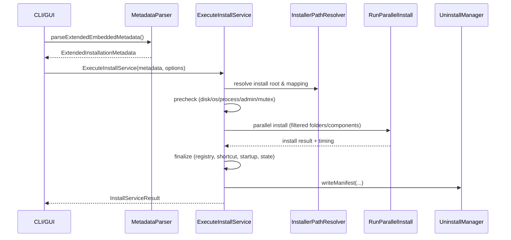
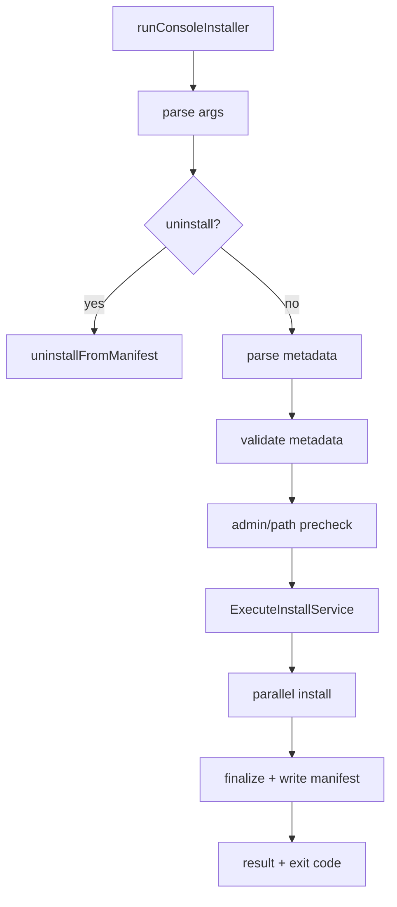

# Installer 详细设计文档

## 1. 设计目标与定位
`installer` 是安装执行端，负责读取打包器生成的内嵌元数据与压缩数据，完成安装/卸载流程。

目标：
- 同时支持 GUI 与 CLI 模式。
- 支持静默安装、打包期权限策略、路径映射、并行解压安装。
- 提供可回溯的安装清单（manifest）与卸载能力。

入口：
- `src/installer/main.cpp`

---

## 2. 总体架构
```mermaid
flowchart LR
    A[installer main] --> B[ConsoleInterface / GUIManager]
    A --> C[MetadataParser]
    A --> D[InstallService]

    D --> E[InstallerPathResolver]
    D --> F[RunParallelInstall]
    D --> G[RegistryUtils / InstallStateUtils]
    D --> H[UninstallManager(write manifest)]

    F --> I[DecompressionEngine]
    I --> J[TarStreamExtractor]
    I --> K[FileSystemOperator]
    I --> L[ThreadPoolManager]
```

### 2.1 关键模块职责
- `main.cpp`
  - 模式分发（GUI/CLI、install/uninstall、silent/debug）
  - 启动前置检查（元数据、资源）
- `MetadataParser`
  - 解析内嵌 metadata/data（或外置 data package）
- `InstallService`
  - 核心安装编排：预检、安装、收尾、状态持久化
- `installer_parallel_install`（`common/installer_parallel_install.*`）
  - 按目录/块执行解压与写入
- `DecompressionEngine`
  - LZMA 解压、块级校验、流式写入
- `InstallerPathResolver`
  - 环境变量展开、目标目录解析、路径标准化
- `UninstallManager`
  - manifest 写入/读取、反向卸载、清理与自删除
- GUI 子系统（`include/gui`, `src/gui`）
  - 页面控制、安装线程、进度事件、用户交互

---

## 3. 运行模式与入口行为

### 3.1 CLI 模式
触发条件：
- 非 GUI 构建，或传入 `--silent` 等参数，或 GUI 不可用回退。

入口函数：
- `runConsoleInstaller(...)` in `src/installer/main.cpp`

### 3.2 GUI 模式（Windows）
入口函数：
- `wWinMain(...)` in `src/installer/main.cpp`

特性：
- COM 初始化、DPI 感知设置
- 资源优先从内嵌资源解压目录加载；失败时尝试外部 `resources`
- 卸载模式复用 GUI 壳体

---

## 4. 安装主流程设计


### 4.1 阶段划分（InstallService）
实现：`src/installer/install_service.cpp`
- `Preparing`
- `Precheck`
  - 安装目录解析、磁盘空间检查、最低系统版本检查
  - 安装前进程处理（kill/retry）
  - 旧安装清理（可选）
  - 互斥锁保护
- `Installing`
  - 调用并行安装管线
  - 按配置过滤目录映射/组件选择
- `Finalizing`
  - 注册表写入
  - 开机启动/桌面图标
  - 写 uninstall 信息与安装 manifest
  - 更新 install state
- `Completed/Failed/Cancelled`

### 4.2 进度模型
- 内部按 phase 与 phaseProgress 计算 overallProgress。
- 对外统一通过 `InstallServiceEvent`（状态/进度/告警/错误）发送。

---

## 5. 数据解析与格式兼容

实现：`src/installer/metadata_parser.cpp`

能力：
- 从当前可执行文件尾部读取 `DataLocator` 定位 metadata/data。
- 支持读取外置 data package。
- 支持版本区间校验（`version >= 5 && version <= Constants::VERSION`）。
- 解析 `ExtendedInstallationMetadata`：
  - folder mappings
  - registry/install state
  - 组件配置（`ComponentConfig`）
  - UI 组件绑定配置（`UiComponentSelectionConfig`）

---

## 6. 解压与落盘设计

### 6.1 并行安装入口
- `RunParallelInstall(...)` in `common/installer_parallel_install.cpp`

功能：
- 根据映射生成目标目录
- 组织目录级安装任务
- 汇总每目录 timing

### 6.2 解压引擎
- `src/installer/decompression_engine.cpp`

能力：
- 支持 LZMA 块流解压
- CRC 校验
- 流式写出到 `StreamSink`，降低内存峰值

### 6.3 TAR 流提取
- `src/installer/tar_stream_extractor.cpp`

职责：
- 从打包器生成的顺序流还原文件（路径 + 文件内容）并写入目标目录。

---

## 7. 路径、权限与系统集成

### 7.1 路径解析
- `src/installer/path_resolver.cpp`
- 处理 `%ProgramFiles%`、`%AppData%` 等环境变量。
- 统一输出归一化路径。

### 7.2 权限模型
- 安装权限策略由打包器根据 `install.requireAdmin` 写入 installer exe 的 Windows application manifest。
- `install.requireAdmin=true` 时生成 `requireAdministrator`，`false` 时生成 `asInvoker`。
- 安装器运行时不再根据安装路径、注册表写入或 GUI 选择动态提权重启。
- 卸载流程仍保留运行时管理员检测；非管理员执行卸载时按现有逻辑尝试 `runas` 重启。

### 7.3 系统写入
- 注册表：`registry_utils.cpp`
- install state：`install_state_utils.cpp`
- manifest/uninstall 入口：`uninstall_manager.cpp`

---

## 8. 卸载流程设计
```mermaid
flowchart TD
    A[uninstall mode] --> B[locate manifest]
    B --> C[read manifest json]
    C --> D[delete installed files]
    D --> E[remove registry/startup/shortcut]
    E --> F[cleanup empty dirs]
    F --> G[schedule self-delete(optional)]
```

实现：
- `uninstallFromManifest(...)` in `src/installer/uninstall_manager.cpp`

manifest 来源优先级：
1. 本地同目录 manifest
2. 注册表记录路径
3. 默认安装路径推断
4. 内嵌 metadata 回退推断

---

## 9. GUI 资源加载策略

实现：`src/installer/main.cpp`, `src/installer/embedded_resources.cpp`

策略：
1. 优先读取安装器内嵌 UI 资源并解压至临时目录。
2. 若失败，回退读取外部 `resources`。
3. 可识别 `resources.zip` 或文件目录模式。
4. 资源缺失时弹窗提示，并在特定条件回退 CLI。

> 说明：当前分支的打包侧已经转向“必须内嵌 UI 资源”。安装端仍保留回退分支以兼容历史产物。

---

## 10. 关键流程图（CLI 安装）


---

## 11. 错误处理与退出码

- 统一在 `ConsoleInterface` 和 `InstallServiceEvent` 输出可读信息。
- 安装失败区分：
  - metadata 无效
  - 权限不足
  - 预检失败
  - 解压/写入失败
  - 收尾步骤失败
- CLI 返回值映射到 `INSTALLER_EXIT_*` 常量。

---

## 12. 关键源码索引

- 入口：`src/installer/main.cpp`
- 安装编排：`src/installer/install_service.cpp`
- 元数据解析：`src/installer/metadata_parser.cpp`
- 解压引擎：`src/installer/decompression_engine.cpp`
- 并行安装：`src/common/installer_parallel_install.cpp`
- 路径解析：`src/installer/path_resolver.cpp`
- 卸载管理：`src/installer/uninstall_manager.cpp`
- GUI 管理：`src/gui/gui_manager.cpp`
- GUI 安装线程：`src/gui/installation_worker.cpp`
