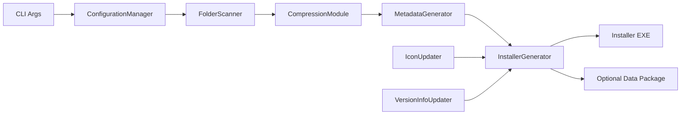
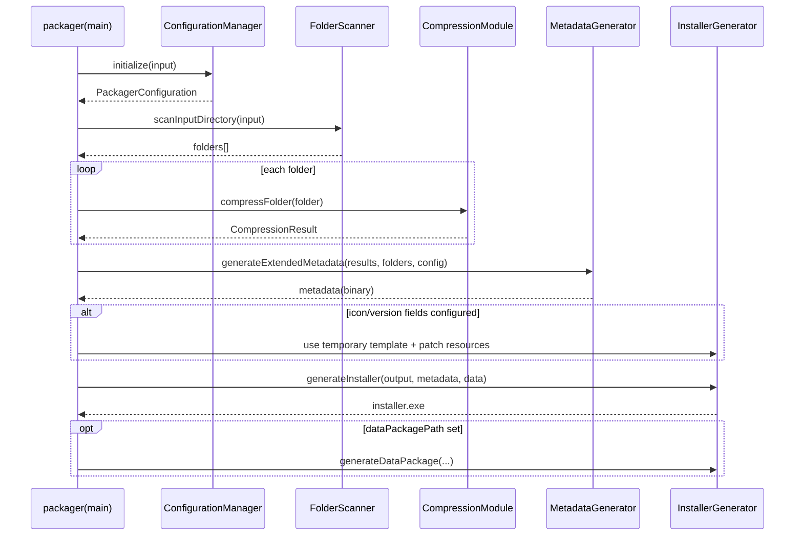

# Packager 详细设计文档

## 1. 设计目标与定位
`packager` 是离线构建工具，输入应用目录与 YAML 配置，输出自解压安装程序（SFX EXE，可选数据包）。

核心目标：
- 将输入目录结构转换为可安装的压缩载荷与元数据。
- 将载荷附加到安装器模板中，形成单文件安装器。
- 在打包阶段内嵌 UI 资源，避免运行时依赖外部 `resources`。

实现入口：
- `src/packager/main.cpp`

---

## 2. 总体架构


### 2.1 核心模块职责
- `ConfigurationLoader/Manager/Validator`
  - 读取并校验 `packager.yaml`。
  - 将配置映射到 `PackagerConfiguration`。
- `FolderScanner`
  - 扫描 `input` 下一级目录，形成 `FolderInfo` 列表。
- `CompressionModule`
  - 将每个目录打包为内部流并执行分块 LZMA 压缩。
- `MetadataGenerator`
  - 生成扩展元数据（目录映射、注册表、安装策略、块索引等）。
- `InstallerGenerator`
  - 装载安装器模板、内嵌 UI 资源、写入 metadata/data、生成最终 EXE。
- `IconUpdater` / `VersionInfoUpdater`
  - 在模板上修改图标和版本资源（Windows）。

---

## 3. 输入输出与数据模型

### 3.1 输入
- 命令行：`packager <input_directory> <output_file>`
- 配置文件：仅支持 YAML
  - `packager.yaml`
  - `.packager.yaml`
  - `packager.yml`
  - `.packager.yml`

### 3.2 输出
- 主产物：安装器可执行文件（SFX）
- 可选产物：数据包（`DataPackageHeader` + metadata + compressed data）

### 3.3 关键数据结构（`include/common/types.h`）
- `PackagerConfiguration`
- `FolderInfo`
- `CompressionResult`
- `ExtendedInstallationMetadata`
- `DataLocator`（安装器尾部定位结构）

---

## 4. 打包主流程（控制流）


步骤说明：
1. 参数校验（输入目录存在、输出目录存在）。
2. 配置加载与校验。
3. 扫描输入目录，构建 folder 列表。
4. 逐目录压缩，收集压缩结果与索引。
5. 生成并序列化扩展元数据。
6. 生成安装器（模板 + 内嵌 UI 资源 + metadata + data + locator + magic）。
7. 输出结果与统计信息。

---

## 5. 配置加载与校验设计
实现文件：
- `src/packager/configuration_loader.cpp`
- `src/packager/configuration_manager.cpp`
- `src/packager/configuration_validator.cpp`

策略：
- YAML-only：JSON 配置直接报错并提示迁移。
- `PACKAGER_CONFIG` 可覆盖默认查找路径（仅允许 `.yaml/.yml`）。
- 校验规则：
  - 必填字段（`Version`、`AppName`、`InstallDir`）
  - 目录映射目标合法性
  - 图标文件有效性
  - 注册表与安装状态配置一致性

---

## 6. 压缩与打包格式设计

### 6.1 压缩策略
实现文件：`src/packager/compression_module.cpp`
- 当前主算法：LZMA
- 过程：
  - 先将目录文件构造成顺序流（路径长度 + 文件长度 + 路径 + 文件内容）
  - 再按 `blockSize` 分块压缩
  - 生成 block index（offset/size/checksum）

### 6.2 元数据
实现文件：`src/packager/metadata_generator.cpp`
- `ExtendedInstallationMetadata` 包含：
  - 应用与安装选项
  - 目录映射
  - 注册表与 install state
  - 文件索引与块索引

### 6.3 SFX 输出布局
实现文件：`src/packager/installer_generator.cpp`
```text
[installer template bytes]
[serialized metadata]
[compressed folder payloads]
[DataLocator]
[end magic]
```

---

## 7. UI 资源内嵌策略（当前分支）

实现文件：`src/packager/installer_generator.cpp`

当前策略：
- 打包必须内嵌 UI 资源（embedded-only）。
- 资源目录必须可解析并存在（模板目录下 `resources`）。
- 若内嵌失败：打包直接失败，给出明确错误。
- 不再依赖外部 `output/resources` 作为运行时兜底。

资源来源解析：
- 优先 `templateResourceDirOverride`
- 否则基于模板目录与候选构建目录解析
- 避免将临时模板所在 `output` 误判为资源根

---

## 8. 错误处理与可观测性

- `main.cpp` 统一输出 `INFO/WARNING/ERROR`。
- `InstallerGenerator` 提供 `getLastError()` 将失败细节传回入口。
- 常见失败类型：
  - 配置文件缺失/格式错误
  - 输入目录结构异常
  - 压缩失败
  - 模板缺失
  - UI 资源内嵌失败

---

## 9. 扩展点

- 配置层：继续扩展 YAML schema（组件、流程）。
- 压缩层：新增算法或调整块策略。
- 元数据层：版本升级并保持安装端兼容解析。
- 模板层：替换 installer 模板或引入签名流程。

---

## 10. 关键源码索引

- 入口：`src/packager/main.cpp`
- 配置：`src/packager/configuration_loader.cpp`
- 校验：`src/packager/configuration_validator.cpp`
- 扫描：`src/packager/folder_scanner.cpp`
- 压缩：`src/packager/compression_module.cpp`
- 元数据：`src/packager/metadata_generator.cpp`
- 安装器生成：`src/packager/installer_generator.cpp`
- 图标更新：`src/packager/icon_updater.cpp`
- 版本信息更新：`src/packager/version_info_updater.cpp`
