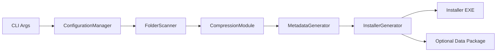

# Packager Detailed Design

## Design Goal

`packager.exe` is an offline build tool that converts a payload input directory plus a config directory into:
- a self-contained installer executable
- optionally an external data package

Current design constraints:
- YAML only
- `schemaVersion: 2` only
- no compatibility with old flat config schema
- no compatibility with old JSON config
- each top-level input folder is packaged as one standard folder payload

## High-Level Flow

## Core Modules

### ConfigurationLoader / ConfigurationManager / ConfigurationValidator

Responsibilities:
- load `packager.yaml` or `packager.yml` from the config directory
- require `schemaVersion: 2`
- parse the 6 top-level blocks
- validate required fields and references

Top-level config blocks:
- `app`
- `package`
- `install`
- `ui`
- `layout`
- `lifecycle`

### FolderScanner

Responsibilities:
- scan top-level folders from input directory
- return `FolderInfo` list

### CompressionModule

Responsibilities:
- thin façade around folder payload compression
- configure algorithm, level, and thread count
- compress one folder at a time

### FolderPayloadCompressor

Responsibilities:
- build the folder tar-like source stream
- compress the full stream into one payload
- support:
  - `XZ/LZMA2`
  - `ZSTD`

Important design point:
- no custom block metadata is generated
- no block split/combine logic exists in the current payload format

### MetadataGenerator

Responsibilities:
- generate package metadata from:
  - folder payload results
  - folder scan results
  - schema v2 config
- serialize metadata for installer consumption

### InstallerGenerator

Responsibilities:
- locate installer and uninstaller templates
- embed UI resources
- append metadata and payload data
- optionally create external data package

## Config Model

The old flat `PackagerConfiguration` was replaced with grouped config sections:

- `AppConfig`
- `PackageConfig`
- `PackagerInstallConfig`
- `UiConfig`
- `LayoutConfig`
- `LifecycleConfig`

This makes the loader and metadata generation path much easier to maintain and avoids mixing:
- product identity
- install defaults
- UI behavior
- physical layout
- lifecycle cleanup

## Packaging Format

### Current Folder Payload Model

For each top-level input folder:
- create one tar-like source stream
- compress it as one standard payload
- record payload metadata in `ExtendedFolderMapping`

Each payload records:
- folder name
- target path
- package offset
- compressed size
- original size
- checksum
- algorithm
- file index

### Removed Legacy Model

The current packager no longer emits:
- block index
- block header metadata
- block-level custom payload format

## Metadata Generation

Metadata includes:
- application name and identity
- directory name
- default install directory
- shortcut naming and localization
- install defaults
- registry writes
- component definitions
- UI component selection metadata
- lifecycle cleanup metadata
- folder payload mappings

Current source mapping examples:
- `config.app.name` -> installer metadata application name
- `config.install.defaultDir` -> metadata default install dir
- `config.layout.folders` -> extended folder mappings
- `config.layout.components` -> metadata components
- `config.lifecycle.registry.onInstall` -> install-time registry entries

## Validation Rules

The validator enforces:
- `schemaVersion == 2`
- required field presence
- valid compression algorithm
- valid icon path
- valid folder destination types
- valid component dependency graph
- component folder references must point to declared folder ids
- local installer paths remain inside install dir
- download installers use `https://` and valid SHA256

## Resource Embedding

The packager embeds:
- `resources.zip`
- `uninstaller.exe`

into the installer template.

The uninstaller template also embeds its own UI resources.

## Logging

Packager logs currently expose:
- selected compression algorithm
- compression level
- thread budget
- per-folder compression timing
- payload size summary
- installer generation progress

Terms are aligned to the current model:
- `folder payload`
- `XZ/LZMA2 payload`
- `payload read`
- `tar stream write`

## Build Notes

Key implementation files:
- [main.cpp](/e:/Work/GitHub/Multi-Threaded_Installer-master/src/packager/main.cpp)
- [configuration_loader.cpp](/e:/Work/GitHub/Multi-Threaded_Installer-master/src/packager/configuration_loader.cpp)
- [configuration_validator.cpp](/e:/Work/GitHub/Multi-Threaded_Installer-master/src/packager/configuration_validator.cpp)
- [configuration_manager.cpp](/e:/Work/GitHub/Multi-Threaded_Installer-master/src/packager/configuration_manager.cpp)
- [compression_module.cpp](/e:/Work/GitHub/Multi-Threaded_Installer-master/src/packager/compression_module.cpp)
- [folder_payload_compressor.cpp](/e:/Work/GitHub/Multi-Threaded_Installer-master/src/packager/folder_payload_compressor.cpp)
- [metadata_generator.cpp](/e:/Work/GitHub/Multi-Threaded_Installer-master/src/packager/metadata_generator.cpp)
- [installer_generator.cpp](/e:/Work/GitHub/Multi-Threaded_Installer-master/src/packager/installer_generator.cpp)
