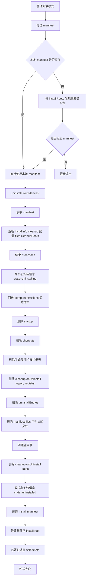

# 安装器流程图

本文档对应当前重构后的安装器与卸载器主流程。

主要入口：

- 安装器入口 [src/installer/installer_main.cpp](/e:/Work/GitHub/Multi-Threaded_Installer-master/src/installer/installer_main.cpp)
- 卸载器入口 [src/installer/uninstaller_main.cpp](/e:/Work/GitHub/Multi-Threaded_Installer-master/src/installer/uninstaller_main.cpp)
- 启动分发 [src/installer/launch_support.cpp](/e:/Work/GitHub/Multi-Threaded_Installer-master/src/installer/launch_support.cpp)
- 安装主服务 [src/installer/install_service.cpp](/e:/Work/GitHub/Multi-Threaded_Installer-master/src/installer/install_service.cpp)

## 主流程图

```mermaid
flowchart TD
    A[启动 installer.exe 或 uninstaller.exe] --> B[构建 LaunchContext]
    B --> C{判断正式启动模式}
    C -->|InstallGui| D1[进入图形安装]
    C -->|InstallSilent| D2[进入静默安装]
    C -->|UninstallGui| D3[进入图形卸载]
    C -->|UninstallSilent| D4[进入静默卸载]

    D1 --> E[读取 embedded metadata]
    D2 --> E
    E --> F{metadata 是否有效}
    F -->|否| F1[报错并退出]
    F -->|是| G[创建 InstallerPathResolver]
    G --> H[构建 InstallServiceOptions]
    H --> I[调用 ExecuteInstallService]

    I --> J[BuildInstallExecutionPlan]
    J --> J1[优先按 cleanup onUpgrade installRoots 发现已安装实例]
    J1 --> J2{是否发现当前用户已安装}
    J2 -->|否| J3[InstallTargetMode = FreshInstall]
    J2 -->|是| J4[InstallTargetMode = OverwriteInstall]
    J3 --> J5[确定 resolvedInstallRoot]
    J4 --> J5

    J5 --> K[ExecuteInstallPrecheck]
    K --> K1[系统版本检查]
    K1 --> K2[磁盘空间检查]
    K2 --> K3[按 install.useMutex 获取互斥体]
    K3 --> K4[按 killProcesses 检测或结束运行进程]
    K4 --> K5{预检查通过?}
    K5 -->|否| K6[写 install_failed 并退出]
    K5 -->|是| L[ExecuteInstallCleanup]

    L --> L1{模式是否为 OverwriteInstall}
    L1 -->|否| M[写核心安装信息 state=installing]
    L1 -->|是| L2[执行旧安装目录清理]
    L2 --> L3[执行 cleanup onUpgrade 显式系统清理]
    L3 --> M

    M --> N[ExecuteInstallExecution]
    N --> N1[按 selectedEmbeddedFolders 选择 payload]
    N1 --> N2[RunParallelInstall]
    N2 --> N3[直接使用 mapping.target 解析最终路径]
    N3 --> N4[解压 embedded folders]
    N4 --> N5[执行 local 或 download 组件安装]
    N5 --> N6[收集 installedRoots installedFiles componentActions rebootRequired]

    N6 --> O{执行成功?}
    O -->|否| O1[写 install_failed 并退出]
    O -->|是| P[ExecuteInstallFinalization]

    P --> P1[按 lifecycle registry onInstall 写扩展注册表]
    P1 --> P2[创建 auto startup]
    P2 --> P3[创建桌面和开始菜单快捷方式]
    P3 --> P4[提取 uninstall.exe]
    P4 --> P5[写 install manifest]
    P5 --> P6[写系统卸载入口]
    P6 --> P7[写核心安装信息 state=installed]
    P7 --> Q[返回安装结果]
```

## 卸载子流程图

## 当前业务规则

### 启动模式

当前只保留四种正式模式：

- 图形安装
- 静默安装
- 图形卸载
- 静默卸载

`--cleanup-self` 仅作为卸载内部自删除辅助参数存在，不再作为正式模式暴露。

### 安装模式

当前只保留两种安装模式：

- `FreshInstall`
- `OverwriteInstall`

判定规则：

- 通过 `cleanup.onUpgrade.installRoots` 发现有效已安装实例时进入 `OverwriteInstall`
- 否则进入 `FreshInstall`

### 静默安装门禁

静默安装规则：

- 未发现已安装实例：允许安装
- 发现已安装实例且当前包版本更高：允许覆盖安装
- 发现已安装实例且当前包版本不更高：拒绝安装

## 主要对应代码

- 启动模式分发  
  [src/installer/launch_support.cpp](/e:/Work/GitHub/Multi-Threaded_Installer-master/src/installer/launch_support.cpp)
- 安装实例发现  
  [src/installer/installed_instance_resolver.cpp](/e:/Work/GitHub/Multi-Threaded_Installer-master/src/installer/installed_instance_resolver.cpp)
- 安装计划构建  
  [src/installer/install_plan_builder.cpp](/e:/Work/GitHub/Multi-Threaded_Installer-master/src/installer/install_plan_builder.cpp)
- 安装服务编排  
  [src/installer/install_service.cpp](/e:/Work/GitHub/Multi-Threaded_Installer-master/src/installer/install_service.cpp)
- 覆盖安装清理  
  [src/installer/install_cleanup_executor.cpp](/e:/Work/GitHub/Multi-Threaded_Installer-master/src/installer/install_cleanup_executor.cpp)
- 显式升级清理  
  [src/installer/upgrade_cleanup.cpp](/e:/Work/GitHub/Multi-Threaded_Installer-master/src/installer/upgrade_cleanup.cpp)
- 卸载执行  
  [src/installer/uninstall_manager.cpp](/e:/Work/GitHub/Multi-Threaded_Installer-master/src/installer/uninstall_manager.cpp)
