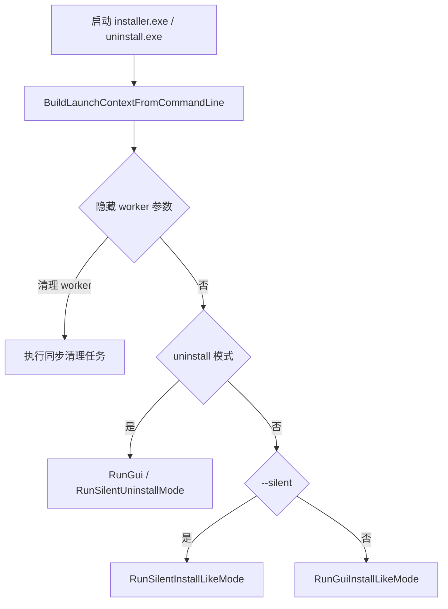
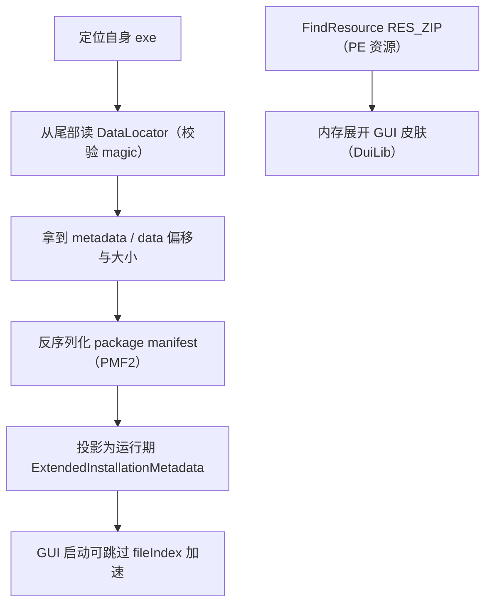
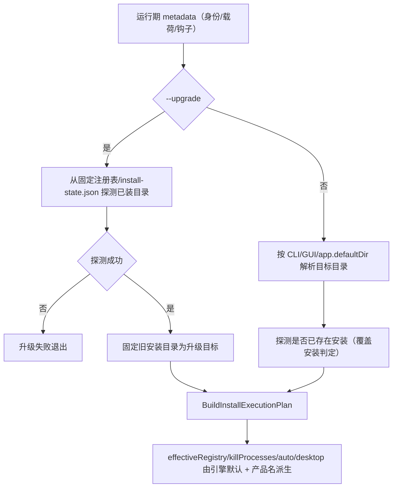
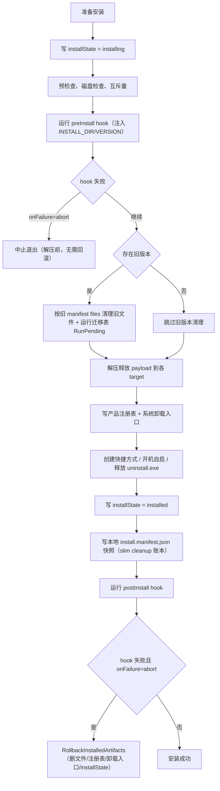
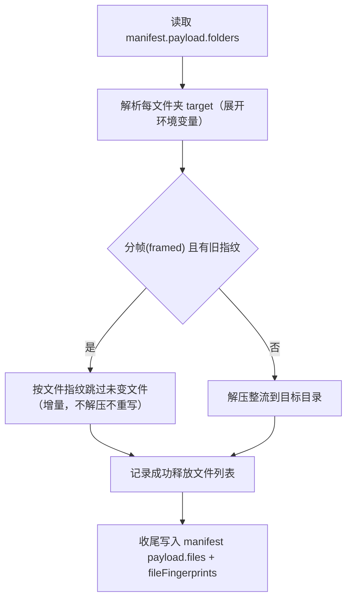
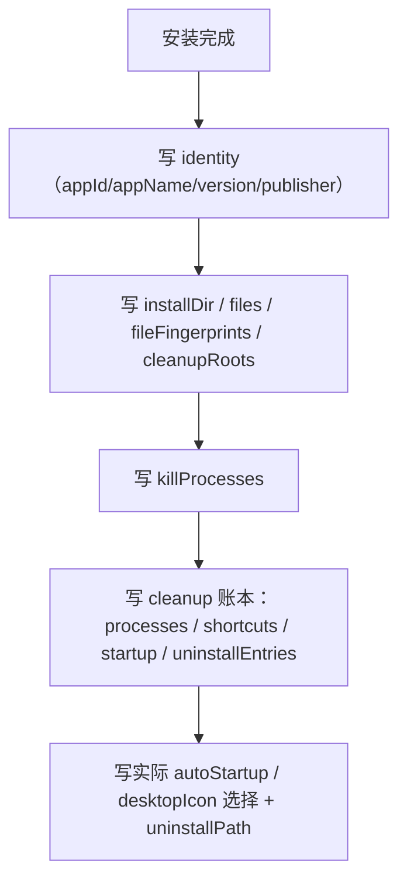
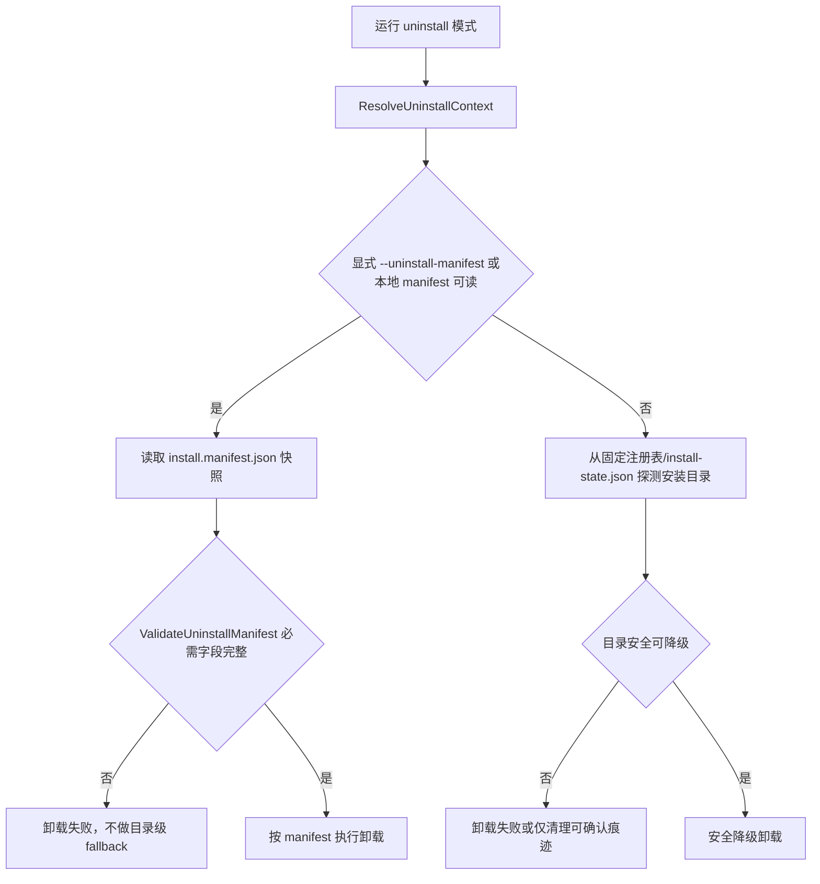
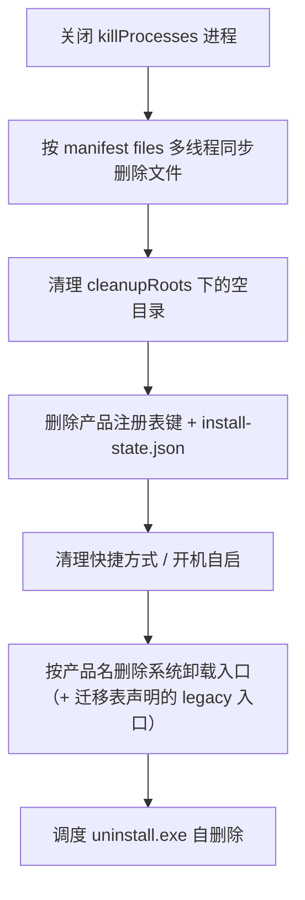

# 安装器流程图

本文档描述当前 manifest 驱动的安装、覆盖/升级、卸载流程。

「值/逻辑各归其位」重构后：内嵌的 package manifest 只携带 **身份 + 载荷 + 钩子**；安装行为默认值、清理规则、注册表、系统卸载入口由引擎写死；跨版本兼容走引擎迁移表（`src/installer/migration`）。配置写法见 [USER_GUIDE](USER_GUIDE.md)。

## 启动分发



## 读取内嵌数据



## 安装计划



## 安装执行



安装失败路径写 `installState = install_failed` 后返回失败。preInstall+abort 在解压前发生，无需回滚；postInstall+abort 触发完整回滚。

## Payload 释放



释放成功文件列表直接用于 `install.manifest.json`，避免收尾再次扫描整个安装目录。

## 本地 manifest 快照



manifest VERSION = 3（slim）。卸载只消费该快照；注册表与系统卸载入口的清理由引擎按产品名写死，不再记录注册表/路径名单。

## 卸载流程



## Manifest 卸载



卸载完成前同步等待清理结束，不使用后台 detached 删除。

## 主要代码索引

- 启动分发：[src/installer/app/launch_support.cpp](../src/installer/app/launch_support.cpp)
- 读取内嵌数据：[src/installer/payload/metadata_parser.cpp](../src/installer/payload/metadata_parser.cpp)、[src/common/package_manifest_codec.cpp](../src/common/package_manifest_codec.cpp)
- 安装计划：[src/installer/pipeline/install_plan_builder.cpp](../src/installer/pipeline/install_plan_builder.cpp)
- 安装执行：[src/installer/pipeline/install_service.cpp](../src/installer/pipeline/install_service.cpp)
- 安装收尾：[src/installer/pipeline/install_finalize.cpp](../src/installer/pipeline/install_finalize.cpp)
- hooks 执行：[src/installer/hooks/hook_runner.cpp](../src/installer/hooks/hook_runner.cpp)
- 跨版本迁移：[src/installer/migration/migration.cpp](../src/installer/migration/migration.cpp)
- manifest 快照：[src/installer/state/install_manifest_store.cpp](../src/installer/state/install_manifest_store.cpp)
- installState：[src/installer/state/install_state_store.cpp](../src/installer/state/install_state_store.cpp)
- 卸载：[src/installer/uninstall/uninstall_manager.cpp](../src/installer/uninstall/uninstall_manager.cpp)
- 清理执行器：[src/installer/pipeline/install_cleanup_executor.cpp](../src/installer/pipeline/install_cleanup_executor.cpp)
```
