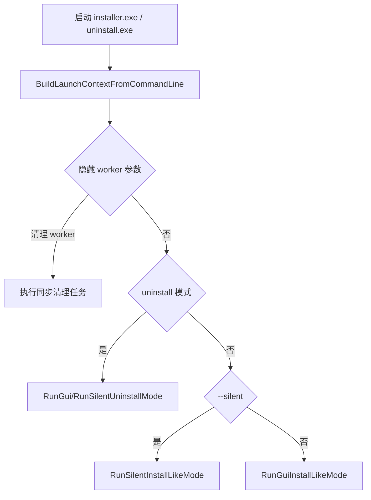
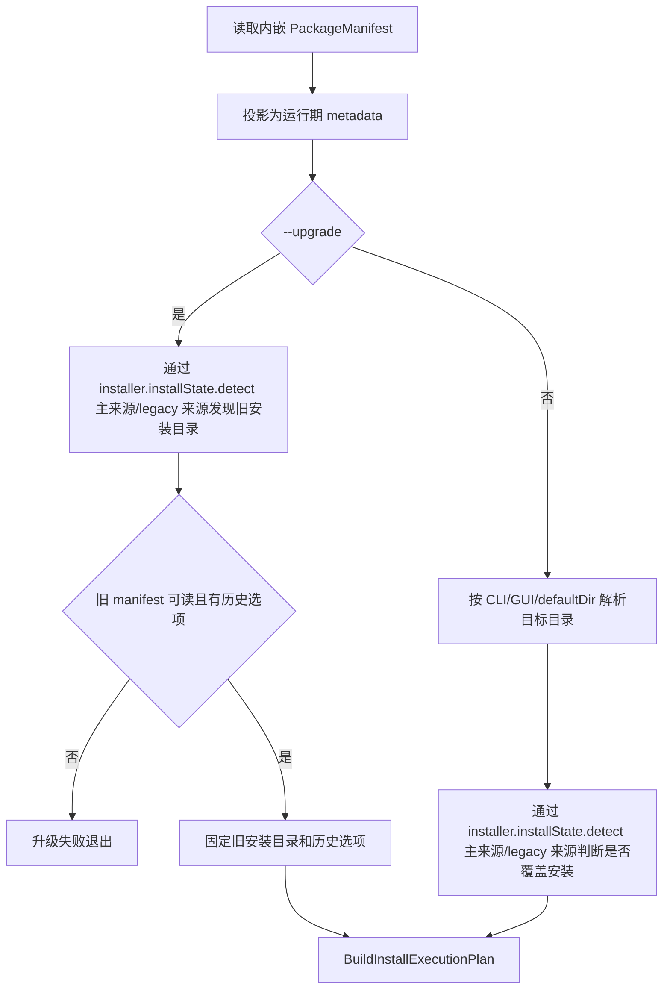
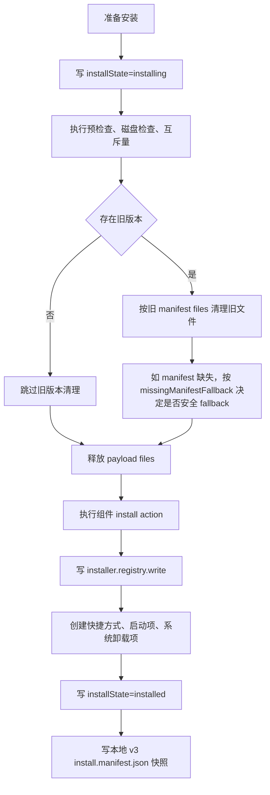
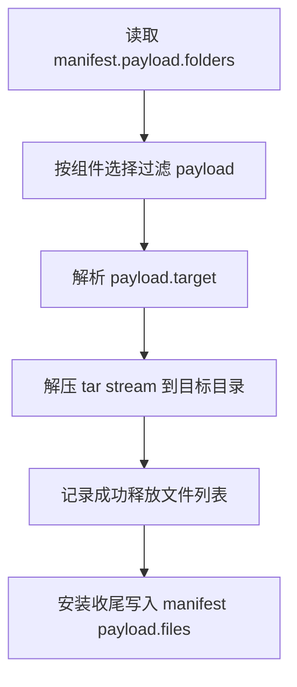
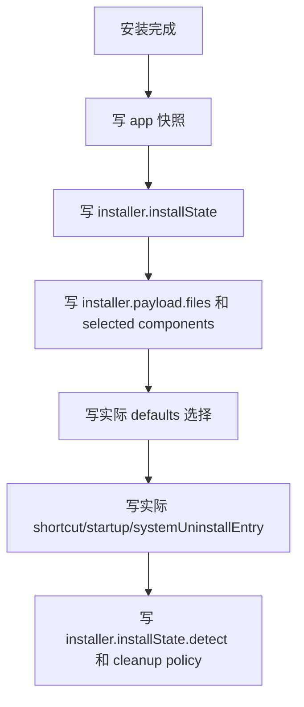
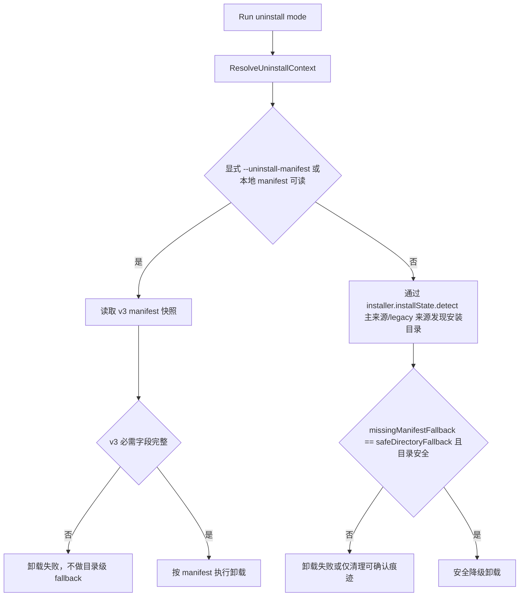
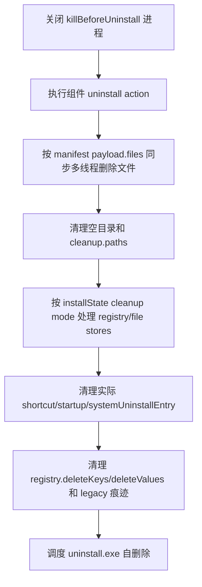

# 安装器流程图

本文档描述当前 v3 manifest 驱动的安装、覆盖/升级和卸载流程。

## 启动分发

## 安装计划

## 安装执行

安装失败路径会写 `installState=install_failed`，然后返回失败状态。

## Payload 释放

释放成功文件列表直接用于 `install.manifest.json`，避免安装收尾再次扫描整个安装目录。

## 本地 manifest 快照

卸载优先消费该快照；当前安装包 metadata 不再作为 manifest 可读卸载的主逻辑来源。

## 卸载流程

## Manifest 卸载

卸载完成前同步等待清理结束，不使用后台 detached 删除。

## 主要代码索引

- 启动分发：[src/installer/launch_support.cpp](../src/installer/launch_support.cpp)
- 安装计划：[src/installer/install_plan_builder.cpp](../src/installer/install_plan_builder.cpp)
- 安装执行：[src/installer/install_service.cpp](../src/installer/install_service.cpp)
- 安装收尾：[src/installer/install_finalize.cpp](../src/installer/install_finalize.cpp)
- manifest 快照：[src/installer/install_manifest_store.cpp](../src/installer/install_manifest_store.cpp)
- installState：[src/installer/install_state_store.cpp](../src/installer/install_state_store.cpp)
- 卸载：[src/installer/uninstall_manager.cpp](../src/installer/uninstall_manager.cpp)
- 清理执行器：[src/installer/install_cleanup_executor.cpp](../src/installer/install_cleanup_executor.cpp)
