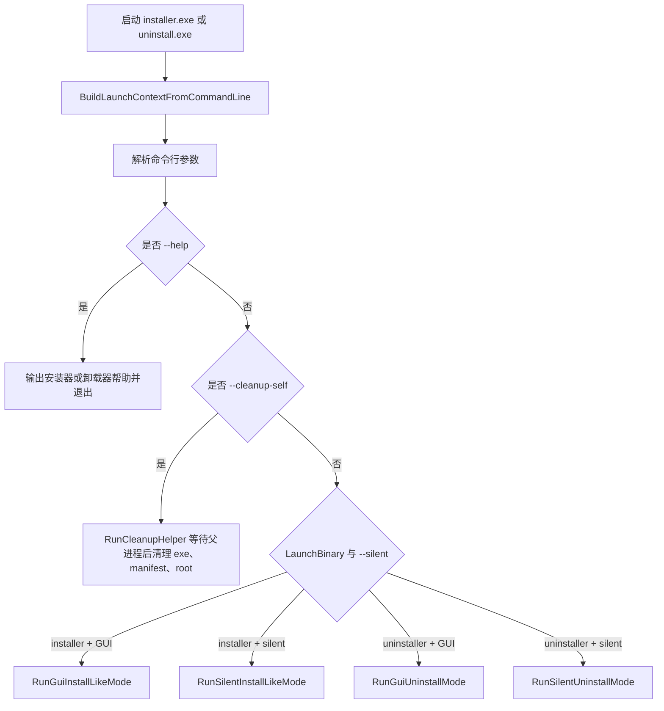
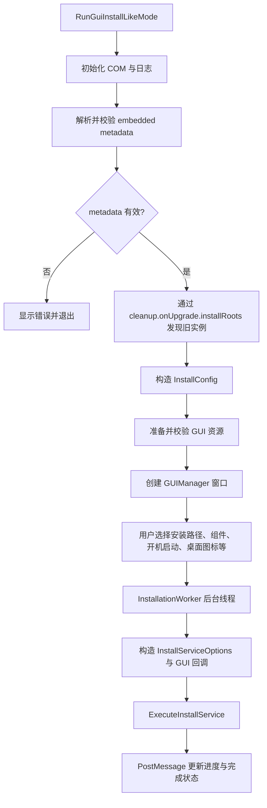
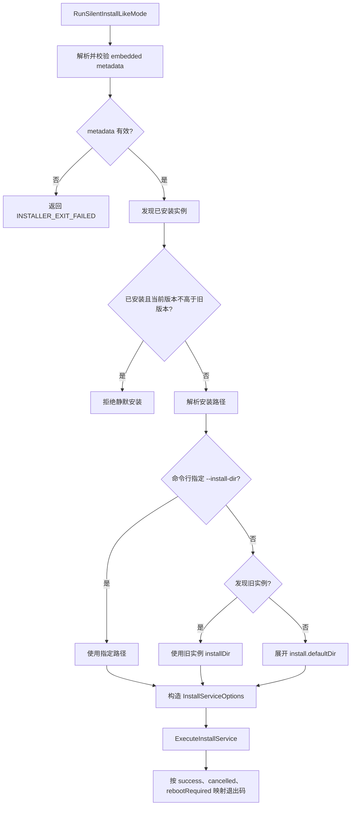
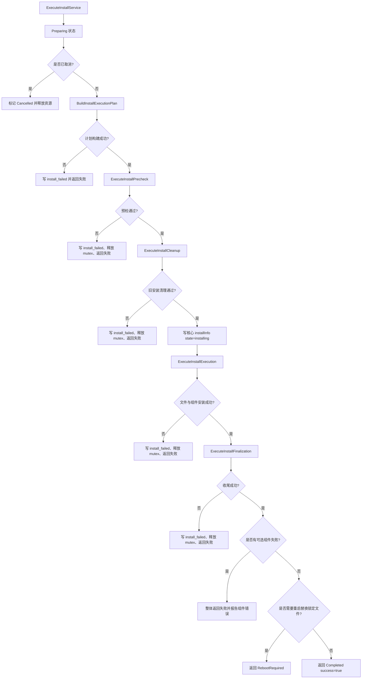
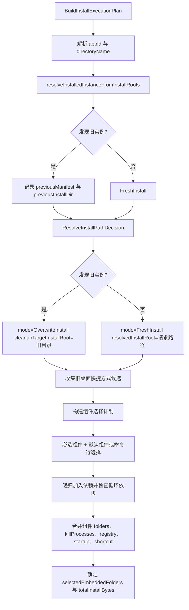
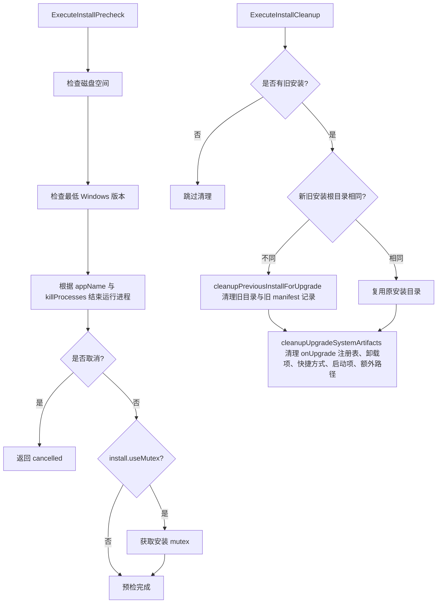
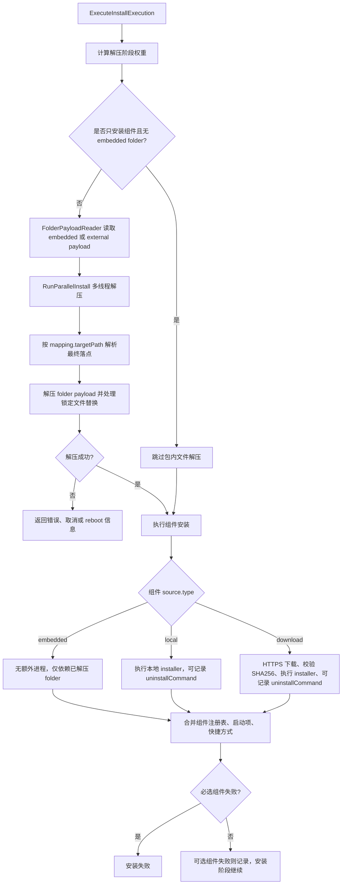
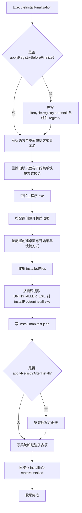
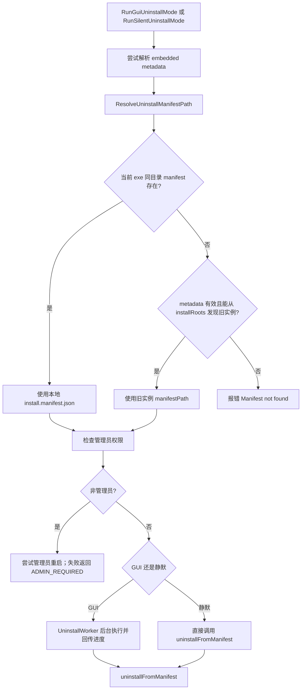
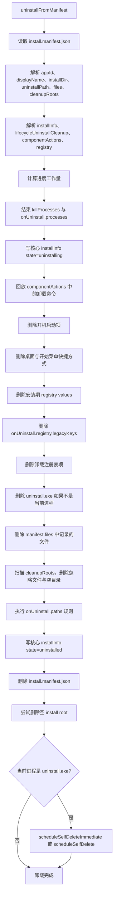

# 安装器流程图

本文档按当前代码重新梳理安装器、卸载器与 GUI/静默入口的主流程。

主要入口：
- 安装器入口：[src/installer/installer_main.cpp](../src/installer/installer_main.cpp)
- 卸载器入口：[src/installer/uninstaller_main.cpp](../src/installer/uninstaller_main.cpp)
- 启动分发：[src/installer/launch_support.cpp](../src/installer/launch_support.cpp)
- 安装服务编排：[src/installer/install_service.cpp](../src/installer/install_service.cpp)
- 卸载执行：[src/installer/uninstall_manager.cpp](../src/installer/uninstall_manager.cpp)

## 总体启动流程

## GUI 安装流程

## 静默安装流程

## 安装服务主流程

## 安装计划构建

## 预检与升级清理

## 文件与组件安装

## 安装收尾

## 卸载流程

## manifest 卸载执行

## 关键规则

- 启动模式只由入口二进制与 `--silent` 决定：`installer.exe` 进入安装，`uninstaller.exe` 进入卸载。
- `--cleanup-self` 是内部清理辅助路径，不参与正常安装或卸载模式选择。
- GUI 安装会先打开窗口，再由 `InstallationWorker` 调用统一安装服务；静默安装直接调用统一安装服务。
- 覆盖安装判定来自 `cleanup.onUpgrade.installRoots` 发现的已安装实例；发现旧实例时会进入 `OverwriteInstall` 并优先复用旧安装目录。
- 静默安装如果发现旧实例，只有当前包版本高于已安装版本才允许继续。
- 安装包内目录最终落点由 metadata 中的 `layout.folders[].target` 固化，安装器不再推导旧式目录类型。
- 组件选择会自动包含 required 组件、默认组件或命令行选择组件，并递归加入依赖。
- 必选组件失败会中止安装；可选组件失败会继续执行，但最终结果标记为失败并返回组件错误。
- 若文件替换需要重启，安装服务返回 `RebootRequired`，不把结果当作普通成功。

## 主要代码索引

- 启动模式分发：[src/installer/launch_support.cpp](../src/installer/launch_support.cpp)
- GUI 安装线程：[src/gui/installation_worker.cpp](../src/gui/installation_worker.cpp)
- GUI 卸载线程：[src/gui/uninstall_worker.cpp](../src/gui/uninstall_worker.cpp)
- 安装计划构建：[src/installer/install_plan_builder.cpp](../src/installer/install_plan_builder.cpp)
- 安装预检：[src/installer/install_precheck.cpp](../src/installer/install_precheck.cpp)
- 升级清理：[src/installer/install_cleanup_executor.cpp](../src/installer/install_cleanup_executor.cpp)
- 文件与组件安装：[src/installer/install_execution.cpp](../src/installer/install_execution.cpp)
- 安装收尾：[src/installer/install_finalize.cpp](../src/installer/install_finalize.cpp)
- manifest 存储：[src/installer/install_manifest_store.cpp](../src/installer/install_manifest_store.cpp)
- 卸载执行：[src/installer/uninstall_manager.cpp](../src/installer/uninstall_manager.cpp)
