# 安装器流程图

本文档按当前代码梳理安装器、卸载器与 GUI/静默入口的主流程，重点覆盖近期优化后的旧版本清理、卸载清理和安装 manifest 文件列表生成逻辑。

主要入口：
- 安装器入口：[src/installer/installer_main.cpp](../src/installer/installer_main.cpp)
- 卸载器入口：[src/installer/uninstaller_main.cpp](../src/installer/uninstaller_main.cpp)
- 启动分发：[src/installer/launch_support.cpp](../src/installer/launch_support.cpp)
- 安装服务编排：[src/installer/install_service.cpp](../src/installer/install_service.cpp)
- 卸载执行：[src/installer/uninstall_manager.cpp](../src/installer/uninstall_manager.cpp)

## 总体启动流程

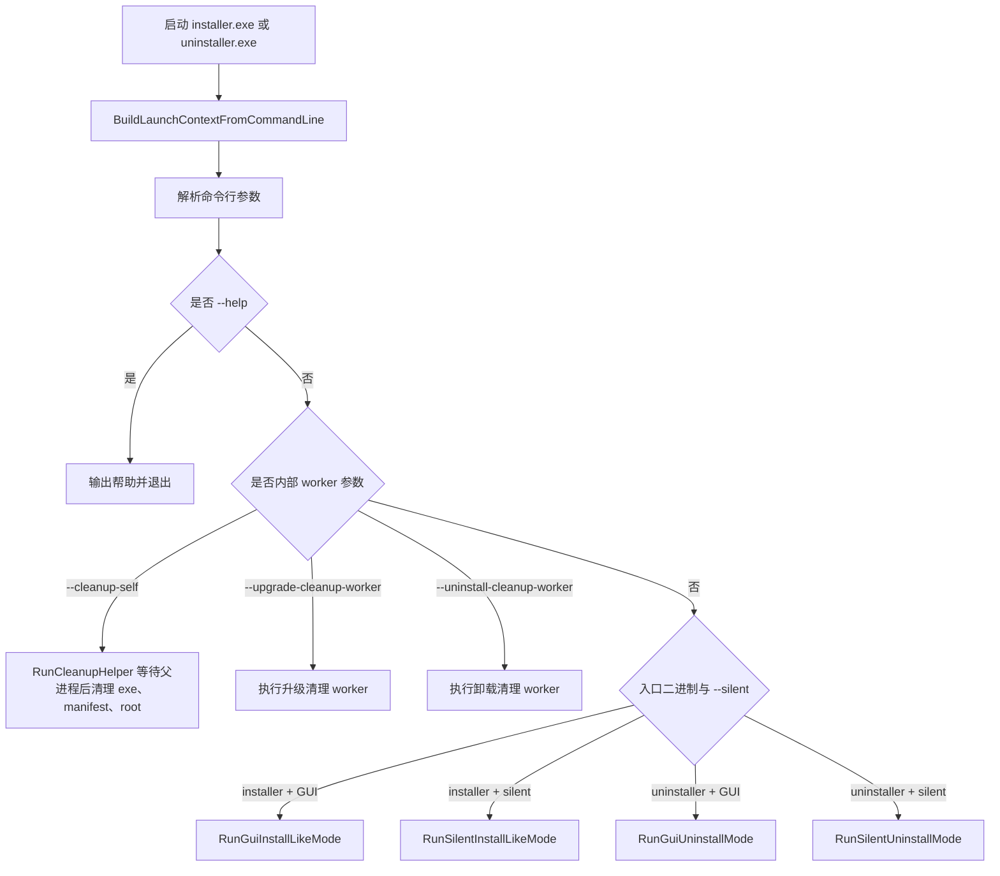

## GUI 安装流程

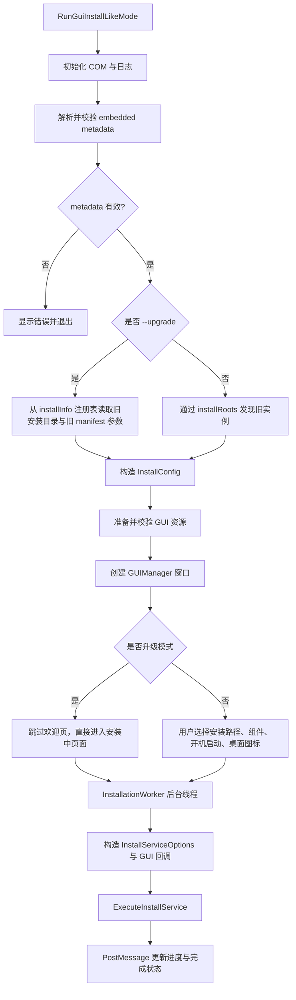

## 静默安装流程

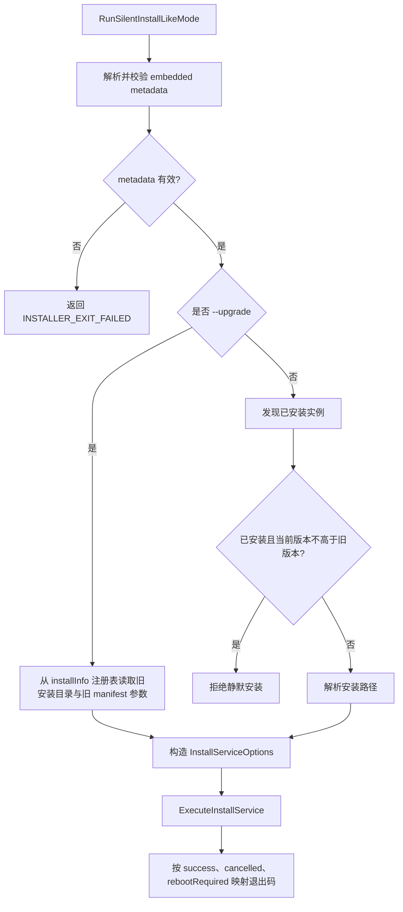

## 安装服务主流程

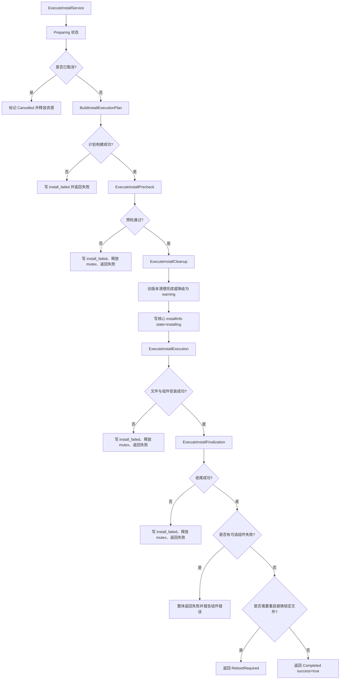

## 安装计划构建

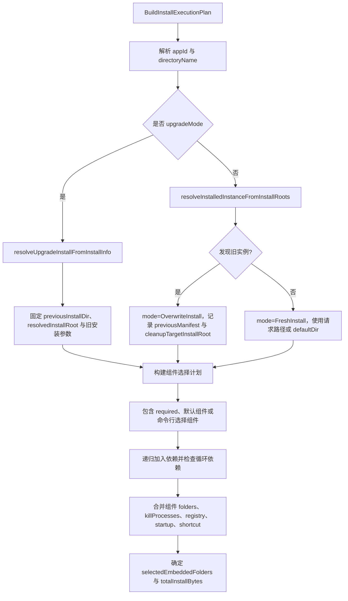

## 预检与升级清理

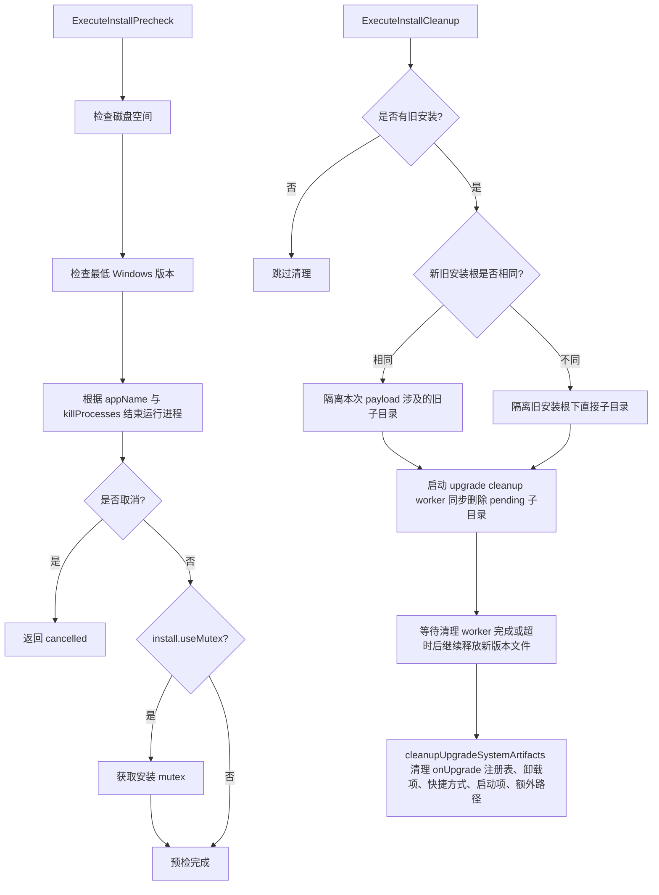

## 升级清理 worker

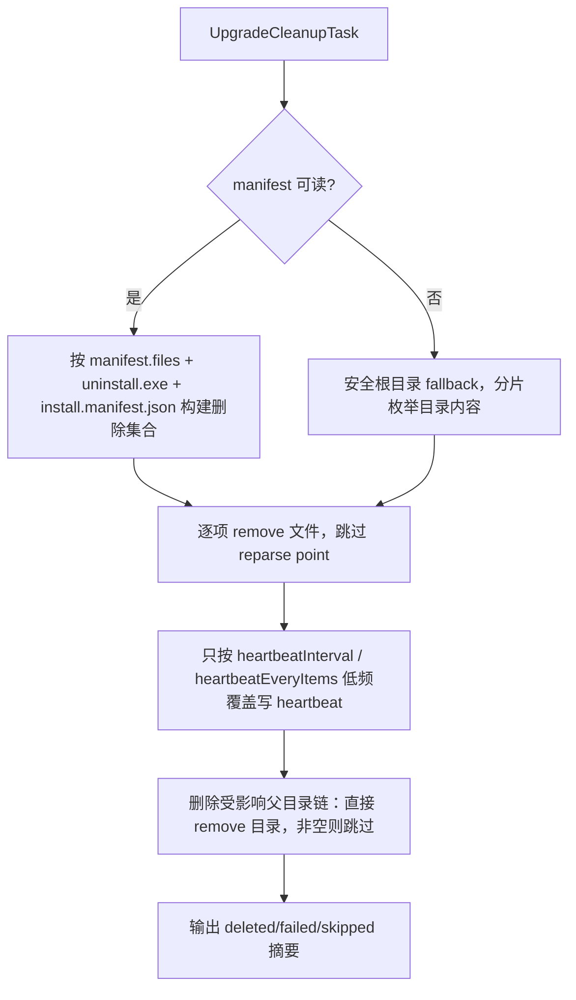

## 文件与组件安装

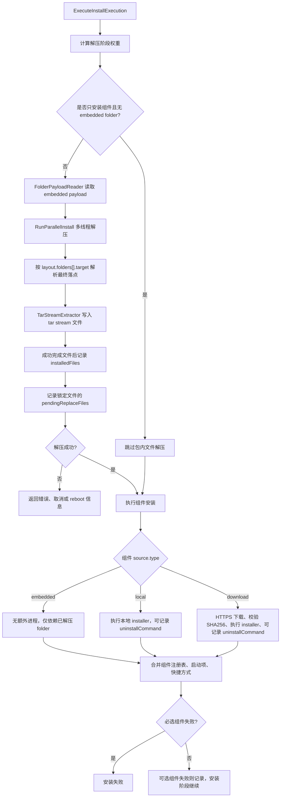

## 安装收尾

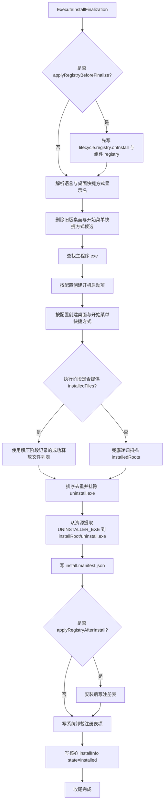

## 卸载流程

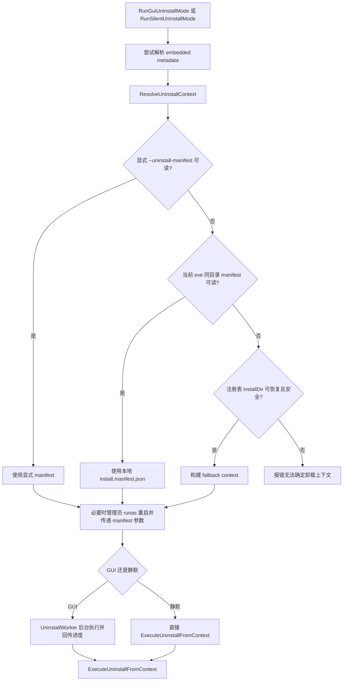

## manifest 卸载执行

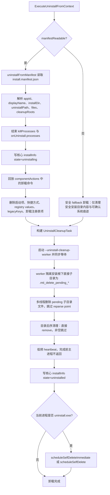

## 关键规则

- 启动模式由入口二进制、`--silent` 和内部 worker 参数决定；`--upgrade` 只改变安装类型，不改变入口二进制。
- 安装权限策略由打包阶段写入 installer exe manifest；安装流程不再根据路径动态提权。
- `--cleanup-self`、`--upgrade-cleanup-worker`、`--uninstall-cleanup-worker` 都是内部参数，不参与普通用户模式选择。
- 覆盖/升级安装不 rename 整个安装根，只隔离安装根下直接子目录或本次 payload 涉及的直接子目录。
- 覆盖/升级安装与卸载都不使用 detached 后台删除；隔离出的 pending 子目录由 cleanup worker 同步删除，完成或超时后才继续后续流程。
- 清理 worker 的 heartbeat 采用低频覆盖写，常规逐文件成功项不写日志，不随文件数量线性追加日志 IO。
- 目录后序删除不先 `is_empty()`，直接 `remove()`；非空目录视为正常跳过，真实错误才记录 warning。
- 安装 manifest 的 `files` 优先来自解压阶段成功释放文件列表，只有该列表为空时才回退到递归扫描安装根。
- 安装包内目录最终落点由 metadata 中的 `layout.folders[].target` 固化，安装器不再根据旧式目录类型推导。
- 必选组件失败会中断安装；可选组件失败会继续执行，但最终结果标记为失败并返回组件错误。
- 若文件替换需要重启，安装服务返回 `RebootRequired`，不把结果当作普通成功。

## 主要代码索引

- 启动模式分发：[src/installer/launch_support.cpp](../src/installer/launch_support.cpp)
- GUI 安装线程：[src/gui/installation_worker.cpp](../src/gui/installation_worker.cpp)
- GUI 卸载线程：[src/gui/uninstall_worker.cpp](../src/gui/uninstall_worker.cpp)
- 安装计划构建：[src/installer/install_plan_builder.cpp](../src/installer/install_plan_builder.cpp)
- 安装预检：[src/installer/install_precheck.cpp](../src/installer/install_precheck.cpp)
- 升级清理编排：[src/installer/install_cleanup_executor.cpp](../src/installer/install_cleanup_executor.cpp)
- 升级清理 worker：[src/installer/upgrade_cleanup.cpp](../src/installer/upgrade_cleanup.cpp)
- 文件与组件安装：[src/installer/install_execution.cpp](../src/installer/install_execution.cpp)
- tar 解压与文件记录：[src/installer/tar_stream_extractor.cpp](../src/installer/tar_stream_extractor.cpp)
- 安装收尾：[src/installer/install_finalize.cpp](../src/installer/install_finalize.cpp)
- manifest 存储：[src/installer/install_manifest_store.cpp](../src/installer/install_manifest_store.cpp)
- 卸载执行：[src/installer/uninstall_manager.cpp](../src/installer/uninstall_manager.cpp)
