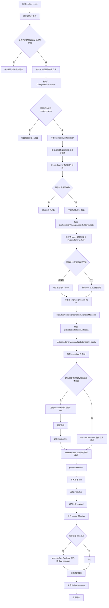

# 打包器流程图

本文档对应当前重构后的打包器主流程，入口代码位于 [`src/packager/main.cpp`](/e:/Work/GitHub/Multi-Threaded_Installer-master/src/packager/main.cpp)。

## 主流程图

## 阶段说明

### 1. 参数解析与路径校验
- 解析 CLI 参数，支持：
  - 输入目录
  - 输出安装包路径
  - 压缩算法覆盖
  - 压缩级别覆盖
  - 线程数覆盖
  - 可选外置 data package
- 若输入目录不存在，或输出目录不存在，直接失败退出。

### 2. 配置加载
- 通过 [`ConfigurationManager`](/e:/Work/GitHub/Multi-Threaded_Installer-master/include/packager/configuration_manager.h) 加载 `packager.yaml`。
- 当前只支持重构后的新 schema，不再兼容旧目录类型配置。
- 关键配置包括：
  - `install.installInfo`
  - `layout.folders[].target`
  - `lifecycle.cleanup.onUpgrade`
  - `lifecycle.cleanup.onUninstall`

### 3. 输入目录扫描
- 通过 `FolderScanner` 扫描输入目录得到 `FolderInfo[]`。
- 之后调用 `ConfigurationManager.applyFolderTargets(...)`，把 YAML 中显式声明的 `target` 落到每个 folder。
- 当前模型中，打包器阶段已经确定最终目标路径，不再把路径推导留给安装器。

### 4. 压缩阶段
- 按 folder 粒度压缩。
- 当 worker 数大于 1 时，使用并行压缩。
- 每个 folder 输出一个 `CompressionResult`，包含：
  - 压缩后的二进制数据
  - 原始大小
  - 压缩后大小
  - 校验值
  - 文件索引

### 5. 元数据生成
- 由 [`MetadataGenerator`](/e:/Work/GitHub/Multi-Threaded_Installer-master/src/packager/metadata_generator.cpp) 生成新的 `ExtendedInstallationMetadata`。
- 关键点：
  - `layout.folders[].target` 会直接写入 metadata
  - `install.installInfo` 会写入 metadata
  - `cleanup.onUpgrade` 和 `cleanup.onUninstall` 会写入 metadata

### 6. 模板准备
- 如果配置了安装器图标或版本资源，先复制 installer 模板为临时文件。
- 对临时模板执行：
  - 图标替换
  - 版本信息写入

### 7. 安装包输出
- `InstallerGenerator.generateInstaller(...)` 负责产出最终安装包。
- 输出结构是：
  - 模板 installer 可执行文件
  - metadata 区块
  - payload 区块
  - locator 和 trailer

### 8. 可选外置 data package
- 当指定 `data out` 时，会额外生成 data package。
- installer 后续可通过同一 metadata 协议读取 embedded 或 external payload。

## 当前设计的关键变化

- 不再输出旧的目录类型推导模型。
- 不再输出 `appendDirectoryName` 相关语义。
- 安装器路径落点依赖 `target`，不是 `destination.type`。
- 升级与卸载清理配置已在打包阶段固化进入 metadata。

## 主要对应代码

- [`main.cpp`](/e:/Work/GitHub/Multi-Threaded_Installer-master/src/packager/main.cpp)
- [`configuration_manager.cpp`](/e:/Work/GitHub/Multi-Threaded_Installer-master/src/packager/configuration_manager.cpp)
- [`configuration_loader.cpp`](/e:/Work/GitHub/Multi-Threaded_Installer-master/src/packager/configuration_loader.cpp)
- [`configuration_validator.cpp`](/e:/Work/GitHub/Multi-Threaded_Installer-master/src/packager/configuration_validator.cpp)
- [`metadata_generator.cpp`](/e:/Work/GitHub/Multi-Threaded_Installer-master/src/packager/metadata_generator.cpp)
- [`installer_generator.cpp`](/e:/Work/GitHub/Multi-Threaded_Installer-master/src/packager/installer_generator.cpp)
