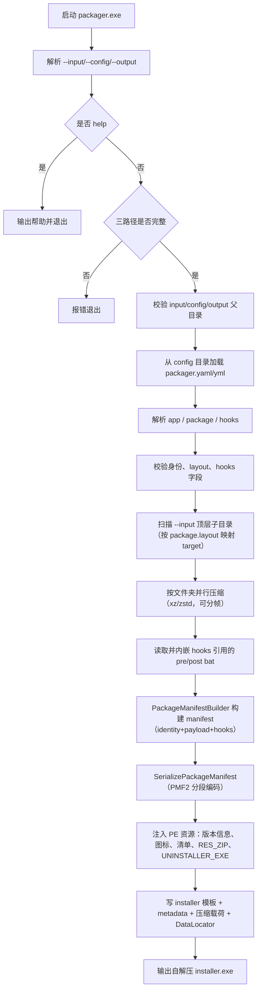
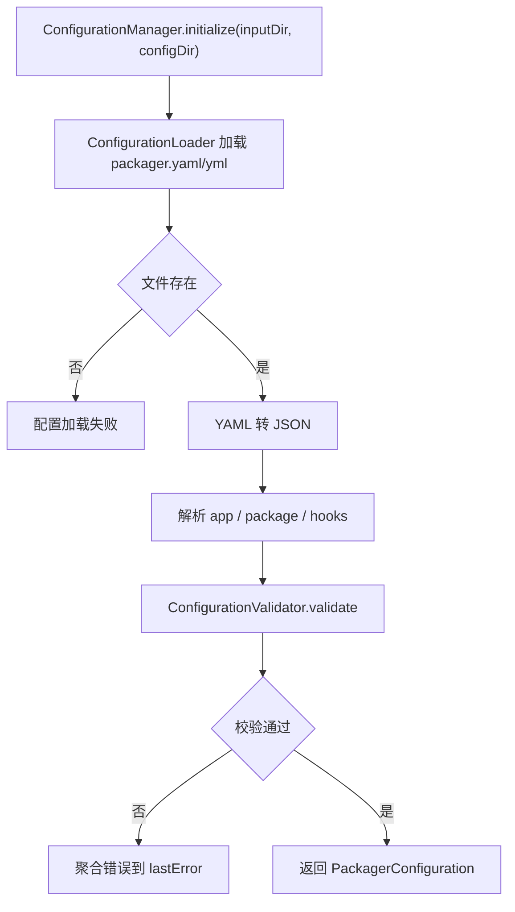
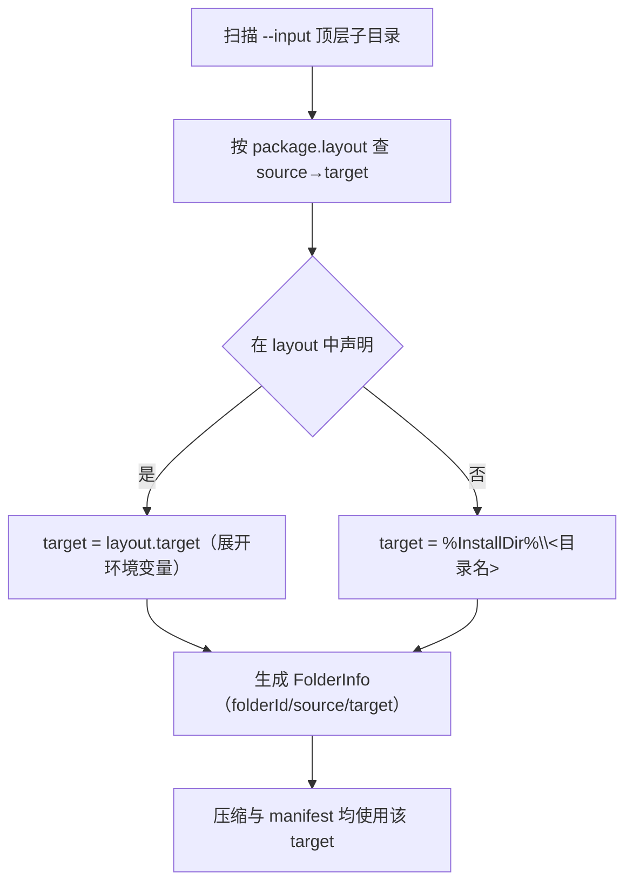
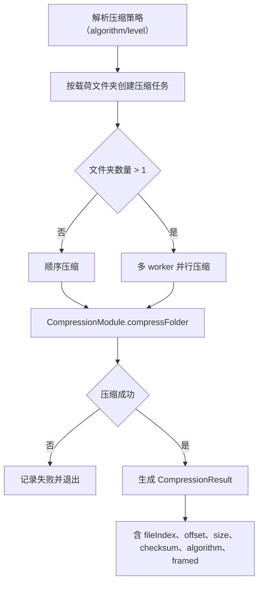
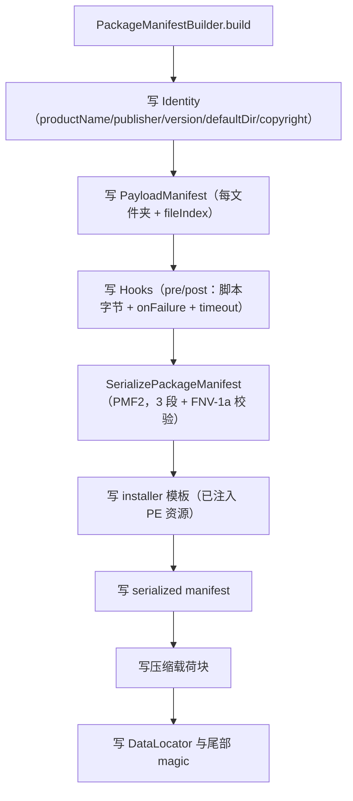
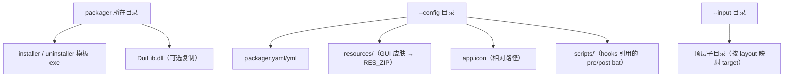

# 打包器流程图

本文档描述当前 `packager.exe` 的主流程。

公开配置已收窄为 `app` / `package` / `hooks` 三块（「值/逻辑各归其位」重构后）。旧 schema（`schemaVersion: 3`、`installer`/`uninstaller`/`components`/`installState` 等）已不再支持，在打包阶段直接失败。配置写法见 [USER_GUIDE](USER_GUIDE.md)。

## 主流程



## 配置加载与校验



关键规则：
- `app.productName / publisher / version / defaultDir` 必填。
- `package.layout[].source` 必须是 `--input` 下存在的顶层子目录；`target` 支持 `%InstallDir%` 与环境变量。
- `package.layout` 可选；未声明的子目录默认落到 `%InstallDir%\<目录名>`。
- `hooks` 可选；声明时 `path` 相对 `--config` 解析，脚本被读入内嵌；`onFailure ∈ {abort, continue}`。
- 清理规则、注册表、系统卸载入口、安装行为默认值**不在 YAML 中**，由引擎写死；跨版本兼容走引擎迁移表。

## Payload 扫描与 target 固化



安装器执行时直接读取 manifest 中每个文件夹的 target，不再按目录类型推导落点。

## 压缩流程



## Manifest 生成与输出协议



最终布局：

```text
[installer 模板 + PE 资源（RES_ZIP / UNINSTALLER_EXE / 版本信息 / 图标 / 清单）]
[分段 package manifest（identity + payload + hooks）]
[压缩载荷块]
[DataLocator]
[end magic]
```

> PE 资源（GUI 皮肤 RES_ZIP、卸载器 UNINSTALLER_EXE、版本信息、图标、requireAdministrator 清单）必须在追加 overlay **之前**由 `EmbedInstallerPeResources` 用 `UpdateResource` 注入到模板文件——`UpdateResource` 会重写 PE 资源节，不能容忍尾部 overlay。

## 模板与资源来源



## 主要代码索引

- CLI 与主流程：[src/packager/main.cpp](../src/packager/main.cpp)
- 配置加载：[src/packager/configuration_loader.cpp](../src/packager/configuration_loader.cpp)
- 配置校验：[src/packager/configuration_validator.cpp](../src/packager/configuration_validator.cpp)
- payload 扫描：[src/packager/folder_scanner.cpp](../src/packager/folder_scanner.cpp)
- 压缩：[src/packager/compression_module.cpp](../src/packager/compression_module.cpp)、[src/packager/folder_payload_compressor.cpp](../src/packager/folder_payload_compressor.cpp)
- manifest 构建：[src/packager/package_manifest_builder.cpp](../src/packager/package_manifest_builder.cpp)
- manifest 编解码：[src/common/package_manifest_codec.cpp](../src/common/package_manifest_codec.cpp)
- PE 资源注入：[src/packager/pe_resource_embedder.cpp](../src/packager/pe_resource_embedder.cpp)、[src/packager/version_info_updater.cpp](../src/packager/version_info_updater.cpp)、[src/packager/icon_updater.cpp](../src/packager/icon_updater.cpp)
- 安装包生成：[src/packager/installer_generator.cpp](../src/packager/installer_generator.cpp)
```
