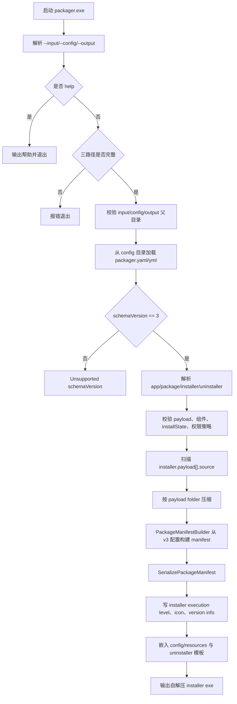
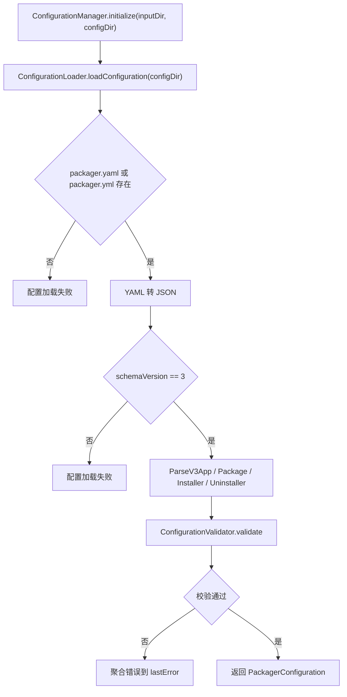
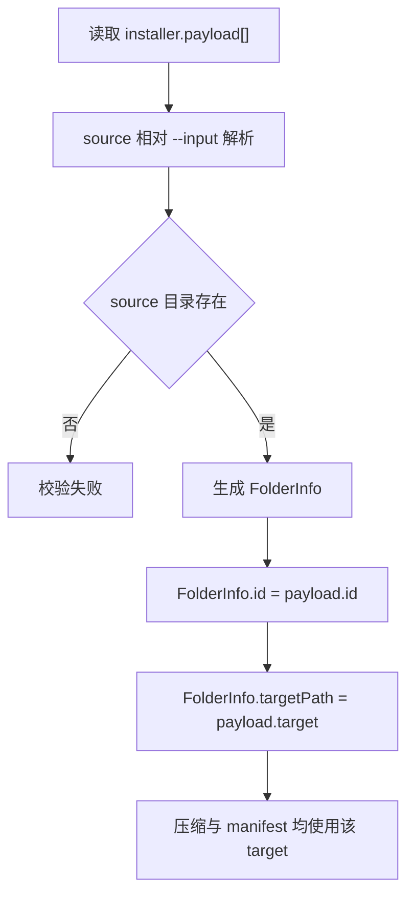
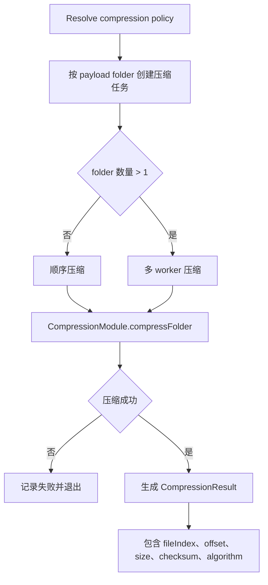
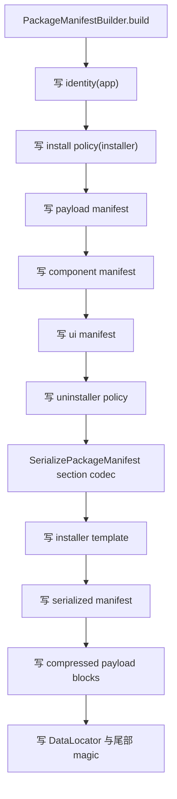
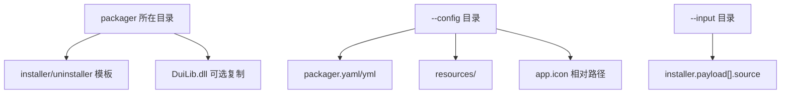

# 打包器流程图

本文档描述当前 `packager.exe` v3 主流程。公开配置只支持 `schemaVersion: 3`，旧 schema 在打包阶段直接失败。

## 主流程



## 配置加载与校验



关键规则：
- `app.id/name/version` 必填。
- `installer.defaultDir` 必填。
- `installer.payload[].id/source/target` 必填且 id 唯一。
- `installer.components[].payload[]` 必须引用已声明 payload id。
- `installer.installState.registries[]` 与 `installer.installState.files[]` 支持多个 store 和自定义 values。
- `installer.requireAdmin=false` 时拒绝 Program Files、HKLM 写入、machine/both 系统卸载项等管理员场景。

## Payload 扫描与 target 固化



安装器执行时直接读取 manifest 中的 payload target，不再按目录类型推导安装落点。

## 压缩流程



## Manifest 生成与输出协议



最终布局：

```text
[installer template + embedded UI resources + embedded uninstaller]
[sectioned package manifest]
[compressed payload blocks]
[DataLocator]
[end magic]
```

## 模板与资源来源



## 主要代码索引

- CLI 与主流程：[src/packager/main.cpp](../src/packager/main.cpp)
- 配置加载：[src/packager/configuration_loader.cpp](../src/packager/configuration_loader.cpp)
- 配置校验：[src/packager/configuration_validator.cpp](../src/packager/configuration_validator.cpp)
- payload 扫描：[src/packager/folder_scanner.cpp](../src/packager/folder_scanner.cpp)
- manifest 构建：[src/packager/package_manifest_builder.cpp](../src/packager/package_manifest_builder.cpp)
- 安装包生成：[src/packager/installer_generator.cpp](../src/packager/installer_generator.cpp)
