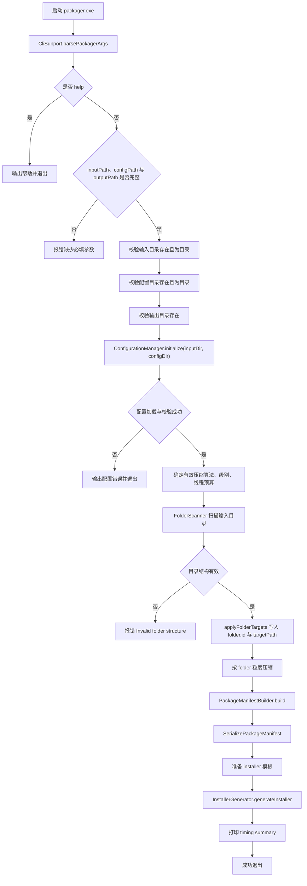
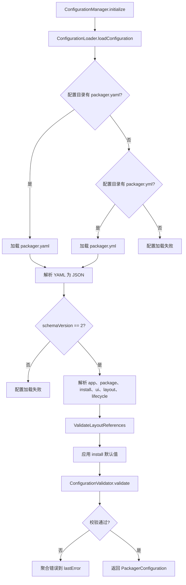
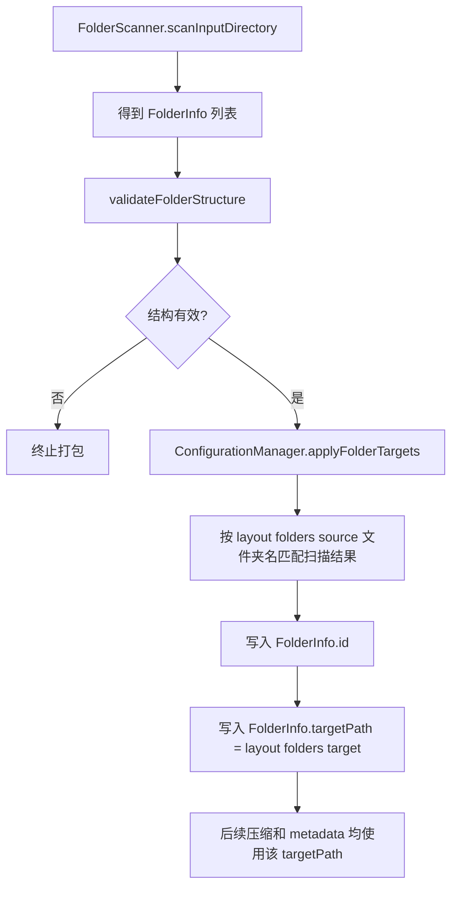
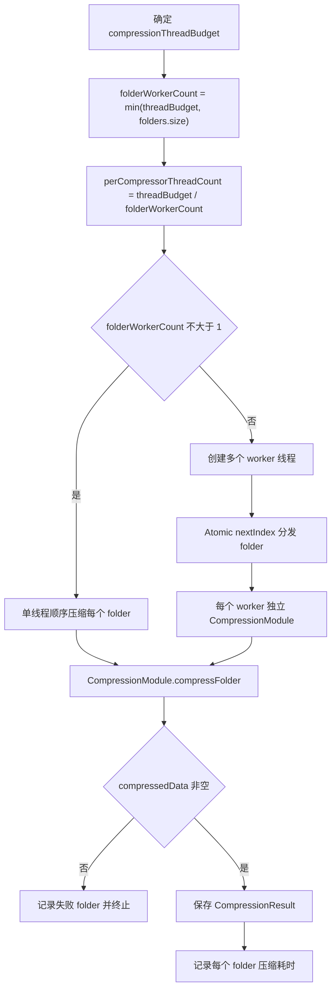
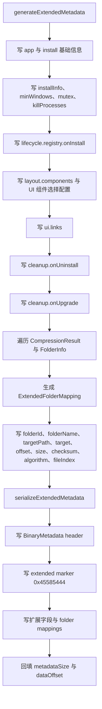
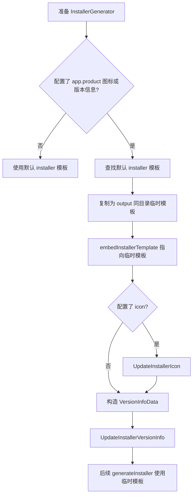
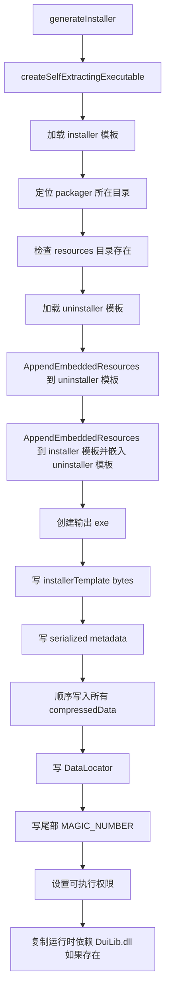

# 打包器流程图

本文档按当前代码重新梳理 `packager.exe` 的主流程、配置 schema、压缩与安装包输出协议。

主要入口：
- 打包器入口：[src/packager/main.cpp](../src/packager/main.cpp)
- 配置管理：[src/packager/configuration_manager.cpp](../src/packager/configuration_manager.cpp)
- 配置加载：[src/packager/configuration_loader.cpp](../src/packager/configuration_loader.cpp)
- 配置校验：[src/packager/configuration_validator.cpp](../src/packager/configuration_validator.cpp)
- 元数据生成：[src/packager/metadata_generator.cpp](../src/packager/metadata_generator.cpp)
- 安装包生成：[src/packager/installer_generator.cpp](../src/packager/installer_generator.cpp)

## 主流程



## 配置加载与校验



## 当前 schema 关键字段

- `schemaVersion` 必须为 `2`。
- `app.name` 与 `app.version` 必填；`app.id` 和 `app.directoryName` 为空时会回退到 `app.name`。
- `package.compression.algorithm` 支持 `xz` 与 `zstd`；压缩级别按算法范围校验。
- `install.defaultDir` 必填；`install.installInfo` 会补默认 registry 路径，但必需字段仍会校验。
- `layout.folders[]` 必须包含 `id`、`source`、`target`，并且 `source` 必须存在。
- `layout.components[]` 可选，支持 `embedded`、`local`、`download` 三类 source。
- `lifecycle.registry.onInstall`、`lifecycle.cleanup.onUpgrade`、`lifecycle.cleanup.onUninstall` 会被写入 metadata，供安装、升级和卸载阶段使用。

## 目录扫描与 target 固化



当前设计中，打包阶段已经把每个 payload folder 的安装落点写入 `targetPath` 与 `target`。安装器执行时直接读取 metadata，不再根据旧式目录类型或目录名做二次推导。

## 压缩流程



每个 `CompressionResult` 包含压缩数据、压缩前后大小、校验值、算法和文件索引。安装阶段按 tar stream 解压时会记录成功释放的文件，并优先用该列表写入 `install.manifest.json`，避免安装收尾再次递归扫描整个安装目录。

## 元数据生成与序列化



安装器通过 [src/installer/metadata_parser.cpp](../src/installer/metadata_parser.cpp) 反序列化这些字段，并用 `validateMetadata` 校验版本、magic、folder 数量和 payload 映射。

## 模板准备与资源更新



图标或版本信息更新失败只产生 warning，不会直接终止打包；模板复制或模板定位失败会终止打包。

## 安装包生成协议



最终自解压 exe 的二进制布局：

```text
[installer template + embedded UI resources + embedded uninstaller]
[serialized metadata]
[compressed folder payload blocks]
[DataLocator]
[end magic]
```

`DataLocator` 记录 metadata 和 payload 的偏移与大小。安装器运行时通过尾部 magic 反向定位该结构，然后读取 metadata 与 payload。

## 关键规则

- 配置文件只从 `--config` 指定目录读取 `packager.yaml` 或 `packager.yml`。
- 当前正式 schema 为 v2；旧式目录类型配置不再参与主流程。
- `layout.folders[].target` 是安装器落点的唯一来源之一，会被固化进 metadata。
- 组件依赖、组件引用的 folder id、download SHA256、local installer 路径约束都会在打包阶段校验。
- 多 folder 压缩时按 folder 粒度并行，每个 worker 拥有独立 `CompressionModule`。
- 生成 installer 时要求 `--config` 指定目录下的 `resources` 目录存在，并强制把 UI 资源嵌入 installer 和 uninstaller 模板。
- 生成后的 installer 会尝试复制 `DuiLib.dll`；如果静态链接或文件不存在，仅输出提示。
- 打包器会输出阶段耗时和最慢 folder 压缩耗时，便于定位性能瓶颈。

## 主要代码索引

- CLI 与主流程：[src/packager/main.cpp](../src/packager/main.cpp)
- 配置加载与默认值：[src/packager/configuration_manager.cpp](../src/packager/configuration_manager.cpp)
- YAML schema 解析：[src/packager/configuration_loader.cpp](../src/packager/configuration_loader.cpp)
- 配置语义校验：[src/packager/configuration_validator.cpp](../src/packager/configuration_validator.cpp)
- 目录扫描：[src/packager/folder_scanner.cpp](../src/packager/folder_scanner.cpp)
- 压缩实现：[src/packager/compression_module.cpp](../src/packager/compression_module.cpp)
- 元数据生成：[src/packager/metadata_generator.cpp](../src/packager/metadata_generator.cpp)
- 模板与输出：[src/packager/installer_generator.cpp](../src/packager/installer_generator.cpp)
- UI 资源嵌入：[src/packager/resource_embedder.cpp](../src/packager/resource_embedder.cpp)
- 图标更新：[src/packager/icon_updater.cpp](../src/packager/icon_updater.cpp)
- 版本信息更新：[src/packager/version_info_updater.cpp](../src/packager/version_info_updater.cpp)
