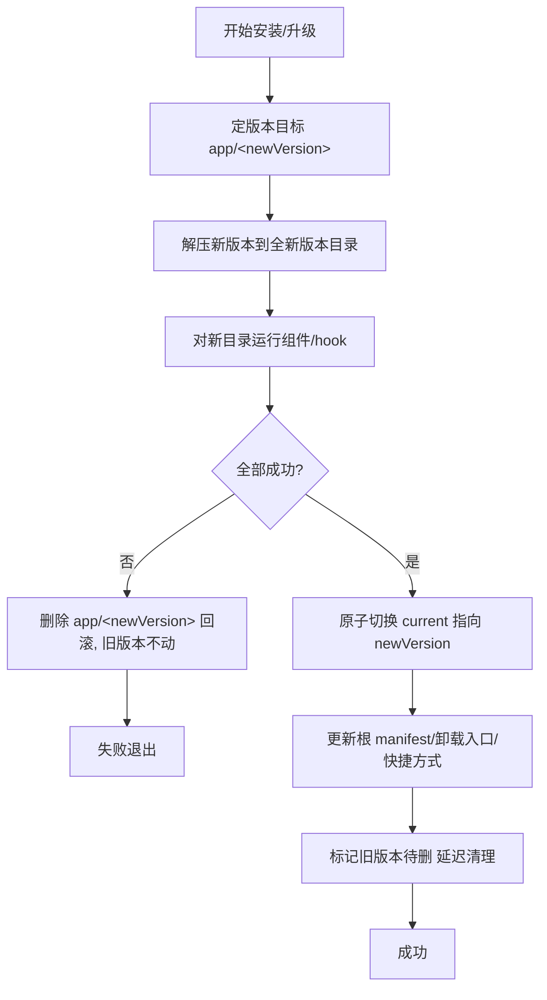

# 版本化目录 + 原子切换 —— 可行性方案

> 目标读者：本安装器引擎维护者。本文只做**可行性设计与落地评估**，不含具体代码实现。
> 参考现代自更新器（Chrome/Google Omaha、Squirrel.Windows、Electron、MSIX）的成熟范式，
> 结合本项目现有安装流水线（`install_plan_builder` → `install_execution` →
> `install_finalize` → `install_cleanup_executor` → `uninstall_manager`）给出改造路径。

---

## 1. 背景与要解决的问题

现有安装采用**就地覆盖（in-place overwrite）**：升级时先按旧 manifest 清理旧文件，再把新版本解压覆盖到同一安装目录。由此带来几个已知问题（详见既有分析）：

- **N1｜升级"先删后装、失败无回滚"**：清理在解压/hook 之前执行且不回滚；升级中任一步失败 → 旧版本已被破坏、新版本没装上，把"可用的旧安装"变成坏的。
- **R1｜解压无事务性**：多文件并行写，中途失败留下"新旧混合"的损坏目录，无整体回滚。
- **锁定文件 / 需重启**：运行中的 `exe/dll` 无法就地覆盖 → 走 `MOVEFILE_DELAY_UNTIL_REBOOT` 重启替换，体验差、且重启前状态不一致。
- **AV 扫描churn**：升级=删旧+写新，离散文件操作多，被 Defender 逐个扫，累计变慢。

**版本化目录 + 原子切换**能一次性缓解以上全部：新版本装进**全新的版本目录**（与旧版本并存，旧的照常运行），装完再把一个**指针原子切到新版本**；失败只需丢弃新版本目录，旧版本毫发无损。

---

## 2. 现状 vs 目标 对比

| 维度 | 现状（就地覆盖） | 目标（版本化 + 原子切换） |
|---|---|---|
| 安装布局 | 文件直接铺在安装目录 | `app\<version>\` 逐版本子目录 + 稳定指针 `current` |
| 升级 | 删旧 → 覆盖写新 | 写新版本目录 → 原子切指针 → 延迟删旧 |
| 失败回滚 | 无（N1/R1） | 删新版本目录即回滚，旧版本不受影响 |
| 锁定文件 | 重启替换（`DELAY_UNTIL_REBOOT`） | 基本消除（旧版本从旧目录运行，不覆盖它） |
| 需重启 | 常见 | 罕见 |
| 回滚到旧版本 | 不支持 | 天然支持（把指针切回旧版本目录） |
| 磁盘占用 | 省（就地，增量跳过未变） | 多（每版本一份，除非做跨版本去重） |
| 快捷方式/注册表 | 指向安装目录固定路径 | 指向稳定的 `current\...`，升级无需改写 |

---

## 3. 目录布局设计

安装根 `<InstallRoot>`（如 `%ProgramFiles%\<Product>\`）：

```text
<InstallRoot>\
├─ app\
│   ├─ 1.2.0\            # 某个版本的全部产品文件（可含 plugins 子目录）
│   │   ├─ <Product>.exe
│   │   └─ ...
│   └─ 1.3.0\            # 新版本，与旧版本并存
│       └─ ...
├─ current   ->  app\1.3.0     # 稳定指针（NTFS 目录联接 junction）
├─ data\                       # 跨版本持久数据（可选，见 §7）
├─ uninstall.exe               # 稳定位置的卸载器
└─ install.manifest.json       # 稳定状态：currentVersion + versions[] + 卸载账本
```

- 快捷方式 / 注册表 / 文件关联 / 服务 一律指向 **`<InstallRoot>\current\<Product>.exe`**（稳定路径），升级切指针后自动生效，**无需改写任何外部引用**。
- 每个版本目录内可自带一份 per-version manifest（该版本的文件清单/指纹），根 manifest 只记"当前版本 + 已装版本列表 + 卸载账本"。

---

## 4. 指针机制（三选一，含推荐）

"稳定指针 `current` 指向当前版本目录"是核心，有三种实现，各有取舍：

### 方案 A：NTFS 目录联接（Junction）—— 推荐
`current` 是一个指向 `app\<version>` 的目录联接。外部引用用 `current\<exe>` 恒可用。
- ✅ 对调用方透明：快捷方式/关联/服务用 `current\...` 固定路径，永不改写。
- ✅ 无额外进程跳转。
- ⚠️ 切换非"单指令原子"（见 §5 有缓解手段）。
- ⚠️ 需要管理员权限创建（本安装器已提权，满足）；个别备份/杀软对 junction 处理不佳；junction 只能同卷。

### 方案 B：启动器存根（Launcher stub）
根目录放一个稳定的小 `<Product>.exe`，它读"当前版本"再拉起 `app\<version>\<真实 exe>`。切换 = 原子改写一个"当前版本"指针文件。
- ✅ 指针切换可做到**完全原子**（写临时文件 + `ReplaceFile`）。
- ✅ 不依赖 junction。
- ⚠️ 多一层进程跳转；真实 exe 路径随版本变，命令行/工作目录需存根透传；有些场景（驱动、COM 注册指向真实 exe）不适配。

### 方案 C：快捷方式重指（Squirrel 风格）
快捷方式/注册表直接指向 `app\<version>\<exe>`；升级时重写这些引用到新版本。
- ✅ 无 junction、无存根，最简单。
- ❌ 外部引用（文件关联、服务、别处的快捷方式、其它程序硬编码的路径）指向旧版本目录，升级后失效；引用面越广越脆。

**推荐：方案 A（junction）**——对"外部引用稳定"最友好，契合"安装到 Program Files、被快捷方式/关联引用"的桌面应用场景。若产品对 junction 敏感或需绝对原子切换，退方案 B。

---

## 5. 原子切换的具体做法与失败处理

以 junction（方案 A）为例，切换步骤：

1. 新版本已完整解压到 `app\<new>\`，组件/hook 已在新目录跑通。
2. **切指针**（尽量原子）：
   - 建一个临时联接 `current.new -> app\<new>`；
   - 用 `MoveFileEx(current.new, current, MOVEFILE_REPLACE_EXISTING)` 把它**改名覆盖** `current`（对同目录下的联接改名，窗口极小）；
   - 若平台不支持对已存在目标改名联接，则回退"删 `current` + 建 `current -> app\<new>`"（有极短空窗，需在失败时可重建）。
   - 采用**方案 B 存根**时，这一步就是"写 `current.txt.new` + `ReplaceFile` 覆盖 `current.txt`"，**完全原子**。
3. 切成功后：更新根 `install.manifest.json`（`currentVersion=<new>`、`versions[]` 追加）、系统卸载入口版本号、（若快捷方式指向 `current\` 则无需动）。
4. **延迟删旧**：旧版本目录 `app\<old>\` 里的二进制可能仍被运行中的旧进程占用，不能立即删。策略：标记为待删，**下次升级/下次启动/计划任务**时清理；保留最近 N 个版本用于回滚。

**失败处理（回滚天然）**：
- 解压新版本失败、组件/hook 失败、切指针前的任何失败 → **删 `app\<new>\` 即可**，`current` 与旧版本零改动，用户仍是可用旧版本。
- 切指针本身失败 → 指针要么仍指旧、要么已指新，二者都是**完整可用**版本（不会半坏）；据结果决定重试或判失败。

---

## 6. 生命周期流程



- **首次安装**：无旧版本，装 `app\<v>\`、建 `current`、写根状态、建快捷方式/卸载入口。
- **升级**：如上；旧版本延迟删。
- **回滚**：把 `current` 切回上一个保留的版本目录 + 回写卸载入口版本 —— 秒级、安全。
- **卸载**：结束进程 → 删 `app\*`、`current`、根文件（uninstall.exe/manifest）、（可选）`data\` → 删注册表/快捷方式/卸载入口 → 自删卸载器。比现在"按 manifest 文件清单逐个删"更简单（直接删版本目录树）。

---

## 7. 版本化 vs 持久化数据的划分（关键）

版本目录会被"整目录替换/删除"，所以**跨版本要保留的东西绝不能放进 `app\<version>\`**：
- 用户配置、许可、缓存、运行期生成的数据 → 放 `<InstallRoot>\data\` 或 `%ProgramData%\<Product>\`（现有 `package.layout` 已支持把某 folder 落到 `%ProgramData%` 等）。
- **组件（plugins）**：需明确它们是"随版本"还是"持久"。
  - 若组件随版本（`app\<version>\plugins\`）：每次升级重装组件，卸载简单，但组件安装/卸载路径随版本变——`RunSelectedComponents` / 组件卸载入口的 plugins 解析要改成基于"当前版本目录"。
  - 若组件持久（`<InstallRoot>\plugins\`）：升级不动组件，但要处理"组件与主程序版本兼容"。
  - 建议：**组件随版本**（与"版本自洽、可整体回滚"一致），并把组件卸载记录也纳入版本或根 manifest。

---

## 8. 磁盘占用与去重

版本化的代价：每个保留版本一份完整文件 → 磁盘占用上升（现状是就地覆盖 + 内容指纹跳过未变文件，最省盘）。缓解手段：
- **跨版本硬链接去重**（Chrome/Squirrel 部分采用）：新版本目录里与旧版本**内容相同**的文件用 `CreateHardLink` 指向旧版本的物理文件，只有变化文件才真正写盘。既省盘又**继续享受"未变文件不写盘 → 少触发 AV"**的好处。需同卷、需处理硬链接与"删旧版本"的引用关系。
- **只保留最近 N 个版本**（默认 2：当前 + 上一个用于回滚），更早的删掉。
- 不做去重则接受磁盘换可靠性（对多数桌面产品可接受）。

> 现有的"内容指纹增量"在版本化下要重新定位：它从"就地跳过重写"变成"跨版本硬链接去重的判据"——指纹相同就硬链接、不同才写。逻辑可复用 `install.manifest.json` 的 `fileFingerprints`。

---

## 9. 从旧"就地安装"迁移

存量用户是**扁平就地安装**（文件直接在安装目录）。首次遇到版本化安装器时需迁移：
- 探测到旧扁平安装（现有 `install-state.json`/注册表/`install.manifest.json`）→ 两条路径：
  1. **就地转版本化**：把现有扁平文件视为 legacy，新版本按版本化装，切指针；旧扁平文件由卸载账本或迁移表（`src/installer/migration`）逐步清理。
  2. **干净重装**：卸载旧扁平安装 → 版本化全新安装（更简单但会丢就地状态，需保留 `data\`）。
- 迁移逻辑走引擎迁移表（`migration::RunPending`，跟版本走），符合项目"跨版本兼容走迁移"的约定。

---

## 10. 对现有代码的改动地图（文件级）

| 模块 | 现状 | 版本化改动 |
|---|---|---|
| [install_plan_builder.cpp](../src/installer/pipeline/install_plan_builder.cpp) | 解析安装根、探测旧装、定 target | 目标改为 `installRoot\app\<version>`；`current`/根路径解析；保留旧版本信息用于回滚/延迟删 |
| [install_execution.cpp](../src/installer/pipeline/install_execution.cpp) / [installer_parallel_install.cpp](../src/common/installer_parallel_install.cpp) | 就地释放到 target | 释放到**全新版本目录**；增量从"就地跳过"改为"跨版本硬链接去重"（可选） |
| [tar_stream_extractor.cpp](../src/installer/payload/tar_stream_extractor.cpp) | staging+ReplaceFile+重启替换 | 写全新目录，几乎不再需要 staging/重启替换（目标是空目录、不覆盖运行中文件）；可保留大缓冲/直写优化 |
| [install_finalize.cpp](../src/installer/pipeline/install_finalize.cpp) | 写注册表/快捷方式/manifest/uninstall.exe | 新增**原子切 `current`**；快捷方式指向 `current\`；根 manifest 记 `currentVersion`+`versions[]`；标记旧版本待删 |
| [install_cleanup_executor.cpp](../src/installer/pipeline/install_cleanup_executor.cpp) / [upgrade_cleanup.cpp](../src/installer/uninstall/upgrade_cleanup.cpp) | 删旧版本文件（先于解压） | 不再"先删旧"；改为**成功切换后延迟删旧版本目录**（best-effort，跳过被占用的） |
| [install_service.cpp](../src/installer/pipeline/install_service.cpp) | 编排：cleanup→hook→解压→finalize | 重排为：解压新目录→组件/hook→**切换**→延迟删旧；失败删新目录回滚（天然解决 N1/R1） |
| 组件 [component_registry](../src/installer/components/component_registry.cpp)/执行/卸载 | plugins 在 installDir 下 | plugins 解析改为**当前版本目录**下；组件卸载读版本目录 |
| [uninstall_manager.cpp](../src/installer/uninstall/uninstall_manager.cpp) | 按 manifest files 删 | 直接删 `app\*` + `current` + 根文件；更简单 |
| [install_manifest_store.cpp](../src/installer/state/install_manifest_store.cpp) | 扁平 files/fingerprints | 根 manifest 增 `currentVersion`/`versions[]`；per-version manifest（可选） |
| [path_resolver.cpp](../src/installer/platform/path_resolver.cpp) / 快捷方式 | 展开 %InstallDir% | 引入 `%CurrentDir%`(=`current`) 供快捷方式/关联使用 |
| [migration.cpp](../src/installer/migration/migration.cpp) | 跨版本收尾 | 承接"扁平→版本化"迁移 |

**打包侧（packager）** 基本不变：仍产出自解压安装器；顶多在 manifest identity 里明确"版本化安装"标志（若做成可切换模式）。

---

## 11. 对"锁文件 / AV 慢"的实际改善

- **锁文件/重启**：新版本装进空目录、不覆盖运行中的旧二进制 → `ERROR_SHARING_VIOLATION` 与重启替换**基本消失**；`tar_stream_extractor` 的 staging+ReplaceFile+reboot 逻辑可大幅简化。
- **AV 慢**：仍会扫每个新写的文件（写新版本是全量写，除非硬链接去重）。所以**版本化本身不直接治 AV 慢**——它治的是"锁文件/回滚/一致性"。要同时缓解 AV 慢，需叠加：**跨版本硬链接去重**（只写变化文件，少扫）+ 之前提的**并行写/重试重排/大缓冲**。二者正交、可叠加。

---

## 12. 风险与权衡

- **磁盘占用上升**（每版本一份），除非做硬链接去重（有同卷/引用管理复杂度）。
- **junction 兼容性**：个别备份/杀软/旧工具对目录联接处理异常；跨卷不支持（安装根与版本目录必须同卷——本就同一安装根下，天然满足）。
- **外部硬编码路径**：若产品别处硬编码了旧的扁平安装路径（非 `current\`），迁移后会失效——需梳理产品对安装路径的依赖。
- **延迟删旧的时机**：被占用的旧版本目录要择机清理，需一套"待删列表 + 下次启动/升级清理"的机制，避免长期残留占盘。
- **改造面大**：涉及 plan/execute/finalize/cleanup/uninstall/组件/迁移几乎整条流水线，属**架构级重构**，需分阶段 + 充分回归。
- **迁移复杂度**：存量扁平安装的平滑迁移是最容易出问题的一环。

---

## 13. 分阶段落地建议

1. **P0 设计定型**：确定指针机制（junction / 存根）、版本保留数 N、版本化 vs 持久数据边界、组件归属、是否做硬链接去重。产出布局与状态 schema。
2. **P1 全新安装走版本化**：plan 定版本目录 → 解压到新目录 → finalize 建 `current` + 快捷方式指 `current\` + 根 manifest。先不做升级/迁移，验证首装 + 卸载。
3. **P2 升级 + 原子切换 + 回滚**：解压新目录 → 切 `current` → 延迟删旧；实现"失败删新目录回滚"（顺带关闭 N1/R1）；实现"回滚到上一版本"。
4. **P3 组件/hook 适配版本目录** + 卸载改为删版本树。
5. **P4 存量扁平安装迁移**（走迁移表）。
6. **P5（可选）跨版本硬链接去重** + 并行写/重试重排/大缓冲，兼顾磁盘与 AV 慢。

可先做成**可切换模式**（引擎内 `kInstallLayout = InPlace | Versioned`）灰度验证，稳定后切默认。

---

## 14. 待决策项（需产品/团队拍板）

1. 指针机制：**junction（推荐）** / 启动器存根 / 快捷方式重指？
2. 保留几个历史版本（默认 2：当前+上一）用于回滚？
3. `plugins` 组件：随版本 还是 持久？
4. 是否做**跨版本硬链接去重**（省盘 + 少扫 vs 复杂度）？
5. 存量扁平安装：**就地转版本化** 还是 **卸载后干净重装**？
6. 是否保留 `data\` 于安装根下，还是统一用 `%ProgramData%`？
7. 是否需要"回滚到上一版本"作为对用户可见的功能，还是仅作失败自动回退？

---

## 15. 结论

- **可行**，且是把 N1（升级无回滚）、R1（解压无事务）、锁文件/需重启一次性解决的现代范式，并天然带来"版本回滚"能力。
- 代价是**磁盘占用**（可用硬链接去重缓解）与**一次架构级重构**（plan/execute/finalize/cleanup/uninstall/组件/迁移）。
- 它**不直接解决 AV 扫描慢**（那需叠加硬链接去重 + 并行写等正交优化），但显著减少"覆盖运行中文件"这一类 AV/锁冲突。
- 建议**分阶段、可切换模式**推进：先 P1 首装版本化打通，再 P2 升级+原子切换（同时收掉 N1/R1），迁移与去重后置。
